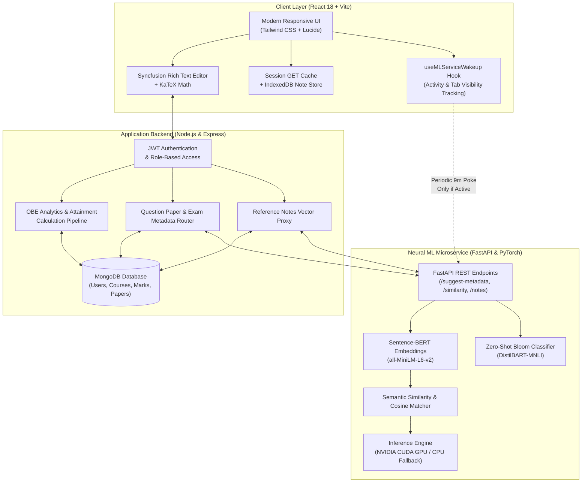
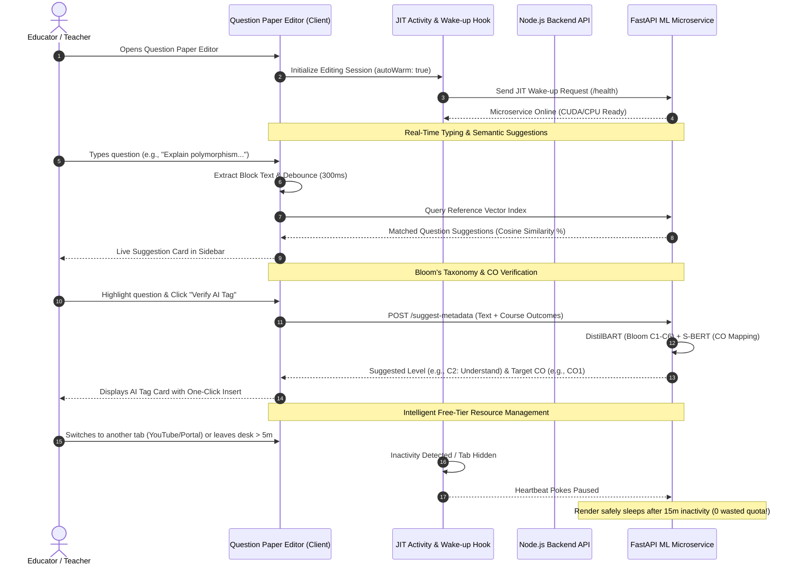
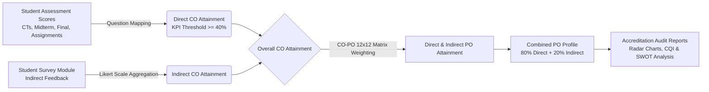

# 🎓 OBE Student Outcome Analyzer & AI Question Paper Intelligence

> **An Enterprise Outcome-Based Education (OBE) Management, Washington Accord Accreditation Analytics, and Neural AI-Powered Question Paper Engineering Platform.**

[](https://sarkarjoy86.github.io/Student-Outcome-Analyzer/)
[](https://reactjs.org/)
[](https://nodejs.org/)
[](https://fastapi.tiangolo.com/)
[](https://pytorch.org/)
[](https://huggingface.co/)
[](LICENSE)

---

## 📌 Executive Overview

The **OBE Student Outcome Analyzer** is an enterprise-grade academic platform built for higher education universities and engineering departments. Designed specifically around the stringent requirements of the **Washington Accord / BAETE Accreditation Frameworks**, the system eliminates fragile Excel spreadsheets with mathematically verified direct/indirect attainment engines, longitudinal student growth profiling, automated Continuous Quality Improvement (CQI) reports, and a state-of-the-art **AI Question Paper Editor** powered by an integrated Python NLP/ML microservice.

### 🌐 Live Production Application
👉 **[Access the Deployed Web Application](https://sarkarjoy86.github.io/Student-Outcome-Analyzer/)**

---

## 🏛️ System Architecture

The platform operates on a resilient three-tier distributed architecture: a responsive client application with offline-first indexing, a robust Node.js/Express business logic & persistence API, and a hardware-accelerated Python FastAPI machine learning microservice.



---

## ⚡ Flagship Feature: AI Question Paper Engineering Suite

The **Question Paper Editor** is an end-to-end academic authoring environment combining real-time typography with neural NLP models to assist educators in drafting accreditation-compliant examination papers.



### 1. Zero-Shot Bloom’s Taxonomy & Course Outcome Verifier
- **Cognitive Level Prediction**: Uses Hugging Face Zero-Shot Classification (`valhalla/distilbart-mnli-12-3` / `bart-large-mnli`) to classify question text into Bloom’s cognitive taxonomy (**C1: Remember, C2: Understand, C3: Apply, C4: Analyze, C5: Evaluate, C6: Create**) with probability distribution scores.
- **Semantic Course Outcome (CO) Alignment**: Uses Sentence-BERT (`sentence-transformers/all-MiniLM-L6-v2`) to encode the question against institutional course syllabus descriptions, mapping questions to the most accurate Course Outcome (**CO1 to CO12**).
- **Non-Destructive Tag Injection**: Injects formatted `[COx→Cy]` tags directly into the active paragraph or table row of the Rich Text Editor with automatic font and styling inheritance.

### 2. Sentence-BERT Exam Paper Similarity Analyzer
- Automatically analyzes the drafted exam paper against historical archived semester papers.
- Computes pairwise cosine similarity embeddings across questions to prevent question repetition and ensure examination novelty across consecutive academic cycles.
- Generates granular similarity percentage tags (e.g., *94% Match with Spring 2025 Midterm*) with full side-by-side comparison modals.

### 3. Real-Time Reference Questions Live Suggestion Engine
- **Dual-Layer Architecture**:
  - **Instant 0ms Local Matching**: Evaluates candidate questions in memory from indexed document chunks using prefix scoring, substring heuristics, and multi-token overlap algorithms.
  - **Background Resilient Vector Sync**: Silently re-syncs document binary blobs from browser `IndexedDB` to the microservice if cloud containers restart during idle periods.
- **Live Debounced Typing Capture**: Listens with capture-phase events across Syncfusion content panels and iframes, surfacing real-time relevant questions after a 300ms pause.

### 4. Generative Exam Assistants
- **AI Question Generator**: Synthesizes scenario-based, analytical, or descriptive exam questions mapped to specific topics and target Bloom levels.
- **AI Markdown Table Generator**: Constructs academic data tables, truth tables, comparison grids, and scheduling matrices on demand.
- **LaTeX Math Formula Generator**: Formats complex equations into KaTeX syntax with live visual preview.
- **Code Execution Output Analyzer**: Parses code snippets across languages (C++, Java, Python), identifying runtime behavior, syntax bugs, and output predictions.

### 5. Smart Cloud Resource & Cold-Start Lifecycle Engine
- **Single Unified Dark-Green Theme Notification**: During cold-starts, displays a single unified dark-emerald notification card (`bg-emerald-950/95 text-emerald-100 border-emerald-400/60`) informing educators that neural models are loading into memory (~20–30s), cleanly transforming into a confirmation checkmark upon completion.
- **Zero-Overhead Activity Detection**: Utilizes passive capture listeners for `pointerdown`, `keydown`, `scroll`, and `wheel` throttled to 15-second write intervals (0% CPU impact, 60/120 FPS buttery-smooth typing and scrolling).
- **5-Minute Inactivity Threshold**: If the teacher does not click, type, or scroll for $\ge 5$ minutes, keep-alive heartbeats are paused. Combined with Render's 15-minute sleep policy, the container sleeps within a maximum of **20 minutes total**, saving hundreds of free-tier compute hours monthly.
- **Tab Visibility Pause**: When the user switches to other browser tabs (e.g., YouTube or university portals), heartbeats pause immediately. Returning within 15 minutes seamlessly refreshes the session without cold-starts.

---

## 📊 Comprehensive OBE Analytics & Washington Accord Attainment

The system implements the full mathematical framework for computing direct, indirect, and combined program outcomes.



### Attainment Formulations

#### 1. Course Outcome (CO) Direct Attainment
$$\text{CO Attainment}_i = \sum_{k=1}^{n} \left( \frac{\text{Student Mark}_k}{\text{Max Mark}_k} \times \frac{\text{Weightage}_k}{\text{Total Weightage}} \right) \times 100$$

#### 2. Program Outcome (PO) Weighted Aggregation
$$\text{PO Attainment}_j = \frac{\sum_{i=1}^{m} \left( \text{CO Attainment}_i \times \text{Weight}_{i,j} \right)}{\sum_{i=1}^{m} \text{Weight}_{i,j}}$$

#### 3. Combined Program Attainment Metric
$$\text{Combined Attainment} = (0.80 \times \text{Direct Attainment}) + (0.20 \times \text{Indirect Attainment})$$

---

## 💻 Tech Stack Breakdown

| Layer | Core Technologies | Highlights & Purpose |
| :--- | :--- | :--- |
| **Frontend UI / UX** | React 18, Vite, Tailwind CSS | High-performance SPA with glassmorphism, responsive sidebar navigation, and sub-millisecond route transitions. |
| **Rich Text & Math** | Syncfusion EJ2 RTE, KaTeX | Academic typesetting, embedded code blocks, tables, and LaTeX math syntax rendering. |
| **Client Storage & Cache** | IndexedDB, SessionStorage, In-Memory Map | 0ms instant tab switching with intelligent write invalidation; offline storage for reference question blobs. |
| **Data Visualization** | Recharts, html2canvas | Interactive Bar, Radar, Pie, and Progress visualizers with one-click PNG export. |
| **Backend Gateway** | Node.js, Express.js | RESTful API routing, JWT session management, file upload pipelines (DOCX/PDF parsing via Mammoth & pdfjs). |
| **Database & ORM** | MongoDB, Mongoose | Relational-like schema modeling across Users, Offerings, Assessments, Marks, Surveys, and Question Papers. |
| **ML Microservice** | Python 3.10+, FastAPI, Uvicorn | Asynchronous, high-throughput microservice serving deep learning models with Swagger UI documentation. |
| **Deep Learning & NLP** | PyTorch, Sentence-Transformers, Hugging Face | Sentence-BERT (`all-MiniLM-L6-v2`), Zero-Shot DistilBART (`valhalla/distilbart-mnli-12-3`), CUDA GPU acceleration with CPU fallback. |

---

## 📂 Repository Directory Layout

```
.
├── server/                         # Express.js Application Server
│   ├── models/                     # Mongoose Schemas (User, Course, Assessment, Paper, Survey)
│   ├── routes/                     # API Routers (authRoutes, obeRoutes, uploadRoutes, notesRoutes)
│   ├── middleware/                 # JWT Auth, Upload handlers, Error interceptors
│   └── index.js                    # Express Gateway Server Entry Point
│
├── ml-service/                     # Python Deep Learning NLP Microservice
│   ├── core/                       # Configuration, Device detection (CUDA/CPU), Logger
│   ├── services/                   # Sentence-BERT & Zero-Shot inference engines
│   ├── routes/                     # FastAPI Endpoints (/suggest-metadata, /similarity, /notes)
│   ├── schemas/                    # Pydantic request & response models
│   ├── training/                   # Model fine-tuning & evaluation scripts
│   ├── requirements.txt            # Python dependencies (PyTorch, FastAPI, Transformers)
│   └── main.py                     # FastAPI Microservice Entry Point
│
├── src/                            # React 18 Single Page Application
│   ├── components/
│   │   ├── admin/                  # System Admin Panel (Users, Courses, Batches, Offerings)
│   │   ├── dashboard/              # Teacher Course Workspaces, Reference Notes Manager
│   │   ├── marks/                  # Question Paper Editor, Marks Spreadsheet, CO-PO Matrix
│   │   ├── reports/                # Radar/Bar Attainment Visuals, SWOT Analysis, CQI Reports
│   │   └── survey/                 # Washington Accord Aligned Student Survey Portal
│   ├── hooks/                      # useMLServiceWakeup (Activity tracking, Keep-alive)
│   ├── services/                   # apiService (Session GET cache), notesApi (Local search)
│   ├── App.jsx                     # Top-Level Router & Dynamic Authentication State
│   └── index.css                   # Tailwind Base Directives & Custom Emerald Design Tokens
│
├── public/                         # Logos, Favicons, and Static Assets
├── package.json                    # Node Scripts, Dependencies, and GitHub Pages Deployment
└── README.md                       # Comprehensive Platform Documentation
```

---

## 🚀 Installation & Local Development

### Prerequisites
- **Node.js**: `v18.x` or higher
- **npm**: `v9.x` or higher
- **Python**: `v3.10` or higher
- **MongoDB**: Local MongoDB community service or MongoDB Atlas connection URI

---

### Step 1: Clone Repository
```bash
git clone https://github.com/sarkarjoy86/Student-Outcome-Analyzer.git
cd Student-Outcome-Analyzer
```

### Step 2: Configure Client & Backend Environment
Create a `.env` file in the root project directory:
```env
PORT=5000
MONGODB_URI=mongodb://localhost:27017/obe_db
JWT_SECRET=your_jwt_secret_key_here
VITE_API_URL=http://localhost:5000
ML_SERVICE_URL=http://localhost:8000
```

Install Node.js dependencies:
```bash
npm install
```

---

### Step 3: Setup Python ML Microservice
Navigate to the `ml-service` directory and configure the virtual environment:

```bash
cd ml-service
python -m venv venv

# Windows (PowerShell)
.\venv\Scripts\Activate.ps1

# Linux / macOS
source venv/bin/activate
```

Install PyTorch and NLP dependencies:
```bash
# For NVIDIA GPUs with CUDA support (Recommended):
pip install torch --index-url https://download.pytorch.org/whl/cu124
pip install -r requirements.txt

# Or for standard CPU-only installation:
pip install torch -r requirements.txt
```

---

### Step 4: Launch the Full Application Suite
From the root project directory, launch all services concurrently:
```bash
npm run dev
```

The services will initialize at:
- 💻 **Frontend Web Client**: `http://localhost:5173` (or `http://localhost:3000`)
- ⚙️ **Backend Express Server**: `http://localhost:5000`
- 🧠 **ML FastAPI Service**: `http://localhost:8000` *(Interactive Swagger docs: `http://localhost:8000/docs`)*

---

## 🌐 Production Deployment

### Frontend (GitHub Pages)
The client application is automated for continuous deployment directly to GitHub Pages:
```bash
npm run deploy
```
*This command executes `npm run build` and publishes the production `dist/` directory to the `gh-pages` branch.*

### Backend & ML Microservice (Render / Cloud Container)
- **Node.js Server**: Configured for standard Node environments with persistent MongoDB Atlas integration.
- **Python ML Service**: Deployed as a lightweight Docker / Python web service on Render, utilizing the custom JIT wake-up hook and activity-based inactivity safeguards to run efficiently on free and standard cloud instances.

---

## 🤝 Academic Contribution & Verification

Contributions, academic feedback, and feature recommendations are warmly welcomed:
1. Fork the Project Repository.
2. Create a Feature Branch (`git checkout -b feature/EducationalEnhancement`).
3. Commit your Changes (`git commit -m 'Add OBE Evaluation Matrix'`).
4. Push to the Branch (`git push origin feature/EducationalEnhancement`).
5. Open an official **Pull Request**.

---

## 📄 License

Distributed under the **MIT License**. See `LICENSE` for complete terms.

---

<p align="center">
  Developed with ❤️ by <b>Joy Sarkar</b> for Outcome-Based Education (OBE) Excellence & Accreditation Automation.
</p>
