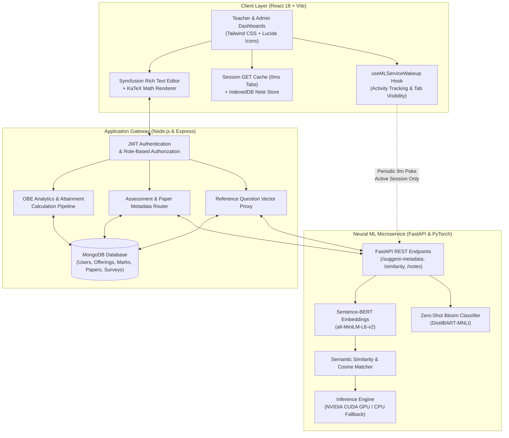
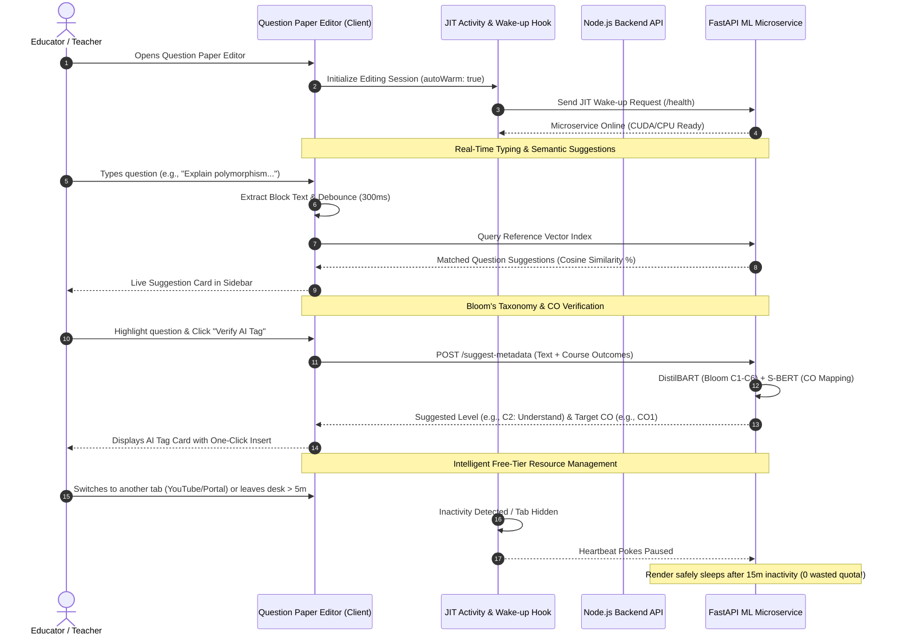
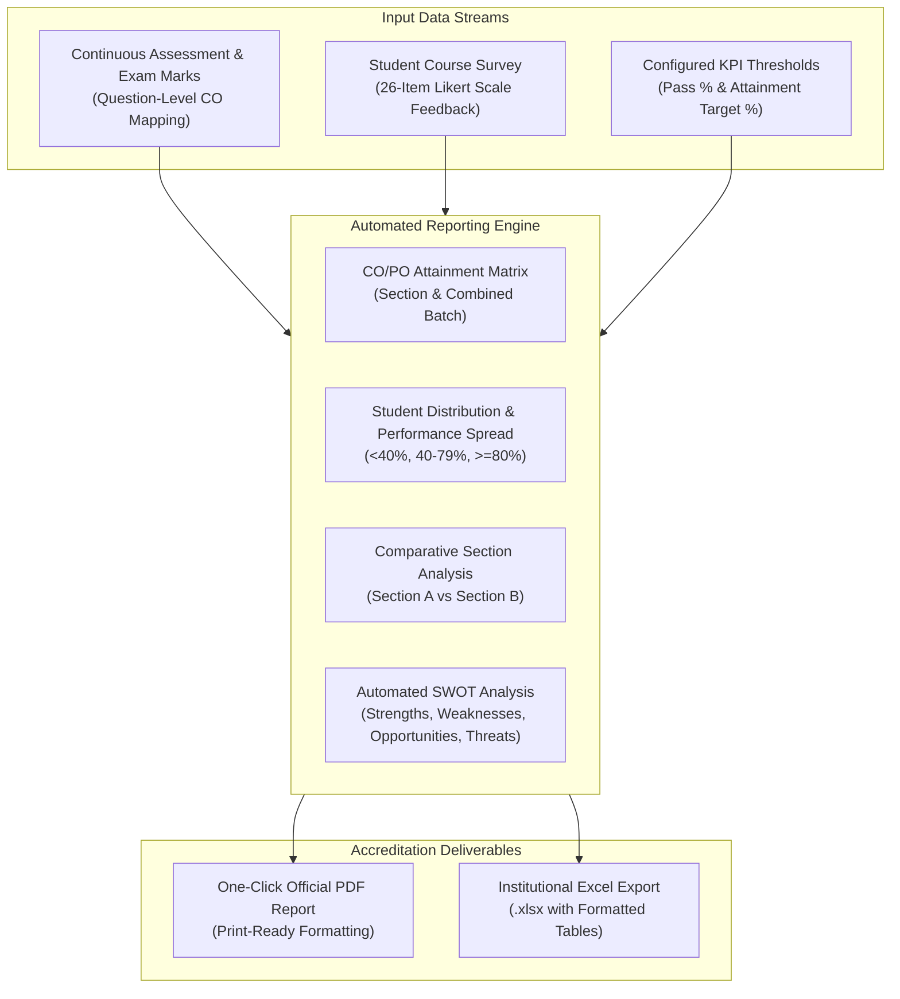
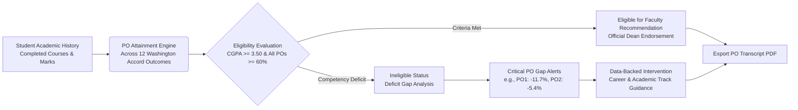
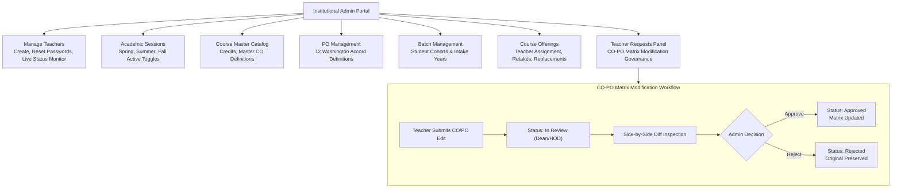

# 🎓 OBE Student Outcome Analyzer & AI Question Paper Intelligence

> **An Enterprise Outcome-Based Education (OBE) Management, Washington Accord Accreditation Analytics, and Neural AI-Powered Question Paper Engineering Platform.**  
> *Developed as a Bachelor Capstone Project for Higher Education & Engineering Accreditation Automation.*

[](https://sarkarjoy86.github.io/Student-Outcome-Analyzer/)
[](LICENSE)
[](https://reactjs.org/)
[](https://nodejs.org/)
[](https://fastapi.tiangolo.com/)
[](https://pytorch.org/)
[](https://huggingface.co/)

---

## 📌 Executive Overview

The **OBE Student Outcome Analyzer** is an enterprise-grade academic platform engineered for universities, engineering departments, and educational institutions operating under the **Washington Accord / BAETE Accreditation Frameworks**. 

Designed to replace disconnected spreadsheets and manual grade computations, the platform provides a unified digital ecosystem connecting **Course Outcomes (CO1–CO12)** with **Program Outcomes (PO1–PO12)**. It features mathematically verified continuous attainment engines, automated Continuous Quality Improvement (CQI) reports, longitudinal student competency tracking, a Washington Accord course survey portal, and a flagship **AI Question Paper Editor** driven by a dedicated Python deep-learning NLP microservice.

### 🌐 Live Production Application
👉 **[Access the Deployed Web Application](https://sarkarjoy86.github.io/Student-Outcome-Analyzer/)**

---

## 🏛️ System Architecture

The platform follows a three-tier distributed architecture combining a high-performance Single Page Application (SPA), a Node.js/Express business logic gateway, and an asynchronous Python FastAPI machine learning microservice.



---

## 👨‍🏫 1. Teacher Dashboard & Course Workspaces

The **Teacher Dashboard** is the core operational hub for educators, structured to guide instructors through the complete academic lifecycle from curriculum mapping to assessment and final outcome evaluation.

```mermaid
flowchart LR
    A[Course Overview\nMetrics & Reminders] --> B[CO-PO Mapping\n12x12 Matrix]
    B --> C[Student Table\nContinuous Marks Roster]
    C --> D[Assessments\nModule Cards & Q.Paper]
    D --> E[Question Paper Editor\nNeural AI Assistant]
    E --> F[Marks Entry\nSpreadsheet & Auto-Sum]
    F --> G[Attainment Engine\nKPI Sliders & Status]
    G --> H[Automated Reports\nSWOT & Comparisons]
    H --> I[PO Recommendation\nStudent Competency Profile]
```



### 1.1 Course Overview & Live Activity Monitor
- **Course Specifications**: Summarizes active academic session (e.g., *Spring 2026*), batch, section (*Section B*), credits (*3 Credit Hours*), level/term (*Level 2, Term II*), and mapped CO count.
- **Actionable Course Reminders**: Surfaces pending academic deadlines, missing marks entries (e.g., *Pending Marks: CT-2 [Required]* with direct navigation links), upcoming presentation dates, and overdue submissions.
- **Assessment Module Summary**: Tabulates all 10 configured evaluation modules with creation dates, max marks, question counts, exam durations, and status badges (**Assigned** / **Evaluated**).
- **Audit Activity Feed**: Displays real-time chronological logs of recent changes made to question papers, assessments, and marks sheets.

---

### 1.2 Interactive 12×12 CO-PO Mapping Matrix
- **Washington Accord Criteria Alignment**: Maps Course Outcomes (**CO1–CO12**) against all 12 Washington Accord Program Outcomes:
  - **PO1**: Engineering Knowledge
  - **PO2**: Problem Analysis
  - **PO3**: Design/Development of Solutions
  - **PO4**: Investigation
  - **PO5**: Modern Tool Usage
  - **PO6**: The Engineer and Society
  - **PO7**: Environment and Sustainability
  - **PO8**: Ethics
  - **PO9**: Individual and Team Work
  - **PO10**: Communication
  - **PO11**: Project Management and Finance
  - **PO12**: Life-long Learning
- **Administrative Governance Workflow**: Teachers can submit mapping proposals (`Propose Mappings / Add CO`), triggering an audit request for Department Head / Dean review before updating institutional records.

---

### 1.3 Continuous Assessment Student Table
- **Comprehensive Roster View**: Lists all enrolled students with Roll ID and Student Name alongside continuous evaluation columns (CT-1, CT-2, CT-3, Extra CT-4, Assignment-1, Attendance, Class Performance, Presentation) and Term Exams (Mid Term, Final).
- **Automated "Best 3 of 4" CT Calculation**: Dynamically identifies and highlights the top three Class Test scores, calculating the **Best CT Total (Max: 30)** automatically on the fly.
- **Full-Screen Capability**: Dedicated full-screen toggle allows distraction-free verification of large class rosters with both horizontal and vertical virtual scrolling.

---

### 1.4 Assessment Management & Extra-CT Target Mapping
- **Modular Assessment Cards**: Individual cards for every assessment displaying max marks, duration, question count, mapped COs, and evaluation status badges.
- **Extra CT Replacement Mapping**: Special support for makeup tests (e.g., *Extra CT-4*), allowing teachers to explicitly designate a **Mapped Target (e.g., CT-2)** to seamlessly replace a missed or poor score without corrupting previous grade history.
- **Direct Editor Launch**: Integrated `Open Q.Paper` action opens the AI Question Paper Editor pre-loaded with the assessment's metadata.

---

### 1.5 Question Archives & Paper Reuse Bank
- **Categorized Question Repository**: Organizes past semester exam papers into folders by category (**Assignment-1, CTs, Mid Term, Final, Presentation**) with historical session counters.
- **Instant Search & Reuse**: Allows instructors to review, search, and clone previously validated questions to save preparation time across academic terms.

---

### 1.6 Dynamic Marks Entry Spreadsheet
- **Spreadsheet-Style Grid**: Excel-like fast entry interface with keyboard navigation (`Enter`, `Tab`, arrow keys).
- **Dynamic Calculation**: Validates marks against maximum boundaries with instant row summing and a **Fully Entered** completion badge.
- **Draft Auto-Recovery**: Prevents accidental data loss by caching uncommitted edits in browser storage, prompting teachers with a *Restored draft marks* notification and one-click discard option.
- **Multi-Mode Input**: Supports both **Total Marks (Single Entry)** and **Question-by-Question** granular score entry.

---

### 1.7 Attainment Threshold Sliders & Status Engine
- **Interactive KPI Threshold Sliders**:
  - **Target Pass Marks (%)**: Configurable pass benchmark (default: 40%).
  - **CO Attainment Target KPI (%)**: Percentage of students required to pass for CO achievement (default: 50%).
  - **PO Attainment Target KPI (%)**: Target attainment percentage for program outcomes (default: 50%).
- **Live Status Badges**: Evaluates class scores in real-time, displaying green **Attained** or red **Not Attained** badges across all COs (CO1–CO6) and POs (PO1–PO12).

---

## 🤖 2. Flagship AI Question Paper Engineering Suite

The **Question Paper Editor** is an end-to-end academic typesetting and intelligence suite that integrates neural NLP directly into the authoring workflow.



### 2.1 Zero-Shot Bloom’s Taxonomy & Course Outcome Verifier
- **Cognitive Level Classification**: Uses Hugging Face Zero-Shot Classification (`valhalla/distilbart-mnli-12-3` / `bart-large-mnli`) to categorize question prompts into Bloom’s cognitive domains:
  - **C1: Remember** (recall, define, state)
  - **C2: Understand** (explain, describe, summarize)
  - **C3: Apply** (implement, solve, demonstrate)
  - **C4: Analyze** (compare, differentiate, deconstruct)
  - **C5: Evaluate** (judge, justify, critique)
  - **C6: Create** (design, formulate, construct)
- **Semantic Course Outcome Alignment**: Encodes question semantics via Sentence-BERT (`all-MiniLM-L6-v2`) against the official course syllabus, mapping questions to the most relevant Course Outcome (**CO1–CO12**).
- **Inline Non-Destructive Tagging**: Inserts formatted `[COx→Cy]` badges directly into the active paragraph or table cell with automated font and styling inheritance.

---

### 2.2 Sentence-BERT Exam Similarity Analyzer
- Computes pairwise cosine similarity embeddings between the current draft paper and historical semester exams stored in MongoDB.
- Detects question overlap and duplicate prompts across consecutive exam cycles to ensure academic rigor and examination novelty.
- Provides side-by-side comparison modals with match percentage tags (e.g., *94% Similarity with Spring 2025 Midterm*).

---

### 2.3 Real-Time Reference Questions Live Suggestion Engine
- **Instant 0ms In-Memory Search**: Scans pre-indexed syllabus questions using prefix matching, substring heuristics, and multi-token overlap algorithms without waiting for network responses.
- **Background Resilient Vector Sync**: Automatically re-uploads document binary blobs from browser `IndexedDB` to the microservice if cloud containers restart during idle periods.
- **Debounced Input Capture**: Uses capture-phase listeners on Syncfusion content panels to surface live question suggestions 300ms after the teacher pauses typing.

---

### 2.4 Generative Academic Assistants
- **AI Question Generator**: Generates descriptive, analytical, or scenario-based examination questions mapped to specified topics and Bloom levels.
- **AI Markdown Table Generator**: Constructs academic tables, truth tables, and scheduling grids on demand.
- **LaTeX Math Formula Generator**: Generates and previews complex mathematical formulas rendered natively through KaTeX.
- **Code Execution Output Analyzer**: Parses code snippets across C++, Java, and Python, predicting output and identifying potential syntax or runtime bugs.

---

### 2.5 Smart Cloud Resource & Activity Keep-Alive Engine
- **Single Unified Dark-Green Notification**: During cold-starts, displays a single unified dark-emerald card (`bg-emerald-950/95 text-emerald-100 border-emerald-400/60`) informing educators that neural models are loading (~20–30s), cleanly transforming into a confirmation checkmark upon completion.
- **Zero-Overhead Activity Detection**: Uses passive capture listeners on `window` and `document` for `pointerdown`, `keydown`, `scroll`, and `wheel` throttled to 15-second write intervals (0% CPU impact, 60/120 FPS buttery-smooth typing and scrolling).
- **5-Minute Inactivity Threshold**: If the teacher does not click, type, or scroll for $\ge 5$ minutes, keep-alive heartbeats are paused. Combined with Render's 15-minute sleep policy, the container sleeps within a maximum of **20 minutes total**, saving hundreds of free-tier compute hours monthly.
- **Tab Visibility Pause**: When the user switches to other browser tabs (e.g., YouTube or university portals), heartbeats pause immediately. Returning within 15 minutes seamlessly refreshes the session without cold-starts.

---

## 📈 3. Automated OBE Reports & Accreditation Intelligence

The **Reports** module automates Continuous Quality Improvement (CQI) documentation required for Washington Accord accreditation visits.



### 3.1 Report Sub-Modules
- **Course Overview**: Aggregated outcome performance metrics across all course sections.
- **CO/PO Attainment (Section)**: Granular percentage attainment for each Course and Program Outcome within a specific section.
- **Student Analysis**: Identifies at-risk students who failed to cross the KPI threshold alongside high-achieving candidates.
- **Comparative Analysis**: Cross-sectional performance benchmarking comparing Section A against Section B to detect teaching or evaluation variance.
- **Mapping Details**: Full breakdown of CO-to-PO contribution weightages.
- **SWOT Analysis (Accreditation Ready)**: Automatically synthesizes institutional **Strengths, Weaknesses, Opportunities, and Threats** based on empirical class attainment percentages.

### 3.2 Interactive Visualizations (Recharts)
- **Course Outcomes (COs) Attainment Bar Chart**: Displays side-by-side comparisons of percentage scores against Pass Marks (40%) and KPI Targets (50%).
- **CO Student Distribution Stacked Bar Chart**: Color-coded student distribution across performance tiers:
  - 🔴 **Below 40%** (At-Risk)
  - 🟠 **40% – 79%** (Satisfactory)
  - 🟢 **≥ 80%** (Exemplary)
- **Export Formats**: One-click **Print Report (PDF)** and **Download Excel (.xlsx)**.

---

## 🎯 4. Student PO Recommendation System

Beyond traditional Cumulative GPA, the **PO Recommendation System** evaluates a student’s true engineering competence across all 12 Washington Accord Program Outcomes over their 4-year degree.



### 4.1 Key Capabilities
- **Longitudinal Competency Profiling**: Tracks student mastery across courses, displaying Cumulative GPA (e.g., *2.41 / 4.00*), Overall PO Average (e.g., *35.5%*), and a Recommendation Score (0–100).
- **Configurable PO Target Threshold**: Interactive slider (e.g., *60% Target Threshold*) to customize institutional standards.
- **Automated Eligibility Status**: Evaluates whether a student meets the dual criteria for official faculty recommendations (**CGPA $\ge$ 3.50 and All POs $\ge$ 60%**).
- **Critical PO Gap Detection**: Surfaces specific competency deficits with exact gap percentages:
  - *PO1: Engineering Knowledge (48.3% vs 60% Target → Deficit: -11.7% gap)*
  - *PO2: Problem Analysis (54.6% vs 60% Target → Deficit: -5.4% gap)*
  - *PO3: Design/Development of Solutions (55.0% vs 60% Target → Deficit: -5.0% gap)*
- **Data-Driven Career Guidance**: Generates personalized recommendations for specialization tracks or academic interventions based on empirical PO strengths and weaknesses.
- **Export PO Transcript**: Produces an official, print-ready PDF transcript of the student's Washington Accord competency profile.

---

## 📋 5. Washington Accord Student Course Survey Module

Replaces external Google Forms with an integrated, tamper-proof student feedback portal feeding directly into indirect attainment calculations.

- **Standardized 26-Question Bank**: Evaluates course learning outcomes and student achievement based on Washington Accord criteria.
- **5-Point Likert Scale**: Questions scored from **1 (Strongly Disagree)** to **5 (Strongly Agree)**.
- **Tokenized Public Evaluation Portal**: Generates secure, tokenized survey links allowing students to submit feedback anonymously from any device without authentication friction.
- **Automated Indirect CO Integration**: Survey submissions are aggregated mathematically to compute the **Indirect Course Outcome Attainment** score.

---

## 🛡️ 6. OBE Administrative Management & Governance Portal

The **Admin Panel** provides centralized institutional control over academic calendars, faculty accounts, and accreditation matrices.



### 6.1 Administrative Modules
- **Faculty Account Management**: Provision new teacher accounts (`@baiust.ac.bd`), reset passwords, and monitor real-time online/offline presence (auto-refreshing every 5 seconds).
- **Academic Session Control**: Configure academic years and semesters with active/completed status toggles.
- **Course Master Catalog**: Maintain institutional course codes, titles, credit hours, and default Course Outcomes.
- **Program Outcome Framework**: Manage Washington Accord criteria definitions.
- **Batch Directory**: Organize students into academic batches and intake cohorts.
- **Course Offerings & Faculty Reassignment**: Allocate courses to instructors by semester, batch, and section. Easily handle retake students and mid-semester faculty replacements.
- **Teacher Requests Panel (CO-PO Governance)**:
  - Review proposed edits submitted by teachers modifying Course Outcomes or the 12×12 matrix.
  - Inspect exact changes via the **View Changes Diff** modal.
  - Formal decision pipeline: **Pending**, **In Review (Dean/HOD)**, **Approved**, or **Rejected** with timestamped decision logs.

---

## 🧮 7. Mathematical Formulations

### 1. Direct Course Outcome (CO) Attainment
$$\text{CO Attainment}_i = \sum_{k=1}^{n} \left( \frac{\text{Student Mark}_k}{\text{Max Mark}_k} \times \frac{\text{Weightage}_k}{\text{Total Weightage}} \right) \times 100$$

### 2. Weighted Program Outcome (PO) Attainment
$$\text{PO Attainment}_j = \frac{\sum_{i=1}^{m} \left( \text{CO Attainment}_i \times \text{Weight}_{i,j} \right)}{\sum_{i=1}^{m} \text{Weight}_{i,j}}$$

### 3. Overall Combined Attainment
$$\text{Overall Attainment} = (80\% \times \text{Direct Attainment}) + (20\% \times \text{Indirect Survey Attainment})$$

---

## 🛠️ 8. Technology Stack Breakdown

| Category | Technology | Version / Specification | Purpose |
| :--- | :--- | :--- | :--- |
| **Frontend** | React | `18.2.0` | Declarative UI and component state architecture |
| | Vite | `5.4.21` | High-speed frontend build and hot module replacement |
| | Tailwind CSS | `3.3.0` | Utility-first responsive styling and emerald design tokens |
| | Syncfusion RTE | `33.2.13` | Rich text authoring for examination papers |
| | KaTeX | `0.18.1` | Fast mathematical formula rendering |
| | Recharts | `2.10.3` | Interactive Bar, Radar, Pie, and Line charts |
| | Lucide React | `0.294.0` | Modern SVG iconography |
| **Backend** | Node.js | `18.x / 20.x` | Asynchronous JavaScript server runtime |
| | Express.js | `5.2.1` | RESTful API routing, middleware, and request handling |
| | MongoDB & Mongoose | `9.6.0` | Document database for institutional persistence |
| | JSON Web Tokens | `9.0.3` | Secure tokenized authentication and role access |
| | Bcrypt.js | `3.0.3` | Salted password hashing |
| **ML Microservice** | Python | `3.10+` | Deep learning runtime |
| | FastAPI | `0.100+` | Asynchronous REST microservice with OpenAPI / Swagger docs |
| | PyTorch | `2.0+` (CUDA / CPU) | Tensor computation and neural model inference |
| | Sentence-Transformers | `all-MiniLM-L6-v2` | Sentence embeddings for CO mapping and paper similarity |
| | Hugging Face Transformers | `DistilBART-MNLI` | Zero-shot classification for Bloom's Taxonomy (C1–C6) |

---

## 📁 9. Repository Directory Layout

```
.
├── server/                         # Express.js Application Server
│   ├── models/                     # Mongoose Schemas (User, Course, Assessment, Paper, Survey)
│   ├── routes/                     # API Routers (authRoutes, obeRoutes, uploadRoutes, notesRoutes)
│   ├── middleware/                 # JWT Auth, Upload handlers, Error interceptors
│   └── index.js                    # Express Gateway Server Entry Point
│
├── ml-service/                     # Python Deep Learning NLP Microservice
│   ├── core/                       # Configuration, Device detection (CUDA/CPU), Logger
│   ├── services/                   # Sentence-BERT & Zero-Shot inference engines
│   ├── routes/                     # FastAPI Endpoints (/suggest-metadata, /similarity, /notes)
│   ├── schemas/                    # Pydantic request & response models
│   ├── training/                   # Model fine-tuning & evaluation scripts
│   ├── requirements.txt            # Python dependencies (PyTorch, FastAPI, Transformers)
│   └── main.py                     # FastAPI Microservice Entry Point
│
├── src/                            # React 18 Single Page Application
│   ├── components/
│   │   ├── admin/                  # System Admin Panel (Users, Courses, Batches, Offerings)
│   │   ├── dashboard/              # Teacher Course Workspaces, Reference Notes Manager
│   │   ├── marks/                  # Question Paper Editor, Marks Spreadsheet, CO-PO Matrix
│   │   ├── reports/                # Radar/Bar Attainment Visuals, SWOT Analysis, CQI Reports
│   │   └── survey/                 # Washington Accord Aligned Student Survey Portal
│   ├── hooks/                      # useMLServiceWakeup (Activity tracking, Keep-alive)
│   ├── services/                   # apiService (Session GET cache), notesApi (Local search)
│   ├── App.jsx                     # Top-Level Router & Dynamic Authentication State
│   └── index.css                   # Tailwind Base Directives & Custom Emerald Design Tokens
│
├── public/                         # Logos, Favicons, and Static Assets
├── package.json                    # Node Scripts, Dependencies, and GitHub Pages Deployment
├── LICENSE                         # Proprietary Academic License Agreement
└── README.md                       # Comprehensive Platform Documentation
```

---

## 🚀 10. Installation & Local Development

### Prerequisites
- **Node.js**: `v18.x` or higher
- **npm**: `v9.x` or higher
- **Python**: `v3.10` or higher
- **MongoDB**: Local MongoDB community service or MongoDB Atlas connection URI

---

### Step 1: Clone Repository
```bash
git clone https://github.com/sarkarjoy86/Student-Outcome-Analyzer.git
cd Student-Outcome-Analyzer
```

### Step 2: Configure Client & Backend Environment
Create a `.env` file in the root project directory:
```env
PORT=5000
MONGODB_URI=mongodb://localhost:27017/obe_db
JWT_SECRET=your_jwt_secret_key_here
VITE_API_URL=http://localhost:5000
ML_SERVICE_URL=http://localhost:8000
```

Install Node.js dependencies:
```bash
npm install
```

---

### Step 3: Setup Python ML Microservice
Navigate to the `ml-service` directory and configure the virtual environment:

```bash
cd ml-service
python -m venv venv

# Windows (PowerShell)
.\venv\Scripts\Activate.ps1

# Linux / macOS
source venv/bin/activate
```

Install PyTorch and NLP dependencies:
```bash
# For NVIDIA GPUs with CUDA support (Recommended):
pip install torch --index-url https://download.pytorch.org/whl/cu124
pip install -r requirements.txt

# Or for standard CPU-only installation:
pip install torch -r requirements.txt
```

---

### Step 4: Launch the Full Application Suite
From the root project directory, launch all services concurrently:
```bash
npm run dev
```

The services will initialize at:
- 💻 **Frontend Web Client**: `http://localhost:5173` (or `http://localhost:3000`)
- ⚙️ **Backend Express Server**: `http://localhost:5000`
- 🧠 **ML FastAPI Service**: `http://localhost:8000` *(Interactive Swagger docs: `http://localhost:8000/docs`)*

---

## 🌐 11. Production Deployment

### Frontend (GitHub Pages)
The client application is automated for continuous deployment directly to GitHub Pages:
```bash
npm run deploy
```
*This command executes `npm run build` and publishes the production `dist/` directory to the `gh-pages` branch.*

### Backend & ML Microservice (Render / Cloud Container)
- **Node.js Server**: Configured for standard Node environments with persistent MongoDB Atlas integration.
- **Python ML Service**: Deployed as a lightweight Docker / Python web service on Render, utilizing the custom JIT wake-up hook and activity-based inactivity safeguards to run efficiently on free and standard cloud instances.

---

## 📄 12. License & Intellectual Property

**Copyright (c) 2026 Joy Sarkar & Development Team. All Rights Reserved.**

This software and its documentation are proprietary and confidential academic intellectual property developed as a Bachelor Capstone Project. Unauthorized copying, distribution, modification, reverse engineering, public deployment, or commercial exploitation is strictly prohibited without explicit written permission from the copyright holders. See `LICENSE` for complete terms.

---

<p align="center">
  <b>Developed by Joy Sarkar & His Team for Outcome-Based Education (OBE) Excellence & Accreditation Automation.</b>
</p>
