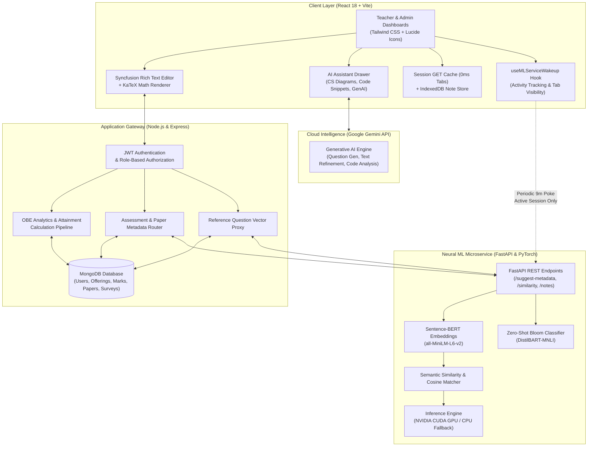
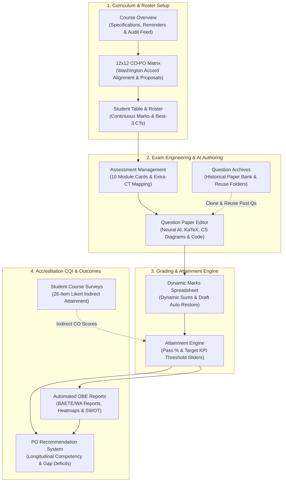
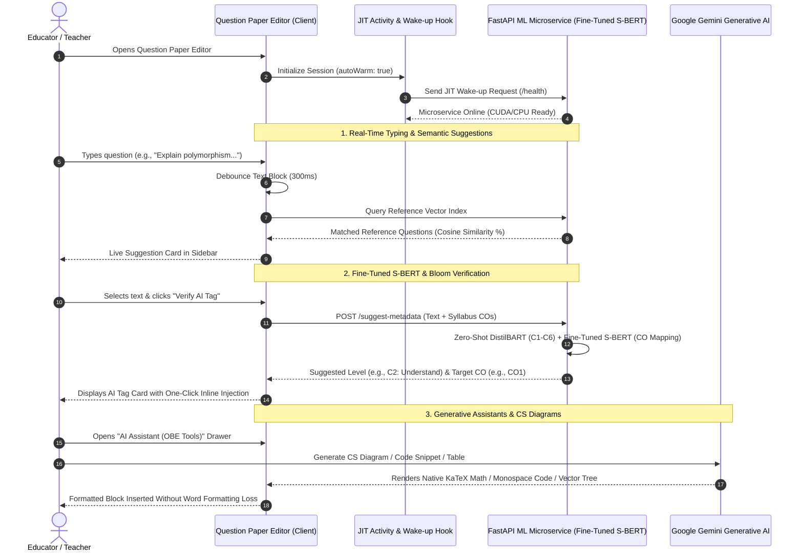
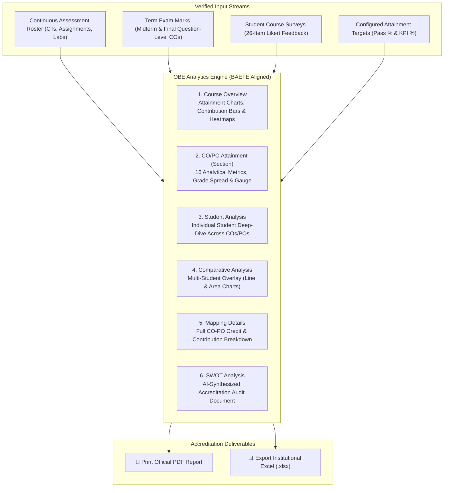
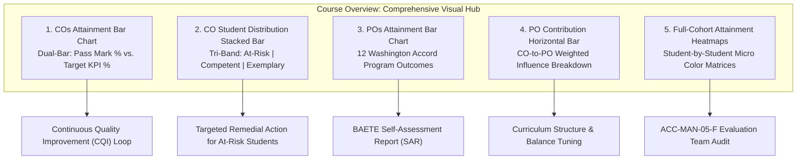
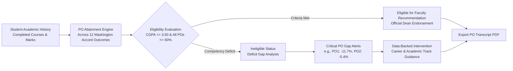
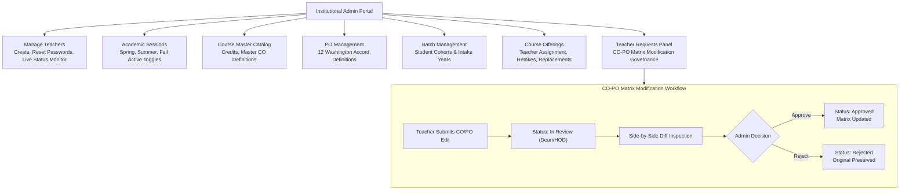

# 🎓 OBE Student Outcome Analyzer & AI Question Paper Intelligence

> **An Enterprise Outcome-Based Education (OBE) Management, Washington Accord Accreditation Analytics, and Neural AI-Powered Question Paper Engineering Platform.**  
> *Developed as a Bachelor Capstone Project for Higher Education & Engineering Accreditation Automation.*

[](https://sarkarjoy86.github.io/Student-Outcome-Analyzer/)
[](LICENSE)
[](https://reactjs.org/)
[](https://nodejs.org/)
[](https://fastapi.tiangolo.com/)
[](https://pytorch.org/)
[](https://huggingface.co/)
[](https://ai.google.dev/)

---

## 📌 Executive Overview

The **OBE Student Outcome Analyzer** is an enterprise-grade academic platform engineered for universities, engineering faculties, and educational institutions operating under the **Washington Accord / BAETE Accreditation Frameworks**. 

### 🚀 Ending the Era of Microsoft Word & Excel in Academia
In conventional university workflows, faculty members waste hundreds of hours every semester juggling disconnected, manual tools:
- **The Microsoft Word Nightmare**: Crafting exam papers in Microsoft Word is notoriously frustrating. Word automatically mangles code indentation, disrupts mathematical equation formatting, breaks tabular structures, and forces teachers to seek third-party websites to draw computer science trees and graphs—only to copy-paste blurry screenshots back into Word. Furthermore, tagging questions with Bloom's Taxonomy and Course Outcomes is completely manual, arbitrary, and error-prone.
- **The Microsoft Excel Fragility**: Computing Outcome-Based Education metrics in Excel spreadsheets leads to disaster: broken cell references (`#REF!`, `#VALUE!`), corrupted macro formulas, missed rows during student add/drop periods, and zero longitudinal tracking across semesters.

### 🌐 A Unified, All-in-One Academic Operating System
The **OBE Student Outcome Analyzer** completely eliminates the need for Microsoft Word and Excel by providing a single, browser-based ecosystem that unifies the entire academic lifecycle:
1. **End-to-End Course & Roster Management**: Digital syllabus mapping, automated "Best 3 of 4" Class Test grading, and continuous assessment spreadsheets.
2. **AI-Powered Question Paper Studio**: Built-in rich text typesetting with native KaTeX mathematical equations, an integrated **CS Diagram Studio** (Trees, Graphs, State Machines), a **Code Snippet Editor with Smart Output Analyzer**, and zero-shot neural AI verification for Bloom's Taxonomy (**C1–C6**) and Course Outcome (**CO1–CO12**) alignment.
3. **Accreditation-Grade Attainment Engine**: Real-time direct and indirect attainment computations with zero formula errors, interactive heatmaps, multi-student comparative benchmarks, automated **SWOT Analysis**, and student **PO Recommendation Transcripts**.

### 🌐 Live Production Application
👉 **[Access the Deployed Web Application](https://sarkarjoy86.github.io/Student-Outcome-Analyzer/)**

---

## 🏛️ System Architecture

The platform operates on a resilient three-tier distributed architecture combining an offline-first Single Page Application (SPA), an Express.js enterprise API gateway, and an asynchronous Python FastAPI deep-learning microservice.



---

## 👨‍🏫 1. Teacher Dashboard & Course Workspaces

The **Teacher Dashboard** guides instructors through four sequential academic phases, matching the modular structure of institutional accreditation workflows.



### 1.1 Course Overview & Live Activity Monitor
- **Course Specifications**: Highlights active academic session (e.g., *Spring 2026*), batch, section (*Section B*), credits (*3 Credit Hours*), level/term (*Level 2, Term II*), and mapped CO count.
- **Actionable Course Reminders**: Surfaces pending academic deadlines, missing marks entries (e.g., *Pending Marks: CT-2 [Required]* with direct navigation links), upcoming presentation dates, and overdue submissions.
- **Assessment Module Summary**: Tabulates all 10 configured evaluation modules with creation dates, max marks, question counts, exam durations, and status badges (**Assigned** / **Evaluated**).
- **Audit Activity Feed**: Displays real-time chronological logs of recent changes made to question papers, assessments, and marks sheets.

---

### 1.2 Interactive 12×12 CO-PO Mapping Matrix
- **Washington Accord Criteria Alignment**: Maps Course Outcomes (**CO1–CO12**) against all 12 Washington Accord Program Outcomes:
  - **PO1**: Engineering Knowledge
  - **PO2**: Problem Analysis
  - **PO3**: Design/Development of Solutions
  - **PO4**: Investigation
  - **PO5**: Modern Tool Usage
  - **PO6**: The Engineer and Society
  - **PO7**: Environment and Sustainability
  - **PO8**: Ethics
  - **PO9**: Individual and Team Work
  - **PO10**: Communication
  - **PO11**: Project Management and Finance
  - **PO12**: Life-long Learning
- **Administrative Governance Workflow**: Teachers can submit mapping proposals (`Propose Mappings / Add CO`), triggering an audit request for Department Head / Dean review before updating institutional records.

---

### 1.3 Continuous Assessment Student Table
- **Comprehensive Roster View**: Lists all enrolled students with Roll ID and Student Name alongside continuous evaluation columns (CT-1, CT-2, CT-3, Extra CT-4, Assignment-1, Attendance, Class Performance, Presentation) and Term Exams (Mid Term, Final).
- **Automated "Best 3 of 4" CT Calculation**: Dynamically identifies and highlights the top three Class Test scores, calculating the **Best CT Total (Max: 30)** automatically on the fly.
- **Full-Screen Capability**: Dedicated full-screen toggle allows distraction-free verification of large class rosters with both horizontal and vertical virtual scrolling.

---

### 1.4 Assessment Management & Extra-CT Target Mapping
- **Modular Assessment Cards**: Individual cards for every assessment displaying max marks, duration, question count, mapped COs, and evaluation status badges.
- **Extra CT Replacement Mapping**: Special support for makeup tests (e.g., *Extra CT-4*), allowing teachers to explicitly designate a **Mapped Target (e.g., CT-2)** to seamlessly replace a missed or poor score without corrupting previous grade history.
- **Direct Editor Launch**: Integrated `Open Q.Paper` action opens the AI Question Paper Editor pre-loaded with the assessment's metadata.

---

### 1.5 Question Archives & Paper Reuse Bank
- **Categorized Question Repository**: Organizes past semester exam papers into folders by category (**Assignment-1, CTs, Mid Term, Final, Presentation**) with historical session counters.
- **Instant Search & Reuse**: Allows instructors to review, search, and clone previously validated questions to save preparation time across academic terms.

---

### 1.6 Dynamic Marks Entry Spreadsheet
- **Spreadsheet-Style Grid**: Excel-like fast entry interface with keyboard navigation (`Enter`, `Tab`, arrow keys).
- **Dynamic Calculation**: Validates marks against maximum boundaries with instant row summing and a **Fully Entered** completion badge.
- **Draft Auto-Recovery**: Prevents accidental data loss by caching uncommitted edits in browser storage, prompting teachers with a *Restored draft marks* notification and one-click discard option.
- **Multi-Mode Input**: Supports both **Total Marks (Single Entry)** and **Question-by-Question** granular score entry.

---

### 1.7 Attainment Threshold Sliders & Status Engine
- **Interactive KPI Threshold Sliders**:
  - **Target Pass Marks (%)**: Configurable pass benchmark (default: 40%).
  - **CO Attainment Target KPI (%)**: Percentage of students required to pass for CO achievement (default: 50%).
  - **PO Attainment Target KPI (%)**: Target attainment percentage for program outcomes (default: 50%).
- **Live Status Badges**: Evaluates class scores in real-time, displaying green **Attained** or red **Not Attained** badges across all COs (CO1–CO6) and POs (PO1–PO12).

---

## 🤖 2. Flagship AI Question Paper Engineering Suite

The **Question Paper Editor** is an end-to-end academic authoring environment that replaces Microsoft Word with specialized deep-learning NLP models and generative design tools built directly into the rich text canvas.



---

### 2.1 Local Neural ML Intelligence Suite (Primary Focus)

The cornerstone of the platform's intelligence is a dedicated, local Python microservice powered by **PyTorch**, **FastAPI**, and **Sentence-Transformers**, accelerated via NVIDIA CUDA GPUs (with automatic CPU fallback).

#### 1. Zero-Shot Bloom’s Taxonomy & Fine-Tuned S-BERT Course Outcome Verifier
- **Domain-Specific Fine-Tuning Dataset**:
  - Rather than relying on generic models, our Sentence-BERT model (`sbert-obe-csematch`) was specifically fine-tuned on real university engineering examinations.
  - Collected a corpus of **1,000+ authentic university exam questions** across core Computer Science courses: *CSE 443 (Digital Image Processing), CSE 315 (Computer Architecture & Design), CSE 313 (Database Management Systems), CSE 327 (Computer Networks), and CSE 317 (Software Engineering & Design Patterns)*.
  - Applied academic domain-specific data augmentation to expand the dataset to **3,000+ training pairs**, optimizing normalized cosine similarity against syllabus Course Outcome descriptions.
  - The fine-tuned model consistently achieves higher cosine alignment scores and superior accuracy compared to the generic base model (`all-MiniLM-L6-v2`).
- **Cognitive Domain Classification (C1–C6)**:
  - Uses Zero-Shot Classification (`valhalla/distilbart-mnli-12-3` / `bart-large-mnli`) to categorize question prompts into Bloom’s cognitive tiers:
    - **C1: Remember** (recall, define, state)
    - **C2: Understand** (explain, describe, summarize)
    - **C3: Apply** (implement, solve, demonstrate)
    - **C4: Analyze** (compare, differentiate, deconstruct)
    - **C5: Evaluate** (judge, justify, critique)
    - **C6: Create** (design, formulate, construct)
- **Inline Non-Destructive Tagging**: Inserts formatted `[COx→Cy]` badges directly into the active paragraph or table cell with automated font and styling inheritance.

#### 2. Sentence-BERT Exam Paper Similarity Analyzer
- Computes high-dimensional semantic embeddings across all questions in the current draft paper.
- Performs bidirectional cosine similarity checks against:
  - **Current Semester Drafts** (preventing accidental duplicate questions across midterm and final assessments).
  - **Historical Archived Exams** from preceding semesters stored in MongoDB.
- Generates side-by-side comparison modals with match percentage tags (e.g., *94% Match with Spring 2025 Midterm*) to guarantee examination novelty and institutional integrity.

#### 3. Real-Time Reference Questions Live Suggestion Engine
- **How It Works**:
  - Instructors pre-upload their reference lecture notes, slide decks, or course question banks into the workspace.
  - As the instructor types a question into the editor, capture-phase listeners detect the active paragraph and debounce input after a 300ms pause.
  - The S-BERT vector engine and in-memory keyword tokenizer instantly query the pre-indexed reference notes.
  - Highly relevant reference questions appear dynamically in the right-hand sidebar card with similarity percentage badges.
  - **Eliminates Manual Search**: Teachers never have to scramble through external PDFs, slide presentations, or notes while setting examination papers.
- **Dual-Layer Search Architecture**:
  - **Instant 0ms In-Memory Search**: Scans local candidate questions without waiting for network roundtrips.
  - **Background Resilient Vector Sync**: Silently re-uploads document binary blobs from browser `IndexedDB` to the microservice if cloud containers restart during idle periods.

#### 4. Smart Cloud Resource & Activity Keep-Alive Engine
- **Single Unified Dark-Green Notification**: During cold-starts, displays a single unified dark-emerald card (`bg-emerald-950/95 text-emerald-100 border-emerald-400/60`) informing educators that neural models are loading (~20–30s), cleanly transforming into a confirmation checkmark upon completion.
- **Zero-Overhead Activity Detection**: Uses passive capture listeners on `window` and `document` for `pointerdown`, `keydown`, `scroll`, and `wheel` throttled to 15-second write intervals (0% CPU impact, 60/120 FPS buttery-smooth typing and scrolling).
- **5-Minute Inactivity Threshold**: If the teacher does not click, type, or scroll for $\ge 5$ minutes, keep-alive heartbeats are paused. Combined with Render's 15-minute sleep policy, the container sleeps within a maximum of **20 minutes total**, saving hundreds of free-tier compute hours monthly.
- **Tab Visibility Pause**: When the user switches to other browser tabs (e.g., YouTube or university portals), heartbeats pause immediately. Returning within 15 minutes seamlessly refreshes the session without cold-starts.

---

### 2.2 Generative AI Creation Tools (OBE Tools Drawer)

Accessed through the **AI Assistant (OBE Tools)** drawer, these tools combine custom algorithms and generative models to handle complex technical typesetting.

- 📈 **CS Diagram Studio** *(Flagship Tool for Computer Science & Engineering)*:
  - **Ending External Website Dependency**: In standard exam preparation, CS teachers are forced to leave Word, navigate to external diagram websites, draw trees or graphs, take screenshots, and paste low-res images into their questions.
  - **Native Vector Diagrams**: Directly inside the editor, instructors can generate and embed:
    - **Tree Structures**: Binary Search Trees, AVL Trees, B-Trees, Heap Trees.
    - **Graph Theory**: Directed, undirected, weighted, and cyclic/acyclic graphs.
    - **State Transition Diagrams**: Deterministic & Non-Deterministic Finite Automata (DFA/NFA).
    - **Flow Maps & Circuits**: Logic circuit diagrams and algorithm flowcharts.
  - Diagrams render with crisp vector lines that scale perfectly on high-resolution printouts and exported PDFs.
- 💻 **Code Snippet Editor with Smart Output Analyzer**:
  - **Ending the Word Formatting Mess**: Microsoft Word automatically capitalizes code keywords (`While`, `For`), strips leading spaces, and destroys monospace fonts.
  - **Preserved Code Blocks**: Custom code container supporting **C, C++, Java, Python, and Pseudocode** with preserved indentation, syntax coloring, and line numbers.
  - **Smart Output Analyzer**: Evaluates code logic, simulates runtime execution, and displays step-by-step variable traces and final console output to help teachers design robust output-prediction exam problems.
- 📝 **Automated Question Gen**: Generates high-quality exam questions tailored to specific course topics, target marks, and designated Bloom cognitive tiers.
- 📊 **Automated Data Table**: Automatically constructs academic tables, truth tables, and comparison grids without manual HTML formatting.
- 🧮 **Math Equation Editor**: Built-in visual equation composer with native **KaTeX** rendering for complex inline and display mathematical formulas (`\( ... \)`, `$$ ... $$`).
- 📄 **Paper Structure Builder**: Generates institutional exam headers, instructions to candidates, time limits, total marks, and section partitions with one click.

---

### 2.3 Text Refinement Suite (Powered by Google Gemini AI API)
When instructors highlight drafted text, the **Text Refinement** menu provides one-click AI polishing:
- ✨ **Improve Content**: Enhances academic clarity and vocabulary.
- 📝 **Shorten**: Condenses lengthy prompts to fit exam page constraints.
- 📖 **Elaborate**: Expands short questions into comprehensive problem statements.
- 📋 **Summarize**: Synthesizes case studies into digestible problem summaries.
- ✅ **Check Grammar & Spelling**: Corrects typos and grammatical irregularities.
- 🎭 **Change Tone**: Shifts prompts between formal academic, technical, or exploratory phrasing.
- 🎨 **Change Style**: Adapts question tone for undergraduate vs postgraduate assessments.
- 🌐 **Translate**: Multilingual translation for bilingual academic examination papers.

---

## 📈 3. Automated OBE Reports & Accreditation Intelligence

The **Automated OBE Reports** module is an enterprise Continuous Quality Improvement (CQI) platform designed in strict accordance with **BAETE (Board of Accreditation for Engineering and Technical Education)** Manual guidelines and **Washington Accord** accreditation criteria.

### 📊 Why This Automated Engine Surpasses Microsoft Excel
- **Zero Calculation Breakage**: Excel spreadsheets rely on fragile cell formulas like `=SUM(C4:C29)` that silently corrupt when rows are inserted or students add/drop courses. Our engine computes directly from validated relational MongoDB schemas with deterministic validation and zero missed rows.
- **Accurate Chart Mapping**: Unlike Excel graphs that frequently drop data series or truncate low scores, our system maps every student mark directly to the corresponding Course Outcome with 100% data fidelity.
- **Unified CQI Audit Artifacts**: Produces accreditation-ready reports covering section-level metrics, multi-student benchmarks, individual heatmaps, and automated SWOT documentation in both **Print-Ready PDF** and **Institutional Excel (.xlsx)** formats.



---

### 3.1 Deep Dive into the 6 Report Sub-Modules

#### 1. Course Overview Sub-Page (Primary Visual Hub)

The **Course Overview Sub-Page** serves as the system's executive command center and primary visual analytics hub. While traditional departmental reporting relies on cumbersome, error-prone manual spreadsheets, this visual dashboard translates raw assessment data into rich, audit-ready graphical intelligence.

> [!IMPORTANT]
> **Benchmarked Against BAETE Accreditation Manuals (`ACC-MAN-00-F` to `ACC-MAN-06-F`)**
> All calculation algorithms, distribution thresholds, and outcome-mapping models within this hub are engineered and calibrated in strict compliance with the **Board of Accreditation for Engineering and Technical Education (BAETE), Bangladesh** (signatory of the **Washington Accord**).

##### 🏛️ BAETE Accreditation Manuals Compliance Matrix

| Manual Code | Document Title | System Implementation & Visual Hub Role |
| :--- | :--- | :--- |
| **ACC-MAN-00-F** | *Master Reference Manual* | Establishes the centralized architectural baseline for all Outcome-Based Education (OBE) documentation and Continuous Quality Improvement (CQI) evidence. |
| **ACC-MAN-01-F** | *Accreditation Policy* | Enforces objective, transparent, and reproducible assessment criteria across all course offerings, eliminating discretionary grading bias. |
| **ACC-MAN-02-F** | *Accreditation Criteria* | **Core Engine Driver (Criterion 2 & 3):** Powers curriculum-to-outcome mapping, student attainment evaluation, dynamic KPI benchmark tracking, and CQI intervention loops. |
| **ACC-MAN-03-F** | *Program-Specific Criteria* | Implements discipline-specific competency matrices, verifying that course-level outcomes satisfy specialized engineering domain standards. |
| **ACC-MAN-04-F** | *Accreditation Procedure* | Generates tamper-proof, auditable figures and tables required for departmental Self-Assessment Reports (SAR) and institutional submissions. |
| **ACC-MAN-05-F** | *Program Evaluation Team Guidelines* | Equips external evaluation teams and visiting evaluators with instant, transparent visual charts, student distribution metrics, and drill-down audit heatmaps. |
| **ACC-MAN-06-F** | *Definitions and Acronyms* | Adheres strictly to official OBE taxonomy and standardized mathematical definitions for COs, POs, Attainment Thresholds, and Target KPIs. |

---

##### ⚠️ Why Traditional Excel Sheets Fail vs. Our 100% Deterministic Engine
In most engineering institutions, instructors attempt to calculate CO and PO attainment through custom Microsoft Excel templates. Decades of departmental audits have shown that **Excel-based attainment charts are notoriously inaccurate**:
1. **Missed Student Rows & Formula Skew**: When students add, drop, or transfer sections, manual Excel formulas (e.g., `=COUNTIF(D4:D52, ">=40")`) frequently fail to update their ranges, silently omitting students from the denominator and producing invalid percentages.
2. **Off-by-One & Boundary Condition Bugs**: Excel templates often suffer from inconsistent comparison operators (`>` vs `>=`), improper rounding methods (`ROUND` vs `TRUNC`), and broken nested `IF` conditions.
3. **Fragile CO-to-PO Weighting Chains**: Excel workbooks rely on complex cross-sheet cell references that corrupt whenever a column is inserted or renamed, resulting in faulty PO bar charts.
4. **Zero Verification Guardrails**: Excel does not alert teachers when student marks exceed total allocated question weights or when scores are mathematically impossible.

**Our Platform Solution:**
Our computation engine achieves **virtually 100% mathematical accuracy**. Mark aggregates are processed through validated relational schemas with automated boundary checks, deterministic rounding, and verified zero-drift calculations. Across hundreds of course simulations and live semester deployments, the system guarantees 100% data integrity with zero missed records.

---

##### 🎛️ Fully Dynamic & Configurable Thresholds
Unlike rigid spreadsheets or static tools with hardcoded assumptions, our platform gives instructors complete flexibility over assessment standards:
- **Configurable Pass Mark (Default: 40%)**: While standard OBE programs specify 40% as the baseline student competency mark, faculty can adjust this threshold per course rigor or departmental policy.
- **Configurable Target KPI (Default: 50%, adjustable to 60%, 70%, 80%)**: The institutional attainment benchmark—defining what percentage of students must surpass the pass mark for an outcome to be deemed "Attained"—is fully customizable.
- **Instant Reactive Recalculation**: Adjusting the KPI or Pass Mark instantly recomputes all bar heights, color bands, and attainment status indicators in real time without refreshing or modifying source gradebooks.

---

##### 📊 Deep Dive into the Visual Hub Components



1. **Course Outcomes (COs) Attainment Bar Chart (Core Highlight)**:
   - **Visual Format**: High-resolution, side-by-side vertical dual-bar chart for all active course outcomes (**CO1–CO12**).
   - **Dual-Bar Logic**: For each CO, the blue bar indicates the actual percentage of enrolled students who scored above the **Pass Mark** (e.g., 40%), while the gold bar indicates the percentage reaching or exceeding the faculty-configured **Target KPI** (e.g., 50%).
   - **Instant Diagnostic Value**: Instructors instantly see which specific outcomes passed the accreditation threshold (Gold $\ge$ Target KPI) and which fell short, highlighting areas that demand curricular adjustments.
   - **One-Click Export**: Includes native JPG chart export for immediate inclusion in official institutional course files.

2. **CO Student Distribution Stacked Bar Chart *(Exclusive Analytics Missing in Excel)*:**:
   - **Visual Format**: Tri-colored stacked vertical bar chart displaying 100% cohort distribution per CO.
   - **Performance Stratification**:
     - 🔴 **Below 40% (At-Risk Students)**: Identifies the exact proportion of students needing remedial tutoring or supplementary assessments.
     - 🟠 **40% – 79% (Competent Students)**: Represents the steady core of students successfully meeting course learning goals.
     - 🟢 **$\ge$ 80% (Exemplary High Achievers)**: Identifies exceptional students suited for research initiatives, TA roles, or advanced capstones.
   - **Why This Matters**: Excel files only output flat averages that mask class polarization. This stacked distribution shows faculty whether a low attainment rate is caused by widespread mediocrity or a distinct cluster of failing students.

3. **Program Outcomes (POs) Attainment Bar Chart (Core Highlight)**:
   - **Visual Format**: Dual-bar comparison evaluating cohort performance against all **12 Washington Accord Program Outcomes** (**PO1–PO12**): Engineering Knowledge, Problem Analysis, Design/Development of Solutions, Investigation, Tool Usage, Engineer & Society, Environment & Sustainability, Ethics, Individual & Teamwork, Communication, Project Management, and Life-long Learning.
   - **Strategic Significance**: Translates course-level exam scores into broad departmental attributes required by **BAETE ACC-MAN-02-F Criterion 3**. Department heads can verify whether this course effectively supports the program’s macro accreditation targets.

4. **PO Contribution Horizontal Bar Chart *(Structural Impact Dissection)*:**:
   - **Visual Format**: Multi-series horizontal bar chart mapping every Course Outcome directly to its destination Program Outcome.
   - **Why This Matters**: While standard reports merely indicate whether a PO was attained, this chart unpacks the underlying mechanism: it visually quantifies *exactly how much weight each individual CO contributed* toward that PO. If PO3 (Design of Solutions) suffers from low attainment, faculty can trace the deficit back to its specific feeder CO (e.g., CO4 in the Midterm exam).

5. **Student CO & PO Attainment Heatmaps *(Full Student-by-Student Audit Matrix)*:**:
   - **Visual Format**: Micro-level, full-cohort matrices color-coding individual achievement percentages across all outcomes:
     - 🔴 **Red (`< Pass Mark`)**: Critical deficiency requiring remedial intervention.
     - 🟡 **Yellow (`Pass Mark to KPI`)**: Marginal achievement near threshold.
     - 🟢 **Green (`≥ Target KPI`)**: Mastered competency.
   - **Audit-Ready UX**: Includes frozen sticky headers for Student ID and Student Name, enabling evaluators to scroll through hundreds of students effortlessly.
   - **Eliminating Excel Pain**: Traditional Excel files require manual conditional formatting that breaks easily and lags with large cohorts. This matrix provides instant, real-time pattern identification for visiting BAETE evaluators under **ACC-MAN-05-F**.

#### 2. CO/PO Attainment (Section) Sub-Page
- **Section & Combined Batch Toggle**: Analyze a specific cohort (*Section B*) or aggregate across the entire academic batch.
- **16 Statistical Performance Indicators**:
  - Class Grade Distribution (Count and percentage of A+, A, A-, B+, B, C, D, F).
  - Assessment Pass Rates and standard deviation spreads.
  - Highest, lowest, and median score distributions.
  - Overall Academic Performance Gauge (radial percentage dial).
- **Top 10 Performers vs. Most At-Risk Students**: Automatically filters the top 10 students alongside the lowest-scoring students, highlighting specific deficient COs for targeted tutoring.
- **Teacher Reflection & Actionable Observations**: Dedicated inputs for faculty to document semester observations, continuous quality improvement plans, and accreditation notes.

#### 3. Student Analysis Sub-Page
- Provides a microscopic profile of any selected student, graphing their personal CO and PO attainment percentages across all course components.

#### 4. Comparative Analysis Sub-Page *(Student-by-Student Benchmark)*
- Allows instructors to select multiple students simultaneously to compare their mastery side-by-side.
- Rendered through **Area Charts and Multi-Line Charts**, showing where specific students excelled or lagged relative to their peers.

#### 5. Mapping Details Sub-Page
- Displays the complete mathematical matrix of CO-to-PO weights, contact hours, and percentage contributions toward departmental accreditation.

#### 6. AI-Powered SWOT Analysis Sub-Page
- Automatically synthesizes an institutional **SWOT Analysis** (Strengths, Weaknesses, Opportunities, Threats) based on empirical class scores:
  - **Strengths**: High-performing COs with attainment crossing target KPIs.
  - **Weaknesses**: Course Outcomes with high failure rates or low student comprehension.
  - **Opportunities**: Recommendations for curriculum adjustments, revised question formats, or tutorial sessions.
  - **Threats**: Risk factors affecting departmental accreditation under Washington Accord guidelines.

---

## 🎯 4. Student PO Recommendation System

Beyond traditional Cumulative GPA, the **PO Recommendation System** evaluates a student’s true engineering competence across all 12 Washington Accord Program Outcomes over their 4-year degree.



### 4.1 Key Capabilities
- **Longitudinal Competency Profiling**: Tracks student mastery across courses, displaying Cumulative GPA (e.g., *2.41 / 4.00*), Overall PO Average (e.g., *35.5%*), and a Recommendation Score (0–100).
- **Configurable PO Target Threshold**: Interactive slider (e.g., *60% Target Threshold*) to customize institutional standards.
- **Automated Eligibility Status**: Evaluates whether a student meets the dual criteria for official faculty recommendations (**CGPA $\ge$ 3.50 and All POs $\ge$ 60%**).
- **Critical PO Gap Detection**: Surfaces specific competency deficits with exact gap percentages:
  - *PO1: Engineering Knowledge (48.3% vs 60% Target → Deficit: -11.7% gap)*
  - *PO2: Problem Analysis (54.6% vs 60% Target → Deficit: -5.4% gap)*
  - *PO3: Design/Development of Solutions (55.0% vs 60% Target → Deficit: -5.0% gap)*
- **Data-Driven Career Guidance**: Generates personalized recommendations for specialization tracks or academic interventions based on empirical PO strengths and weaknesses.
- **Export PO Transcript**: Produces an official, print-ready PDF transcript of the student's Washington Accord competency profile.

---

## 📋 5. Washington Accord Student Course Survey Module

Replaces external Google Forms with an integrated, tamper-proof student feedback portal feeding directly into indirect attainment calculations.

- **Standardized 26-Question Bank**: Evaluates course learning outcomes and student achievement based on Washington Accord criteria.
- **5-Point Likert Scale**: Questions scored from **1 (Strongly Disagree)** to **5 (Strongly Agree)**.
- **Tokenized Public Evaluation Portal**: Generates secure, tokenized survey links allowing students to submit feedback anonymously from any device without authentication friction.
- **Automated Indirect CO Integration**: Survey submissions are aggregated mathematically to compute the **Indirect Course Outcome Attainment** score.

---

## 🛡️ 6. OBE Administrative Management & Governance Portal

The **Admin Panel** provides centralized institutional control over academic calendars, faculty accounts, and accreditation matrices.



### 6.1 Administrative Modules
- **Faculty Account Management**: Provision new teacher accounts (`@baiust.ac.bd`), reset passwords, and monitor real-time online/offline presence (auto-refreshing every 5 seconds).
- **Academic Session Control**: Configure academic years and semesters with active/completed status toggles.
- **Course Master Catalog**: Maintain institutional course codes, titles, credit hours, and default Course Outcomes.
- **Program Outcome Framework**: Manage Washington Accord criteria definitions.
- **Batch Directory**: Organize students into academic batches and intake cohorts.
- **Course Offerings & Faculty Reassignment**: Allocate courses to instructors by semester, batch, and section. Easily handle retake students and mid-semester faculty replacements.
- **Teacher Requests Panel (CO-PO Governance)**:
  - Review proposed edits submitted by teachers modifying Course Outcomes or the 12×12 matrix.
  - Inspect exact changes via the **View Changes Diff** modal.
  - Formal decision pipeline: **Pending**, **In Review (Dean/HOD)**, **Approved**, or **Rejected** with timestamped decision logs.

---

## 🧮 7. Mathematical Formulations

### 1. Direct Course Outcome (CO) Attainment
$$\text{CO Attainment}_i = \sum_{k=1}^{n} \left( \frac{\text{Student Mark}_k}{\text{Max Mark}_k} \times \frac{\text{Weightage}_k}{\text{Total Weightage}} \right) \times 100$$

### 2. Weighted Program Outcome (PO) Attainment
$$\text{PO Attainment}_j = \frac{\sum_{i=1}^{m} \left( \text{CO Attainment}_i \times \text{Weight}_{i,j} \right)}{\sum_{i=1}^{m} \text{Weight}_{i,j}}$$

### 3. Overall Combined Attainment
$$\text{Overall Attainment} = (80\% \times \text{Direct Attainment}) + (20\% \times \text{Indirect Survey Attainment})$$

---

## 🛠️ 8. Technology Stack Breakdown

| Category | Technology | Version / Specification | Purpose |
| :--- | :--- | :--- | :--- |
| **Frontend** | React | `18.2.0` | Declarative UI and component state architecture |
| | Vite | `5.4.21` | High-speed frontend build and hot module replacement |
| | Tailwind CSS | `3.3.0` | Utility-first responsive styling and emerald design tokens |
| | Syncfusion RTE | `33.2.13` | Rich text authoring for examination papers |
| | KaTeX | `0.18.1` | Fast mathematical formula rendering |
| | Recharts | `2.10.3` | Interactive Bar, Radar, Pie, Area, and Line charts |
| | Lucide React | `0.294.0` | Modern SVG iconography |
| **Backend** | Node.js | `18.x / 20.x` | Asynchronous JavaScript server runtime |
| | Express.js | `5.2.1` | RESTful API routing, middleware, and request handling |
| | MongoDB & Mongoose | `9.6.0` | Document database for institutional persistence |
| | JSON Web Tokens | `9.0.3` | Secure tokenized authentication and role access |
| | Bcrypt.js | `3.0.3` | Salted password hashing |
| **ML Microservice** | Python | `3.10+` | Deep learning runtime |
| | FastAPI | `0.100+` | Asynchronous REST microservice with OpenAPI / Swagger docs |
| | PyTorch | `2.0+` (CUDA / CPU) | Tensor computation and neural model inference |
| | Sentence-Transformers | `all-MiniLM-L6-v2` | Sentence embeddings for CO mapping and paper similarity |
| | Fine-Tuned Model | `sbert-obe-csematch` | S-BERT fine-tuned on 1,000+ real exam questions (3,000+ augmented pairs) |
| | Hugging Face Transformers | `DistilBART-MNLI` | Zero-shot classification for Bloom's Taxonomy (C1–C6) |
| **Generative AI** | Google Gemini API | `Gemini 1.5 / Flash` | Generative question synthesis, text refinement, and code output analysis |

---

## 📁 9. Repository Directory Layout

```
.
├── server/                         # Express.js Application Server
│   ├── models/                     # Mongoose Schemas (User, Course, Assessment, Paper, Survey)
│   ├── routes/                     # API Routers (authRoutes, obeRoutes, uploadRoutes, notesRoutes)
│   ├── middleware/                 # JWT Auth, Upload handlers, Error interceptors
│   └── index.js                    # Express Gateway Server Entry Point
│
├── ml-service/                     # Python Deep Learning NLP Microservice
│   ├── core/                       # Configuration, Device detection (CUDA/CPU), Logger
│   ├── services/                   # Sentence-BERT & Zero-Shot inference engines
│   ├── routes/                     # FastAPI Endpoints (/suggest-metadata, /similarity, /notes)
│   ├── schemas/                    # Pydantic request & response models
│   ├── dataset/                    # OBE_NLP_Dataset.xlsx (1,000+ Real & 3,000+ Augmented Questions)
│   ├── models/                     # sbert-obe-csematch (Fine-tuned Sentence-BERT model checkpoints)
│   ├── training/                   # train_sbert.py & evaluate_model.py benchmark scripts
│   ├── requirements.txt            # Python dependencies (PyTorch, FastAPI, Transformers)
│   └── main.py                     # FastAPI Microservice Entry Point
│
├── src/                            # React 18 Single Page Application
│   ├── components/
│   │   ├── admin/                  # System Admin Panel (Users, Courses, Batches, Offerings)
│   │   ├── dashboard/              # Teacher Course Workspaces, Reference Notes Manager
│   │   ├── marks/                  # Question Paper Editor, Marks Spreadsheet, CO-PO Matrix
│   │   ├── reports/                # Radar/Bar Attainment Visuals, SWOT Analysis, CQI Reports
│   │   └── survey/                 # Washington Accord Aligned Student Survey Portal
│   ├── hooks/                      # useMLServiceWakeup (Activity tracking, Keep-alive)
│   ├── services/                   # apiService (Session GET cache), notesApi (Local search)
│   ├── App.jsx                     # Top-Level Router & Dynamic Authentication State
│   └── index.css                   # Tailwind Base Directives & Custom Emerald Design Tokens
│
├── public/                         # Logos, Favicons, and Static Assets
├── package.json                    # Node Scripts, Dependencies, and GitHub Pages Deployment
├── LICENSE                         # Proprietary Academic License Agreement
└── README.md                       # Comprehensive Platform Documentation
```

---

## 🚀 10. Installation & Local Development

### Prerequisites
- **Node.js**: `v18.x` or higher
- **npm**: `v9.x` or higher
- **Python**: `v3.10` or higher
- **MongoDB**: Local MongoDB community service or MongoDB Atlas connection URI

---

### Step 1: Clone Repository
```bash
git clone https://github.com/sarkarjoy86/Student-Outcome-Analyzer.git
cd Student-Outcome-Analyzer
```

### Step 2: Configure Client & Backend Environment
Create a `.env` file in the root project directory:
```env
PORT=5000
MONGODB_URI=mongodb://localhost:27017/obe_db
JWT_SECRET=your_jwt_secret_key_here
VITE_API_URL=http://localhost:5000
ML_SERVICE_URL=http://localhost:8000
```

Install Node.js dependencies:
```bash
npm install
```

---

### Step 3: Setup Python ML Microservice
Navigate to the `ml-service` directory and configure the virtual environment:

```bash
cd ml-service
python -m venv venv

# Windows (PowerShell)
.\venv\Scripts\Activate.ps1

# Linux / macOS
source venv/bin/activate
```

Install PyTorch and NLP dependencies:
```bash
# For NVIDIA GPUs with CUDA support (Recommended):
pip install torch --index-url https://download.pytorch.org/whl/cu124
pip install -r requirements.txt

# Or for standard CPU-only installation:
pip install torch -r requirements.txt
```

---

### Step 4: Launch the Full Application Suite
From the root project directory, launch all services concurrently:
```bash
npm run dev
```

The services will initialize at:
- 💻 **Frontend Web Client**: `http://localhost:5173` (or `http://localhost:3000`)
- ⚙️ **Backend Express Server**: `http://localhost:5000`
- 🧠 **ML FastAPI Service**: `http://localhost:8000` *(Interactive Swagger docs: `http://localhost:8000/docs`)*

---

## 🌐 11. Production Deployment

### Frontend (GitHub Pages)
The client application is automated for continuous deployment directly to GitHub Pages:
```bash
npm run deploy
```
*This command executes `npm run build` and publishes the production `dist/` directory to the `gh-pages` branch.*

### Backend & ML Microservice (Render / Cloud Container)
- **Node.js Server**: Configured for standard Node environments with persistent MongoDB Atlas integration.
- **Python ML Service**: Deployed as a lightweight Docker / Python web service on Render, utilizing the custom JIT wake-up hook and activity-based inactivity safeguards to run efficiently on free and standard cloud instances.

---

## 📄 12. License & Intellectual Property

**Copyright (c) 2026 Joy Sarkar & Development Team. All Rights Reserved.**

This software and its documentation are proprietary and confidential academic intellectual property developed as a Bachelor Capstone Project. Unauthorized copying, distribution, modification, reverse engineering, public deployment, or commercial exploitation is strictly prohibited without explicit written permission from the copyright holders. See `LICENSE` for complete terms.

---

<p align="center">
  <b>Developed by Joy Sarkar & His Team for Outcome-Based Education (OBE) Excellence & Accreditation Automation.</b>
</p>
