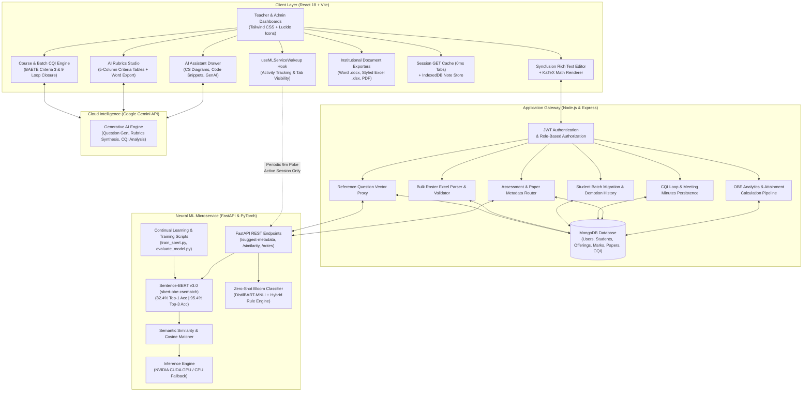
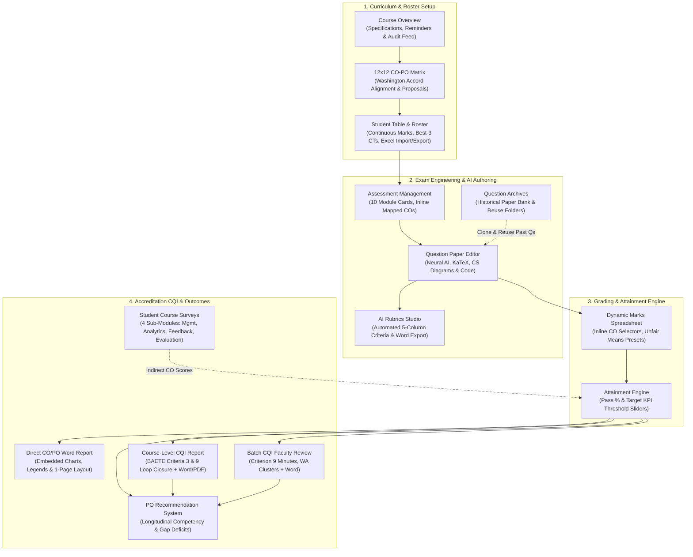
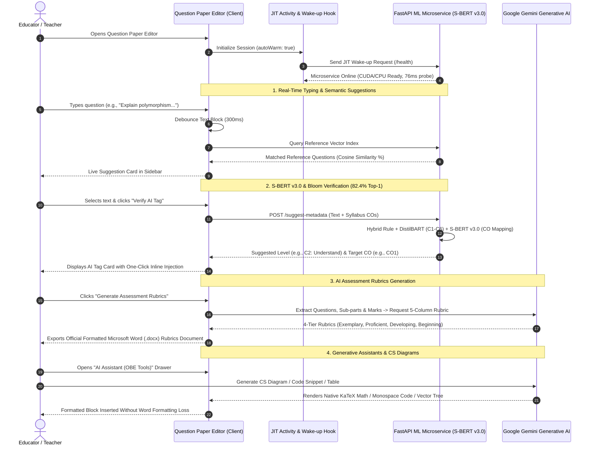
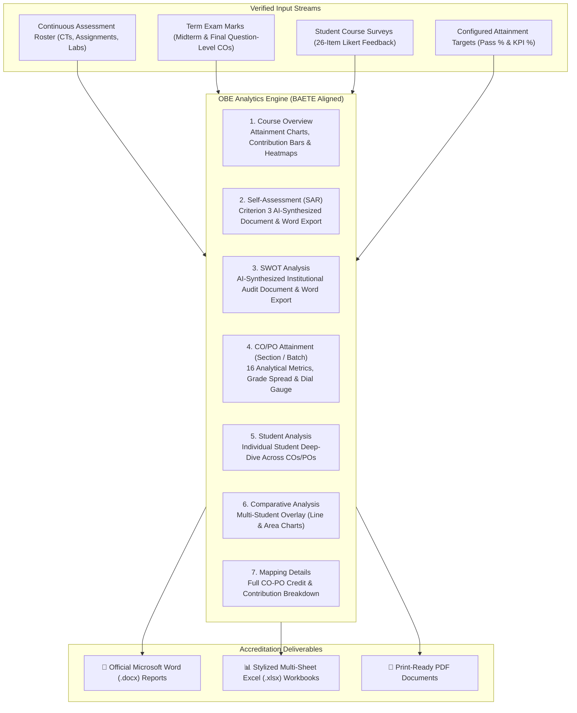
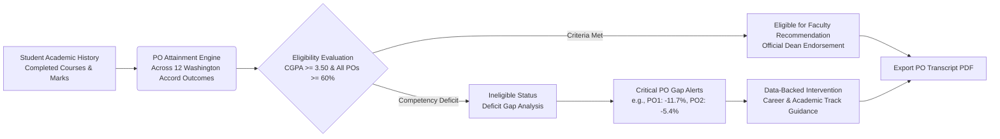
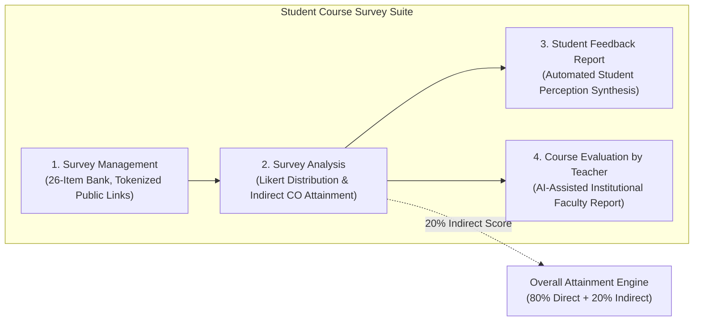
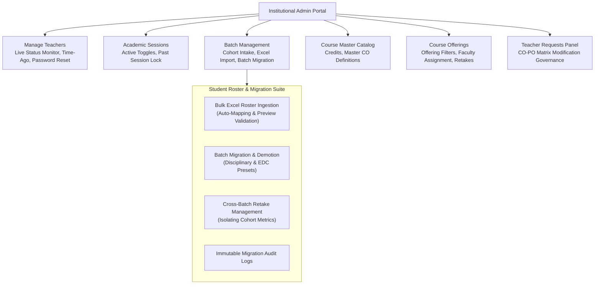

# 🎓 OBE Student Outcome Analyzer & AI Question Paper Intelligence

> **An Enterprise Outcome-Based Education (OBE) Management, Washington Accord Accreditation Analytics, and Neural AI-Powered Question Paper Engineering Platform.**  
> *Developed as a Bachelor Capstone Project for Higher Education & Engineering Accreditation Automation.*

[](https://sarkarjoy86.github.io/Student-Outcome-Analyzer/)
[](LICENSE)
[](https://reactjs.org/)
[](https://nodejs.org/)
[](https://fastapi.tiangolo.com/)
[](https://pytorch.org/)
[](https://huggingface.co/)
[](docs/system_architecture.md)
[](docs/system_architecture.md)
[](https://ai.google.dev/)

---

## 📌 Executive Overview

The **OBE Student Outcome Analyzer** is an enterprise-grade academic platform engineered for universities, engineering faculties, and educational institutions operating under the **Washington Accord / BAETE Accreditation Frameworks**. 

### 🚀 Ending the Era of Microsoft Word & Excel in Academia
In conventional university workflows, faculty members waste hundreds of hours every semester juggling disconnected, manual tools:
- **The Microsoft Word Nightmare**: Crafting exam papers in Microsoft Word is notoriously frustrating. Word automatically mangles code indentation, disrupts mathematical equation formatting, breaks tabular structures, and forces teachers to seek third-party websites to draw computer science trees and graphs—only to copy-paste blurry screenshots back into Word. Furthermore, tagging questions with Bloom's Taxonomy and Course Outcomes is completely manual, arbitrary, and error-prone.
- **The Microsoft Excel Fragility**: Computing Outcome-Based Education metrics in Excel spreadsheets leads to disaster: broken cell references (`#REF!`, `#VALUE!`), corrupted macro formulas, missed rows during student add/drop periods, and zero longitudinal tracking across semesters.

### 🌐 A Unified, All-in-One Academic Operating System
The **OBE Student Outcome Analyzer** completely eliminates the need for manual Word and Excel spreadsheets by providing a single, browser-based ecosystem that unifies the entire academic lifecycle:
1. **End-to-End Course & Roster Management**: Digital syllabus mapping, automated "Best 3 of 4" Class Test grading, dynamic inline Mapped CO selectors, continuous assessment spreadsheets, and stylized multi-sheet Excel exports.
2. **AI-Powered Question Paper Studio & Assessment Rubrics Generator**: Built-in rich text typesetting with native KaTeX mathematical equations, an integrated **CS Diagram Studio** (Trees, Graphs, State Machines), a **Code Snippet Editor with Smart Output Analyzer**, zero-shot neural AI verification for Bloom's Taxonomy (**C1–C6**) and Course Outcome (**CO1–CO12**) alignment, and automated **5-Column Outcome-Based Assessment Rubrics Generation** with native **Microsoft Word (.docx)** export.
3. **Sentence-BERT v3.0 Deep Learning Suite**: Domain-tuned neural matching engine trained on **2,260 authentic university examination questions** augmented to **7,006 training pairs**, achieving **82.4% Top-1 Accuracy** (+27.8% leap over baseline) and **95.4% Top-3 Accuracy**, evaluated against rigorous held-out test splits with zero overfitting and sub-second production inference.
4. **Accreditation-Grade Attainment & CQI Engine (BAETE Criteria 3 & 9)**: Real-time direct and indirect attainment computations with zero formula drift, full-cohort heatmaps, multi-student comparative benchmarks, **Course-Level Continuous Quality Improvement (CQI) Action Reports**, **Batch CQI Faculty Review & Meeting Minutes**, automated **Self-Assessment Reports (SAR)**, and **Student PO Recommendation Transcripts**.
5. **Dual-Format Institutional Document Suite**: One-click generation of official, print-ready PDFs, native Microsoft Word (`.docx`) documents with institutional branding and running headers/footers, and stylized multi-sheet Excel (`.xlsx`) workbooks.
6. **Enterprise Student Governance & Batch Migration**: Secure batch-to-batch demotion and migration management with standardized institutional disciplinary presets (*Unfair Means in Examination, EDC Penalties, Academic Suspension*), complete historical audit trails, and bulk Excel roster onboarding.

### 🌐 Live Production Application
👉 **[Access the Deployed Web Application](https://sarkarjoy86.github.io/Student-Outcome-Analyzer/)**

---

## 🏛️ System Architecture

The platform operates on a resilient three-tier distributed architecture combining an offline-first Single Page Application (SPA), an Express.js enterprise API gateway, and an asynchronous Python FastAPI deep-learning microservice.


```mermaid
graph TB
    subgraph Client ["Client Layer (React 18 + Vite)"]
        UI["Teacher & Admin Dashboards\n(Tailwind CSS + Lucide Icons)"]
        RTE["Syncfusion Rich Text Editor\n+ KaTeX Math Renderer"]
        AIAssistant["AI Assistant Drawer\n(CS Diagrams, Code Snippets, GenAI)"]
        RubricsEngine["AI Rubrics Studio\n(5-Column Criteria Tables + Word Export)"]
        CQIEngine["Course & Batch CQI Engine\n(BAETE Criteria 3 & 9 Loop Closure)"]
        ExportHub["Institutional Document Exporters\n(Word .docx, Styled Excel .xlsx, PDF)"]
        Cache["Session GET Cache (0ms Tabs)\n+ IndexedDB Note Store"]
        WakeHook["useMLServiceWakeup Hook\n(Activity Tracking & Tab Visibility)"]
    end

    subgraph BackendGateway ["Application Gateway (Node.js & Express)"]
        AuthMiddleware["JWT Authentication\n& Role-Based Authorization"]
        OBERoutes["OBE Analytics & Attainment\nCalculation Pipeline"]
        ExamRoutes["Assessment & Paper Metadata Router"]
        CQIRoutes["CQI Loop & Meeting Minutes Persistence"]
        MigrationRoutes["Student Batch Migration & Demotion History"]
        ExcelImportRoutes["Bulk Roster Excel Parser & Validator"]
        NotesRoutes["Reference Question Vector Proxy"]
        MongoDB[("MongoDB Database\n(Users, Students, Offerings, Marks, Papers, CQI)")]
    end

    subgraph MLMicroservice ["Neural ML Microservice (FastAPI & PyTorch)"]
        MLRouter["FastAPI REST Endpoints\n(/suggest-metadata, /similarity, /notes)"]
        SBERTV3["Sentence-BERT v3.0 (sbert-obe-csematch)\n(82.4% Top-1 Acc | 95.4% Top-3 Acc)"]
        ZeroShot["Zero-Shot Bloom Classifier\n(DistilBART-MNLI + Hybrid Rule Engine)"]
        VectorMatch["Semantic Similarity & Cosine Matcher"]
        ContinualPipeline["Continual Learning & Training Scripts\n(train_sbert.py, evaluate_model.py)"]
        HardwareEngine["Inference Engine\n(NVIDIA CUDA GPU / CPU Fallback)"]
    end

    subgraph CloudAI ["Cloud Intelligence (Google Gemini API)"]
        GeminiEngine["Generative AI Engine\n(Question Gen, Rubrics Synthesis, CQI Analysis)"]
    end

    UI --> RTE
    UI --> AIAssistant
    UI --> RubricsEngine
    UI --> CQIEngine
    UI --> ExportHub
    UI --> Cache
    UI --> WakeHook
    RTE <--> AuthMiddleware
    AIAssistant <--> CloudAI
    RubricsEngine <--> CloudAI
    CQIEngine <--> CloudAI
    WakeHook -.->|Periodic 9m Poke\nActive Session Only| MLRouter
    AuthMiddleware --> OBERoutes
    AuthMiddleware --> ExamRoutes
    AuthMiddleware --> CQIRoutes
    AuthMiddleware --> MigrationRoutes
    AuthMiddleware --> ExcelImportRoutes
    AuthMiddleware --> NotesRoutes
    OBERoutes <--> MongoDB
    ExamRoutes <--> MongoDB
    CQIRoutes <--> MongoDB
    MigrationRoutes <--> MongoDB
    ExcelImportRoutes <--> MongoDB
    NotesRoutes <--> MongoDB
    ExamRoutes <--> MLRouter
    NotesRoutes <--> MLRouter
    MLRouter --> SBERTV3
    MLRouter --> ZeroShot
    SBERTV3 --> VectorMatch
    VectorMatch --> HardwareEngine
    ContinualPipeline -.-> SBERTV3
```

---

## 👨‍🏫 1. Teacher Dashboard & Course Workspaces

The **Teacher Dashboard** guides instructors through four sequential academic phases, matching the modular structure of institutional accreditation workflows.


```mermaid
graph TB
    subgraph Phase1 ["1. Curriculum & Roster Setup"]
        Overview["Course Overview\n(Specifications, Reminders & Audit Feed)"]
        COPO["12x12 CO-PO Matrix\n(Washington Accord Alignment & Proposals)"]
        Roster["Student Table & Roster\n(Continuous Marks, Best-3 CTs, Excel Import/Export)"]
    end

    subgraph Phase2 ["2. Exam Engineering & AI Authoring"]
        Assessments["Assessment Management\n(10 Module Cards, Inline Mapped COs)"]
        Archives["Question Archives\n(Historical Paper Bank & Reuse Folders)"]
        Editor["Question Paper Editor\n(Neural AI, KaTeX, CS Diagrams & Code)"]
        Rubrics["AI Rubrics Studio\n(Automated 5-Column Criteria & Word Export)"]
    end

    subgraph Phase3 ["3. Grading & Attainment Engine"]
        Marks["Dynamic Marks Spreadsheet\n(Inline CO Selectors, Unfair Means Presets)"]
        Attainment["Attainment Engine\n(Pass % & Target KPI Threshold Sliders)"]
    end

    subgraph Phase4 ["4. Accreditation CQI & Outcomes"]
        DirectWord["Direct CO/PO Word Report\n(Embedded Charts, Legends & 1-Page Layout)"]
        CourseCQI["Course-Level CQI Report\n(BAETE Criteria 3 & 9 Loop Closure + Word/PDF)"]
        BatchCQI["Batch CQI Faculty Review\n(Criterion 9 Minutes, WA Clusters + Word)"]
        PORec["PO Recommendation System\n(Longitudinal Competency & Gap Deficits)"]
        Surveys["Student Course Surveys\n(4 Sub-Modules: Mgmt, Analytics, Feedback, Evaluation)"]
    end

    Overview --> COPO
    COPO --> Roster
    Roster --> Assessments
    Assessments --> Editor
    Editor --> Rubrics
    Archives -.->|Clone & Reuse Past Qs| Editor
    Editor --> Marks
    Marks --> Attainment
    Attainment --> DirectWord
    Attainment --> CourseCQI
    Attainment --> BatchCQI
    Attainment --> PORec
    Surveys -.->|Indirect CO Scores| Attainment
    CourseCQI --> PORec
    BatchCQI --> PORec
```

### 1.1 Course Overview & Live Activity Monitor
- **Course Specifications**: Highlights active academic session (e.g., *Spring 2026*), batch, section (*Section B*), credits (*3 Credit Hours*), level/term (*Level 2, Term II*), and mapped CO count.
- **Actionable Course Reminders**: Surfaces pending academic deadlines, missing marks entries (e.g., *Pending Marks: CT-2 [Required]* with direct navigation links), upcoming presentation dates, and overdue submissions.
- **Assessment Module Summary**: Tabulates all 10 configured evaluation modules with creation dates, max marks, question counts, exam durations, and status badges (**Assigned** / **Evaluated**).
- **Audit Activity Feed**: Displays real-time chronological logs of recent changes made to question papers, assessments, and marks sheets.

---

### 1.2 Interactive 12×12 CO-PO Mapping Matrix
- **Washington Accord Criteria Alignment**: Maps Course Outcomes (**CO1–CO12**) against all 12 Washington Accord Program Outcomes:
  - **PO1**: Engineering Knowledge
  - **PO2**: Problem Analysis
  - **PO3**: Design/Development of Solutions
  - **PO4**: Investigation
  - **PO5**: Modern Tool Usage
  - **PO6**: The Engineer and Society
  - **PO7**: Environment and Sustainability
  - **PO8**: Ethics
  - **PO9**: Individual and Team Work
  - **PO10**: Communication
  - **PO11**: Project Management and Finance
  - **PO12**: Life-long Learning
- **Standardized Dark-Green Matrix Styling**: High-contrast, accessibility-checked emerald palette for active mapping indicators.
- **Administrative Governance Workflow**: Teachers can submit mapping proposals (`Propose Mappings / Add CO`), triggering an audit request for Department Head / Dean review before updating institutional records.

---

### 1.3 Continuous Assessment Student Table & Excel Suite
- **Comprehensive Roster View**: Lists all enrolled students with Roll ID and Student Name alongside continuous evaluation columns (CT-1, CT-2, CT-3, Extra CT-4, Assignment-1, Attendance, Class Performance, Presentation) and Term Exams (Mid Term, Final).
- **Automated "Best 3 of 4" CT Calculation**: Dynamically identifies and highlights the top three Class Test scores, calculating the **Best CT Total (Max: 30)** automatically on the fly.
- **Stylized Excel Export Engine**: Exports the complete student roster with custom header fills, formatted borders, exact column auto-sizing, and calculated totals using `xlsx-js-style`.
- **Full-Screen Capability**: Dedicated full-screen toggle allows distraction-free verification of large class rosters with both horizontal and vertical virtual scrolling.

---

### 1.4 Assessment Management & Dynamic Inline Mapped CO Dropdown
- **Modular Assessment Cards**: Individual cards for every assessment displaying max marks, duration, question count, mapped COs, and evaluation status badges.
- **Dynamic Inline Mapped CO Dropdown**: Directly assign and switch mapped Course Outcomes for direct-marks assessments (Class Tests, Assignments, Presentations) via an inline selector without navigating away.
- **Extra CT Replacement Mapping**: Special support for makeup tests (e.g., *Extra CT-4*), allowing teachers to explicitly designate a **Mapped Target (e.g., CT-2)** to seamlessly replace a missed or poor score without corrupting previous grade history.
- **Direct Editor Launch**: Integrated `Open Q.Paper` action opens the AI Question Paper Editor pre-loaded with the assessment's metadata.

---

### 1.5 Question Archives & Paper Reuse Bank
- **Categorized Question Repository**: Organizes past semester exam papers into folders by category (**Assignment-1, CTs, Mid Term, Final, Presentation**) with historical session counters.
- **Instant Search & Reuse**: Allows instructors to review, search, and clone previously validated questions to save preparation time across academic terms.

---

### 1.6 Dynamic Marks Entry Spreadsheet
- **Spreadsheet-Style Grid**: Excel-like fast entry interface with keyboard navigation (`Enter`, `Tab`, arrow keys).
- **Dynamic Inline CO Selectors**: Easily modify question-level or assessment-level CO associations directly within the header cells.
- **Vertical CO/PO Labels**: Clean, rotated column headers optimize horizontal screen real estate for wide multi-question examination spreadsheets.
- **Dynamic Calculation & Validation**: Validates marks against maximum boundaries with instant row summing and a **Fully Entered** completion badge.
- **Draft Auto-Recovery**: Prevents accidental data loss by caching uncommitted edits in browser storage, prompting teachers with a *Restored draft marks* notification and one-click discard option.
- **Multi-Mode Input**: Supports both **Total Marks (Single Entry)** and **Question-by-Question** granular score entry.
- **Resilient 0% Score & Unfair Means Presets**: Accurately computes attainment brackets when students receive zero marks due to absence or exam penalties without dividing by zero.

---

### 1.7 Attainment Threshold Sliders & Status Engine
- **Interactive KPI Threshold Sliders**:
  - **Target Pass Marks (%)**: Configurable pass benchmark (default: 40%).
  - **CO Attainment Target KPI (%)**: Percentage of students required to pass for CO achievement (default: 50%).
  - **PO Attainment Target KPI (%)**: Target attainment percentage for program outcomes (default: 50%).
- **Live Status Badges**: Evaluates class scores in real-time, displaying green **Attained** or red **Not Attained** badges across all COs (CO1–CO6) and POs (PO1–PO12).
- **Mini Slider Chart Toggles**: Quick-toggle switches on Recharts bar graphs allow rapid toggling between active-only outcomes and full 12-outcome perspectives.

---

## 🤖 2. Flagship AI Question Paper Engineering Suite

The **Question Paper Editor** is an end-to-end academic authoring environment that replaces Microsoft Word with specialized deep-learning NLP models, automated rubrics generation, and generative design tools built directly into the rich text canvas.


```mermaid
sequenceDiagram
    autonumber
    actor Teacher as Educator / Teacher
    participant Editor as Question Paper Editor (Client)
    participant WakeHook as JIT Activity & Wake-up Hook
    participant LocalML as FastAPI ML Microservice (S-BERT v3.0)
    participant CloudAI as Google Gemini Generative AI

    Teacher->>Editor: Opens Question Paper Editor
    Editor->>WakeHook: Initialize Session (autoWarm: true)
    WakeHook->>LocalML: Send JIT Wake-up Request (/health)
    LocalML-->>WakeHook: Microservice Online (CUDA/CPU Ready, 76ms probe)
    
    Note over Editor,LocalML: 1. Real-Time Typing & Semantic Suggestions
    Teacher->>Editor: Types question (e.g., "Explain polymorphism...")
    Editor->>Editor: Debounce Text Block (300ms)
    Editor->>LocalML: Query Reference Vector Index
    LocalML-->>Editor: Matched Reference Questions (Cosine Similarity %)
    Editor-->>Teacher: Live Suggestion Card in Sidebar

    Note over Editor,LocalML: 2. S-BERT v3.0 & Bloom Verification (82.4% Top-1)
    Teacher->>Editor: Selects text & clicks "Verify AI Tag"
    Editor->>LocalML: POST /suggest-metadata (Text + Syllabus COs)
    LocalML->>LocalML: Hybrid Rule + DistilBART (C1-C6) + S-BERT v3.0 (CO Mapping)
    LocalML-->>Editor: Suggested Level (e.g., C2: Understand) & Target CO (e.g., CO1)
    Editor-->>Teacher: Displays AI Tag Card with One-Click Inline Injection

    Note over Editor,CloudAI: 3. AI Assessment Rubrics Generation
    Teacher->>Editor: Clicks "Generate Assessment Rubrics"
    Editor->>CloudAI: Extract Questions, Sub-parts & Marks -> Request 5-Column Rubric
    CloudAI-->>Editor: 4-Tier Rubrics (Exemplary, Proficient, Developing, Beginning)
    Editor-->>Teacher: Exports Official Formatted Microsoft Word (.docx) Rubrics Document

    Note over Editor,CloudAI: 4. Generative Assistants & CS Diagrams
    Teacher->>Editor: Opens "AI Assistant (OBE Tools)" Drawer
    Teacher->>CloudAI: Generate CS Diagram / Code Snippet / Table
    CloudAI-->>Editor: Renders Native KaTeX Math / Monospace Code / Vector Tree
    Editor-->>Teacher: Formatted Block Inserted Without Word Formatting Loss
```

---

### 2.1 Local Neural ML Intelligence Suite (Sentence-BERT v3.0)

The cornerstone of the platform's intelligence is a dedicated, local Python microservice powered by **PyTorch**, **FastAPI**, and **Sentence-Transformers**, accelerated via NVIDIA CUDA GPUs (with automatic CPU fallback).

#### 1. Domain-Specific Training Dataset (2,260 Authentic Questions Augmented to 7,006 Pairs)
- **Domain-Specific Fine-Tuning Dataset**:
  - Rather than relying on generic pre-trained NLP models, our Sentence-BERT model (`sbert-obe-csematch` v3.0) was specifically fine-tuned on authentic university engineering examinations.
  - Collected a corpus of **2,260 authentic university examination questions** across core Computer Science courses:
    - *CSE 443 (Digital Image Processing)*
    - *CSE 315 (Computer Architecture & Design)*
    - *CSE 313 (Database Management Systems)*
    - *CSE 327 (Computer Networks)*
    - *CSE 317 (Software Engineering & Design Patterns)*
  - Applied academic domain-specific data augmentation to expand the dataset to **7,006 training pairs** (spanning 7,009 rows across 212 distinct Course+CO groups), optimizing normalized cosine similarity against syllabus Course Outcome descriptions.
  - The fine-tuned model consistently achieves higher cosine alignment scores and superior accuracy compared to the generic base model (`all-MiniLM-L6-v2`).

#### 2. Sentence-BERT v3.0 Milestone: Empirical Benchmark Results
Evaluated across a standardized 500-sample test cohort against the industry standard base model (`sentence-transformers/all-MiniLM-L6-v2`), **S-BERT v3.0 delivers transformative gains**:

| Evaluation Metric | Base Model (`all-MiniLM-L6-v2`) | Fine-Tuned Model (`sbert-obe-csematch` v3.0) | Absolute Improvement | Relative Gain |
| :--- | :---: | :---: | :---: | :---: |
| **Top-1 Accuracy** | `54.6%` | **`82.4%`** | **`+27.8%`** | **`+50.9%`** 🚀 |
| **Top-3 Accuracy** | `88.6%` | **`95.4%`** | **`+6.8%`** | **`+7.7%`** |
| **Macro Precision** | `47.8%` | **`75.8%`** | **`+28.0%`** | **`+58.6%`** |
| **Macro Recall** | `48.7%` | **`86.5%`** | **`+37.8%`** | **`+77.6%`** 🚀 |
| **Macro F1-Score** | `47.9%` | **`79.6%`** | **`+31.7%`** | **`+66.2%`** |
| **Weighted Precision** | `54.8%` | **`82.8%`** | **`+28.0%`** | **`+51.1%`** |
| **Weighted Recall** | `54.6%` | **`82.4%`** | **`+27.8%`** | **`+50.9%`** |
| **Weighted F1-Score** | `54.5%` | **`82.4%`** | **`+27.9%`** | **`+51.2%`** |
| **Mean Positive Similarity** | `0.346` | **`0.515`** | `+0.169` | `+48.8%` |
| **Mean Negative Similarity** | `0.256` | **`0.301`** | `+0.045` | `+17.6%` |
| **Semantic Margin (Separation)** | `0.089` | **`0.214`** | **`+0.125`** | **`2.40x Higher Margin`** 🎯 |

#### 3. Generalization on Unseen Courses (Chapter 7 Held-Out Split)
To rigorously test against data leakage or rote memorization, **10% of Course+CO groups were completely held out** from training (622 total rows across 21 groups and 20 distinct courses, seed 42):
- **Held-Out Top-1 Accuracy**: **`63.2%`** (vs 57.9% base model)
- **Held-Out Original Questions Top-1**: **`64.8%`** (vs 59.8% base model)
- **Held-Out Mean Reciprocal Rank (MRR)**: **`0.791`** (vs 0.766 base model)
- **Semantic Discrimination**: Paraphrase pairs achieve **`0.404 ± 0.272`** cosine similarity, while unrelated inter-course questions drop to **`0.016 ± 0.108`** (near zero), proving genuine semantic comprehension.

#### 4. Production Latency & Ultralight Resource Footprint
Benchmarked on live production deployment:
- **Cold-Start Probe (`GET /health`)**: **`76 ms`** (instant health ping)
- **First Inference After Wake-up (`POST /suggest-metadata`)**: **`1.75 s`** mean latency
- **Similarity Check (`POST /similarity-check`)**: **`4.08 s`** for full multi-question paper scanning
- **Memory Consumption**: Idle RSS of **`84.6 MB`**, peaking at only **`109.9 MB`** under active concurrent load—allowing effortless operation within free-tier container limits.

#### 5. Cognitive Domain Classification (Bloom's Taxonomy C1–C6)
- **Hybrid Rule + Zero-Shot Engine**: A high-precision regex action-verb classifier fires first (**69.5% real-exam question coverage** with **55.9% standalone accuracy**), falling back smoothly to Zero-Shot Classification (`valhalla/distilbart-mnli-12-3`).
- **Cognitive Tiers Supported**: **C1 (Remember)**, **C2 (Understand)**, **C3 (Apply)**, **C4 (Analyze)**, **C5 (Evaluate)**, and **C6 (Create)**.
- **Inline Non-Destructive Tagging**: Inserts formatted `[COx→Cy]` badges directly into the active editor paragraph or table cell with automated font inheritance.

#### 6. Sentence-BERT Exam Paper Similarity Analyzer
- Computes high-dimensional semantic embeddings across all questions in the current draft paper.
- Performs bidirectional cosine similarity checks against:
  - **Current Semester Drafts** (preventing accidental duplicate questions across midterm and final assessments).
  - **Historical Archived Exams** from preceding semesters stored in MongoDB.
- Generates side-by-side comparison modals with match percentage tags (e.g., *94% Match with Spring 2025 Midterm*) to guarantee examination novelty.

#### 7. Real-Time Reference Questions Live Suggestion Engine
- **How It Works**:
  - Instructors pre-upload reference lecture notes, slide decks, or question banks into the course workspace.
  - As the instructor types, capture-phase listeners detect the active paragraph and debounce input after a 300ms pause.
  - The S-BERT vector engine instantly queries the pre-indexed reference notes.
  - Highly relevant reference questions appear dynamically in the right-hand sidebar card with similarity percentage badges.
- **Dual-Layer Search Architecture**:
  - **Instant 0ms In-Memory Search**: Scans local candidate questions without waiting for network roundtrips.
  - **Background Resilient Vector Sync**: Silently re-uploads document binary blobs from browser `IndexedDB` to the microservice if cloud containers restart during idle periods.

#### 8. Smart Cloud Resource & Activity Keep-Alive Engine
- **Single Unified Dark-Green Notification**: During cold-starts, displays a single unified dark-emerald card (`bg-emerald-950/95 text-emerald-100 border-emerald-400/60`) informing educators that neural models are loading (~20–30s), cleanly transforming into a confirmation checkmark upon completion.
- **Zero-Overhead Activity Detection**: Uses passive capture listeners on `window` and `document` for `pointerdown`, `keydown`, `scroll`, and `wheel` throttled to 15-second write intervals (0% CPU impact, 60/120 FPS buttery-smooth typing and scrolling).
- **5-Minute Inactivity Threshold**: If the teacher does not click, type, or scroll for $\ge 5$ minutes, keep-alive heartbeats are paused. Combined with Render's 15-minute sleep policy, the container sleeps within a maximum of **20 minutes total**, saving hundreds of free-tier compute hours monthly.
- **Tab Visibility Pause**: When switching to other browser tabs, heartbeats pause immediately. Returning within 15 minutes seamlessly refreshes the session without cold-starts.

---

### 2.2 AI-Powered Assessment Rubrics Generator & MS Word (.docx) Exporter

Outcome-based education accreditation requires rigorous grading rubrics for all formal examinations. Crafting rubrics manually in Word or Excel takes hours of tedious formatting. The **AI Rubrics Studio** automates this entirely:

1. **Intelligent Question Decomposition**: Parses the current Question Paper canvas, extracting question numbers, titles, sub-parts, scenario prompts, code snippets, and mark weights.
2. **Pedagogical 4-Tier Rubric Matrix**: Synthesizes 5-column outcome-based rubrics adhering to university faculty accreditation guidelines:
   - **Column 1: Assessment Criteria & Sub-Outcome**
   - **Column 2: Exemplary / Mastery (Tier 4, 80–100% Marks)**: Flawless technical implementation, exhaustive analysis, optimal computational complexity.
   - **Column 3: Proficient / Accomplished (Tier 3, 60–79% Marks)**: Correct conceptual approach, minor syntactical or procedural omissions.
   - **Column 4: Developing / Marginal (Tier 2, 40–59% Marks)**: Basic understanding shown, but significant logical gaps or incomplete calculations.
   - **Column 5: Beginning / Unacceptable (Tier 1, 0–39% Marks)**: Fails to address core problem, major misconceptions, or blank submission.
3. **Parallel Batching & Quote Repair**: Uses parallel chunk processing and JSON quote sanitization to handle complex, multi-question exam papers with embedded code and mathematical equations without truncation or API timeouts.
4. **Native Microsoft Word (.docx) Export**:
   - Institutional banner with dark-green branding (`#064e3b`).
   - Complete exam metadata table (Course Code, Title, Department, Credit Hours, Exam Duration, Total Marks).
   - High-contrast, publication-quality 5-column criteria tables.
   - Native Word running footers with dynamic page numbers (`Page X of Y`).
   - Formal sign-off signature blocks for Course Teacher and Examination Committee Chairman.

---

### 2.3 Generative AI Creation Tools (OBE Tools Drawer)

Accessed through the **AI Assistant (OBE Tools)** drawer, these tools combine custom algorithms and generative models to handle complex technical typesetting.

- 📈 **CS Diagram Studio** *(Flagship Tool for Computer Science & Engineering)*:
  - **Ending External Website Dependency**: In standard exam preparation, CS teachers are forced to leave Word, navigate to external diagram websites, draw trees or graphs, take screenshots, and paste low-res images into their questions.
  - **Native Vector Diagrams**: Directly inside the editor, instructors can generate and embed:
    - **Tree Structures**: Binary Search Trees, AVL Trees, B-Trees, Heap Trees.
    - **Graph Theory**: Directed, undirected, weighted, and cyclic/acyclic graphs.
    - **State Transition Diagrams**: Deterministic & Non-Deterministic Finite Automata (DFA/NFA).
    - **Flow Maps & Circuits**: Logic circuit diagrams and algorithm flowcharts.
  - Diagrams render with crisp vector lines that scale perfectly on high-resolution printouts and exported documents.
- 💻 **Code Snippet Editor with Smart Output Analyzer**:
  - **Ending the Word Formatting Mess**: Microsoft Word automatically capitalizes code keywords (`While`, `For`), strips leading spaces, and destroys monospace fonts.
  - **Preserved Code Blocks**: Custom code container supporting **C, C++, Java, Python, and Pseudocode** with preserved indentation, syntax coloring, and line numbers.
  - **Smart Output Analyzer**: Evaluates code logic, simulates runtime execution, and displays step-by-step variable traces and final console output to help teachers design robust output-prediction exam problems.
- 📝 **Automated Question Gen**: Generates high-quality exam questions tailored to specific course topics, target marks, and designated Bloom cognitive tiers.
- 📊 **Automated Data Table**: Automatically constructs academic tables, truth tables, and comparison grids without manual HTML formatting.
- 🧮 **Math Equation Editor**: Built-in visual equation composer with native **KaTeX** rendering for complex inline and display mathematical formulas (`\( ... \)`, `$$ ... $$`).
- 📄 **Paper Structure Builder**: Generates institutional exam headers, instructions to candidates, time limits, total marks, and section partitions with one click.

---

### 2.4 Text Refinement Suite (Powered by Google Gemini AI API)
When instructors highlight drafted text, the **Text Refinement** menu provides one-click AI polishing:
- ✨ **Improve Content**: Enhances academic clarity and vocabulary.
- 📝 **Shorten**: Condenses lengthy prompts to fit exam page constraints.
- 📖 **Elaborate**: Expands short questions into comprehensive problem statements.
- 📋 **Summarize**: Synthesizes case studies into digestible problem summaries.
- ✅ **Check Grammar & Spelling**: Corrects typos and grammatical irregularities.
- 🎭 **Change Tone**: Shifts prompts between formal academic, technical, or exploratory phrasing.
- 🎨 **Change Style**: Adapts question tone for undergraduate vs postgraduate assessments.
- 🌐 **Translate**: Multilingual translation for bilingual academic examination papers.

---

## 📈 3. Automated OBE Reports & Accreditation Intelligence

The **Automated OBE Reports** module is an enterprise Continuous Quality Improvement (CQI) platform designed in strict accordance with **BAETE (Board of Accreditation for Engineering and Technical Education)** Manual guidelines and **Washington Accord** accreditation criteria.

### 📊 Why This Automated Engine Surpasses Microsoft Excel
- **Zero Calculation Breakage**: Excel spreadsheets rely on fragile cell formulas like `=SUM(C4:C29)` that silently corrupt when rows are inserted or students add/drop courses. Our engine computes directly from validated relational MongoDB schemas with deterministic validation and zero missed rows.
- **Accurate Chart Mapping**: Unlike Excel graphs that frequently drop data series or truncate low scores, our system maps every student mark directly to the corresponding Course Outcome with 100% data fidelity.
- **Unified CQI Audit Artifacts**: Produces accreditation-ready reports covering section-level metrics, multi-student benchmarks, individual heatmaps, automated **Self-Assessment Reports (SAR)**, and **SWOT Analysis** documentation in **Print-Ready PDF**, **Official Word (.docx)**, and **Institutional Excel (.xlsx)** formats.


```mermaid
flowchart TD
    subgraph DataInputs ["Verified Input Streams"]
        ContinuousMarks["Continuous Assessment Roster (CTs, Assignments, Labs)"]
        ExamMarks["Term Exam Marks (Midterm & Final Question-Level COs)"]
        SurveyScores["Student Course Surveys (26-Item Likert Feedback)"]
        TargetKPIs["Configured Attainment Targets (Pass % & KPI %)"]
    end

    subgraph CoreEngine ["OBE Analytics Engine (BAETE Aligned)"]
        CourseOverviewTab["1. Course Overview\nAttainment Charts, Contribution Bars & Heatmaps"]
        SARSubTab["2. Self-Assessment (SAR)\nCriterion 3 AI-Synthesized Document & Word Export"]
        SWOTSubTab["3. SWOT Analysis\nAI-Synthesized Institutional Audit Document & Word Export"]
        SectionAnalysisTab["4. CO/PO Attainment (Section / Batch)\n16 Analytical Metrics, Grade Spread & Dial Gauge"]
        StudentAnalysisTab["5. Student Analysis\nIndividual Student Deep-Dive Across COs/POs"]
        ComparativeTab["6. Comparative Analysis\nMulti-Student Overlay (Line & Area Charts)"]
        MappingTab["7. Mapping Details\nFull CO-PO Credit & Contribution Breakdown"]
    end

    subgraph ExportSuite ["Accreditation Deliverables"]
        WordExport["📄 Official Microsoft Word (.docx) Reports"]
        ExcelExport["📊 Stylized Multi-Sheet Excel (.xlsx) Workbooks"]
        PDFExport["📑 Print-Ready PDF Documents"]
    end

    ContinuousMarks --> CoreEngine
    ExamMarks --> CoreEngine
    SurveyScores --> CoreEngine
    TargetKPIs --> CoreEngine
    CoreEngine --> WordExport
    CoreEngine --> ExcelExport
    CoreEngine --> PDFExport
```

---

### 3.1 BAETE Accreditation Manuals Compliance Matrix

All calculation algorithms, distribution thresholds, and outcome-mapping models within this hub are engineered and calibrated in strict compliance with the **Board of Accreditation for Engineering and Technical Education (BAETE), Bangladesh** (signatory of the **Washington Accord**):

| Manual Code | Document Title | System Implementation & Accreditation Role |
| :--- | :--- | :--- |
| **ACC-MAN-00-F** | *Master Reference Manual* | Establishes the centralized architectural baseline for all Outcome-Based Education (OBE) documentation and Continuous Quality Improvement (CQI) evidence. |
| **ACC-MAN-01-F** | *Accreditation Policy* | Enforces objective, transparent, and reproducible assessment criteria across all course offerings, eliminating discretionary grading bias. |
| **ACC-MAN-02-F** | *Accreditation Criteria* | **Core Engine Driver (Criterion 2, 3 & 9):** Powers curriculum-to-outcome mapping, student attainment evaluation, dynamic KPI benchmark tracking, and CQI intervention loops. |
| **ACC-MAN-03-F** | *Program-Specific Criteria* | Implements discipline-specific competency matrices, verifying that course-level outcomes satisfy specialized engineering domain standards. |
| **ACC-MAN-04-F** | *Accreditation Procedure* | Generates tamper-proof, auditable figures and tables required for departmental Self-Assessment Reports (SAR) and institutional submissions. |
| **ACC-MAN-05-F** | *Program Evaluation Team Guidelines* | Equips external evaluation teams and visiting evaluators with instant, transparent visual charts, student distribution metrics, and drill-down audit heatmaps. |
| **ACC-MAN-06-F** | *Definitions and Acronyms* | Adheres strictly to official OBE taxonomy and standardized mathematical definitions for COs, POs, Attainment Thresholds, and Target KPIs. |

---

### 3.2 Deep Dive into the 7 Core Report Tabs

The **Automated OBE Reports** module is structured into seven sequential, audit-ready tabs reflecting the complete institutional accreditation workflow:

#### Tab 1: Course Overview Sub-Page (Visual Hub)
1. **Course Outcomes (COs) Attainment Bar Chart**: Side-by-side vertical dual-bar chart showing actual percentage of students surpassing the Pass Mark vs. the Target KPI threshold.
2. **CO Student Distribution Stacked Bar Chart**: Tri-band performance breakdown per CO:
   - 🔴 **Below 40% (At-Risk Students)**: Identifies students requiring immediate remedial clinic sessions.
   - 🟠 **40% – 79% (Competent Students)**: The steady cohort meeting baseline course goals.
   - 🟢 **$\ge$ 80% (Exemplary High Achievers)**: Identifies candidates for research projects or teaching assistantships.
3. **Program Outcomes (POs) Attainment Bar Chart**: Translates course marks into 12 Washington Accord graduate attributes.
4. **PO Contribution Horizontal Bar Chart**: Dissects how much weight each individual CO contributed toward each Program Outcome.
5. **Full-Cohort Attainment Heatmaps**: Micro-level matrix color-coding every student's achievement across all COs and POs with frozen sticky headers for seamless scrolling.
6. **Integrated Course-Level CQI Action Report**: Embedded view of Section 9.2 Continuous Quality Improvement loop closure.

#### Tab 2: Self-Assessment Report (SAR) Sub-Page
- **Criterion 3 Compliance Synthesis**: Dynamically generates institutional Self-Assessment documentation required by external accreditation review boards.
- **Structured Curriculum Mapping**: Outlines course learning objectives, contact hours, assessment breakdowns, and detailed mathematical justifications for CO-to-PO alignments.
- **Attainment Evidence & Performance Tiers**: Tabulates empirical student achievement against benchmarks, ready for departmental archiving.
- **One-Click Official Word (.docx) Export**: Exports complete SAR artifacts with university branding, formal headers, and reviewer sign-off tables.

#### Tab 3: AI-Powered SWOT Analysis Sub-Page
- **Empirical SWOT Synthesis**: Automatically generates an institutional SWOT matrix derived directly from verified student grades:
  - **Strengths**: Course Outcomes with attainment crossing faculty KPI thresholds.
  - **Weaknesses**: Course Outcomes with high failure concentrations or marginal pass rates.
  - **Opportunities**: Actionable curricular adjustments, revised lab tutorials, and refined question taxonomies.
  - **Threats**: Accreditation risks under Washington Accord guidelines if deficits persist unaddressed across cohorts.
- **Word Document Exporter**: Downloads formatted SWOT summaries for academic council and accreditation reviews.

#### Tab 4: CO/PO Attainment (Section / Combined Batch) Sub-Page
- **Section & Combined Batch Toggle**: Analyze a specific cohort (*Section B*) or aggregate across the entire academic batch.
- **16 Statistical Performance Indicators**: Grade spread (A+ to F), assessment pass rates, standard deviations, and median scores.
- **Overall Academic Performance Gauge**: Radial percentage dial depicting general class mastery.
- **Top 10 Performers vs. Most At-Risk Students**: Automatically filters top achievers alongside lowest-scoring students, highlighting specific deficient COs for targeted tutoring.
- **Teacher Reflection & Actionable Observations**: Dedicated text editor for faculty to record semester observations, continuous quality improvement plans, and accreditation notes.

#### Tab 5: Student Analysis Sub-Page
- Provides a microscopic profile of any selected student, graphing their personal CO and PO attainment percentages across all continuous and term assessments.

#### Tab 6: Comparative Analysis Sub-Page
- Allows instructors to select multiple students simultaneously to compare their mastery side-by-side.
- Rendered through **Area Charts and Multi-Line Charts**, showing where specific students excelled or lagged relative to their peers.

#### Tab 7: Mapping Details Sub-Page
- Displays the complete mathematical matrix of CO-to-PO weights, contact hours, and percentage contributions toward departmental accreditation.

---

### 3.3 Direct Measurements of COs and POs Report (Native Word .docx Export)
- **High-Fidelity Document Generation**: Generates official institutional Word reports (`exportCOPOWordReport`) designed to fit onto a single, publication-quality page.
- **Embedded Recharts Graphics**: Automatically clones and renders live Recharts bar charts into high-resolution images embedded directly within the document body.
- **Sanitized Native Legends**: Replaces standard HTML legend elements with crisp, colored Unicode square boxes (■) to guarantee crisp typography across all versions of Microsoft Word.
- **Structured Metadata & Grade Breakdown**: Includes course code, semester, academic year, target thresholds, and complete tabulated attainment percentages.
- **Institutional Signature Block**: Dual-signature table for Course Instructor and Head of Department with dedicated date and endorsement cells.

---

### 3.4 Course-Level Continuous Quality Improvement (CQI) Action Report
Engineered to fulfill **BAETE Criterion 9.2 (Continuous Quality Improvement at Course Level)**:
- **Automated Deficit Detection**: Compares empirical student marks against configured Target KPIs ($Pass \% = 40\%$, $Target KPI = 50\%$) to identify deficient outcomes.
- **AI-Driven Pedagogical Remediation (`cqiAiService.js`)**: Evaluates underlying examination questions mapped to failing COs/POs and generates actionable curricular interventions (e.g., *lab tutorial restructuring, revised problem-solving rubrics, hands-on tool practicals*).
- **Subsequent Term Milestones**: Recommends concrete milestones for the upcoming semester (e.g., *Spring 2027*) with accountable faculty roles.
- **Closing-the-Loop Quantitative Targets**: Sets realistic target attainment goals for the next course cycle to close the CQI loop.
- **Official Dual Word & PDF Export (`cqiWordExportService.js`, `cqiPdfExportService.js`)**: Downloads the complete CQI report with official institutional headers, emerald accent tables, and validation sign-offs.

---

### 3.5 Stylized Multi-Sheet Excel Exporter (`xlsx-js-style`)
Generates comprehensive institutional Excel workbooks matching official university audit standards:
- **Sheet 1: Course Overview & Attainment Summary**: Includes official course information banners, COs attainment tables, CO distribution tables, POs attainment summaries, and reserved figure placement regions for auditor insertion.
- **Sheet 2: Student CO Heatmap**: Preserves full student roll numbers (string formatting preserving leading zeros), color-coded threshold fills (soft green, soft yellow, soft red), frozen panes on Student ID and Name, and cohort average rows.

---

## 🎯 4. Student PO Recommendation & Batch CQI Governance

Beyond simple GPA metrics, the **PO Recommendation System** tracks a student’s true engineering competence across all 12 Washington Accord Program Outcomes throughout their academic degree.


```mermaid
flowchart LR
    A[Student Academic History\nCompleted Courses & Marks] --> B(PO Attainment Engine\nAcross 12 Washington Accord Outcomes)
    B --> C{Eligibility Evaluation\nCGPA >= 3.50 & All POs >= 60%}
    C -->|Criteria Met| D[Eligible for Faculty Recommendation\nOfficial Dean Endorsement]
    C -->|Competency Deficit| E[Ineligible Status\nDeficit Gap Analysis]
    E --> F[Critical PO Gap Alerts\ne.g., PO1: -11.7%, PO2: -5.4%]
    F --> G[Data-Backed Intervention\nCareer & Academic Track Guidance]
    D --> H[Export PO Transcript PDF]
    G --> H
```

### 4.1 Individual Longitudinal Competency Profiling
- **Comprehensive Competency Scorecard**: Displays Cumulative GPA (e.g., *3.62 / 4.00*), Overall PO Average (e.g., *74.2%*), and a Composite Recommendation Score (0–100).
- **Configurable Target Threshold Slider**: Adjust institutional recommendation benchmarks (e.g., *60% Target Threshold*).
- **Automated Eligibility Decision**: Formally evaluates if a student meets the dual standard for official faculty endorsements (**CGPA $\ge$ 3.50 and All POs $\ge$ 60%**).
- **Competency Gap Deficit Detection**: Pinpoints exact areas of underperformance with negative percentage margins (e.g., *PO2 Problem Analysis: 54.6% vs 60.0% Target → Deficit: -5.4%*).
- **Printable Competency Transcript**: Generates an official, print-ready PDF transcript of the student's complete Washington Accord competency profile.

---

### 4.2 Batch PO Recommendation & BAETE Criterion 3/9 Faculty Review
- **Washington Accord Outcome Clusters**: Aggregates batch-wide attainment across three core engineering pillars:
  - 🔷 **Technical Foundations (PO1–PO4)**: Engineering Knowledge, Problem Analysis, Design of Solutions, Investigation.
  - 🟢 **Modern Engineering & Society (PO5–PO8)**: Modern Tool Usage, Engineer & Society, Environment, Ethics.
  - 🔶 **Professional & Lifelong Skills (PO9–PO12)**: Teamwork, Communication, Project Management, Lifelong Learning.
- **Cohort Isolation (Regular vs. Cross-Batch Retakes)**: Automatically separates regular batch cohort students from senior/junior retake students to prevent sample contamination in batch accreditation reviews.
- **Batch CQI Faculty Review & Meeting Minutes Modal (`BatchCQIFacultyMeetingModal.jsx`)**:
  - Automatically synthesizes official departmental Continuous Quality Improvement meeting minutes.
  - Outlines meeting agenda, participating faculty, cluster achievement summaries, root cause analyses, and approved corrective action commitments.
  - Exports official **Microsoft Word (.docx)** meeting minutes with signature blocks for Department Head and Accreditation Coordinator.

---

## 📋 5. Washington Accord Student Course Survey Module

Replaces external survey forms with an integrated, tamper-proof student feedback portal feeding directly into indirect attainment calculations. The module comprises **four specialized sub-modules**:


```mermaid
graph LR
    subgraph SurveyModule ["Student Course Survey Suite"]
        SM["1. Survey Management\n(26-Item Bank, Tokenized Public Links)"]
        SA["2. Survey Analysis\n(Likert Distribution & Indirect CO Attainment)"]
        SFR["3. Student Feedback Report\n(Automated Student Perception Synthesis)"]
        CET["4. Course Evaluation by Teacher\n(AI-Assisted Institutional Faculty Report)"]
    end

    SM --> SA
    SA --> SFR
    SA --> CET
    SA -.->|20% Indirect Score| AttainmentEngine["Overall Attainment Engine\n(80% Direct + 20% Indirect)"]
```

### 5.1 Survey Management & Tokenized Public Evaluation Portal (`SurveyManagement.jsx`)
- **Standardized 26-Question Bank**: Comprehensive survey bank engineered to evaluate course learning outcomes across all 12 Washington Accord graduate attributes.
- **5-Point Likert Scale**: Standardized academic grading scale from **1 (Strongly Disagree)**, **2 (Disagree)**, **3 (Neutral)**, **4 (Agree)**, to **5 (Strongly Agree)**.
- **Tokenized Frictionless Evaluation Link (`PublicSurveyForm.jsx`)**: Generates unique, secure public URLs allowing enrolled students to submit anonymous feedback from any smartphone, tablet, or laptop without needing account logins.
- **Lifecycle & Submission Controls**: Real-time response counters, survey status toggles (**Draft**, **Published**, **Closed**), and configurable survey active windows.

---

### 5.2 Real-Time Survey Analysis & Indirect Attainment Engine (`SurveyAnalysis.jsx`)
- **Empirical Response Breakdown**: Visual bar charts, radar distributions, and tabular percentage spreads for each of the 26 questions.
- **Statistical Rigor**: Computes mean satisfaction scores, variance, and participation rates across enrolled student cohorts.
- **Automated Indirect Course Outcome (CO) Calculation**: Mathematically maps question-level survey scores to the corresponding Course Outcomes to derive the official **Indirect CO Attainment** percentage.
- **Seamless Blended Attainment Integration**: Automatically injects the indirect score into the institutional formula:
  $$\text{Overall Attainment} = (80\% \times \text{Direct Assessment}) + (20\% \times \text{Indirect Survey Attainment})$$

---

### 5.3 Automated Student Feedback Report (`StudentFeedbackReport.jsx`)
- **Automated Perception Synthesis**: Synthesizes qualitative student comments and quantitative satisfaction indices into an executive summary.
- **Curricular Dimension Highlights**: Categorizes student sentiment across core educational dimensions:
  - *Clarity of Course Objectives & Syllabus Coverage*
  - *Effectiveness of Teaching Methodologies & Class Delivery*
  - *Lab Practicals, Hands-on Tools & Assignment Realism*
  - *Instructor Responsiveness & Consultation Availability*
- **Audit-Ready Feedback Artifacts**: Prepares actionable feedback digests for departmental academic committees and accreditation continuous quality improvement reviews.

---

### 5.4 Course Evaluation by Teacher (`CourseEvaluationByTeacher.jsx`)
- **Official Institutional Faculty Self-Evaluation**: Enables course instructors to complete an official, structured self-evaluation of their course delivery.
- **AI-Assisted Analytical Synthesis**: Leverages generative AI to analyze and correlate student survey ratings with actual exam marks and student grade spreads.
- **Standardized Accreditation Reporting Format**:
  - *Achievement of Course Objectives & Syllabus Completion*
  - *Evaluation of Student Engagement, Attendance & Performance*
  - *Assessment Quality & Exam Question Cognitive Rigor*
  - *Pedagogical Innovations Applied & Lab Infrastructure Reflections*
  - *Formative Corrective Recommendations for Subsequent Semester Offerings*
- **Accreditation Course File Ready**: Formatted according to official university faculty evaluation guidelines for immediate insertion into departmental accreditation binders.

---

## 🛡️ 6. OBE Administrative Management & Governance Portal

The **Admin Panel** provides centralized institutional control over academic calendars, faculty accounts, student cohort migrations, and accreditation matrices.


```mermaid
graph TD
    Admin[Institutional Admin Portal] --> Teachers[Manage Teachers\nLive Status Monitor, Time-Ago, Password Reset]
    Admin --> Sessions[Academic Sessions\nActive Toggles, Past Session Lock]
    Admin --> Batches[Batch Management\nCohort Intake, Excel Import, Batch Migration]
    Admin --> Courses[Course Master Catalog\nCredits, Master CO Definitions]
    Admin --> Offerings[Course Offerings\nOffering Filters, Faculty Assignment, Retakes]
    Admin --> Requests[Teacher Requests Panel\nCO-PO Matrix Modification Governance]

    subgraph BatchOps ["Student Roster & Migration Suite"]
        ExcelImport["Bulk Excel Roster Ingestion\n(Auto-Mapping & Preview Validation)"]
        BatchMigration["Batch Migration & Demotion\n(Disciplinary & EDC Presets)"]
        RetakeOps["Cross-Batch Retake Management\n(Isolating Cohort Metrics)"]
        MigrationHistory["Immutable Migration Audit Logs"]
    end

    Batches --> BatchOps
```

### 6.1 Comprehensive Batch Management & Student Lifecycle
- **Intake Batch Directory**: Create and configure academic batches (e.g., *Batch 21, Batch 22, Batch 23*) with intake years and active academic terms.
- **Cross-Batch Retake Management**: Seamlessly assign students retaking individual courses to target course offerings without merging their records into the regular batch roster.
- **Cohort Isolation in Accreditation**: Filters out cross-batch retake students from regular batch outcome summaries to ensure graduating batch metrics remain strictly accurate.

---

### 6.2 Bulk Excel Roster Ingestion Suite (`ExcelImportModal.jsx`)
- **Multi-Step Upload Wizard**: Upload `.xlsx`, `.xls`, or `.csv` class rosters through an intuitive drag-and-drop modal.
- **Intelligent Header Auto-Mapping**: Automatically detects and matches Student ID, Student Name, and Email columns across diverse institutional naming formats.
- **Real-Time Validation Preview**: Highlights incoming rows with status tags:
  - `✓ Valid`: Ready for database commit.
  - `⚠ Duplicate`: Duplicate ID within the uploaded file.
  - `⊘ Already Exists`: Student ID already exists in another batch/section.
  - `✎ Incomplete`: Missing critical student attributes.
- **Inline Correction & One-Click Commit**: Allows administrators to edit errors directly in the preview table before batch insertion.
- **Sample Template Download**: Provides pre-formatted Excel template files for faculty and department staff.

---

### 6.3 Student Batch Demotion & Migration Governance (`StudentBatchMigrationModal.jsx`, `StudentDeleteModal.jsx`)
Academic programs require structured mechanisms to demote students who fall behind or commit exam violations. The **Batch Migration Suite** provides institutional governance:
- **Multi-Student Batch Transfer**: Select multiple students and seamlessly migrate them from their current cohort to a target junior/senior batch and section.
- **Standardized Institutional Disciplinary Presets**:
  - *Semester Retake (Fell Behind 3+ Courses / Demoted to Junior Batch)*
  - *Course Retake Reassignment*
  - *Academic Level / Year Adjustment*
  - *Section Transfer (Same Batch)*
  - *Disciplinary Action: Unfair Means in Examination (Demoted to Junior Batch)*
  - *Examination Disciplinary Committee (EDC) Penalty / Suspension*
  - *Academic Misconduct / Cheating in Exam Penalty*
  - *Readmission / Resumed Studies*
- **Immutable Migration History**: Every student profile maintains an auditable `migrationHistory` record tracking `fromBatch`, `toBatch`, `reason`, `migratedBy`, and exact timestamps.

---

### 6.4 Real-Time Faculty Activity & Session Locks
- **Live Faculty Presence Monitor**: Real-time heartbeat tracking displaying green **Online** badges or relative "time-ago" indicators for offline faculty (e.g., *Active 12m ago*, *Active 2h ago*), preserving `lastActiveAt` even after session termination.
- **Active Academic Session Lock**: Prevents accidental changes or rogue grade entries in past completed academic semesters while keeping current sessions open for faculty input.
- **Faculty Search, Multi-Column Sorting, and Profile Avatars**: Streamlined management of large departmental teaching rosters.

---

### 6.5 Teacher Requests Panel (CO-PO Matrix Governance)
- **Proposed Matrix Edits Review**: Teachers submit requests to adjust Course Outcomes or mapping weights.
- **Visual Diff Inspector**: Inspect side-by-side differences between original mappings and proposed modifications.
- **Formal Approval Pipeline**: Decision workflow (**Pending**, **In Review**, **Approved**, **Rejected**) with timestamped administrative audit logs.

---

## 📑 7. Institutional Document & Export Suite Matrix

The platform provides a comprehensive document generation engine covering every formal accreditation deliverable:

| Document Deliverable | Source Module | Available Formats | Key Features & Accreditation Utility |
| :--- | :--- | :---: | :--- |
| **Question Paper** | Question Paper Editor | `Word (.docx)`<br>`PDF` | Institutional exam headers, native KaTeX equations, vector CS diagrams, syntax-highlighted code blocks, section instructions. |
| **Outcome-Based Assessment Rubrics** | AI Rubrics Studio | `Word (.docx)` | 5-column criteria tables, 4-tier graduation descriptors, parallel batching, dynamic running footers with page numbering. |
| **Direct Measurements of COs & POs** | Reports Overview | `Word (.docx)` | Embedded Recharts bar graphs, sanitized color box legends, running footers, teacher signature block, guaranteed 1-page fit. |
| **Course Overview Attainment Workbook** | Reports Overview | `Excel (.xlsx)` | Multi-sheet workbook (`xlsx-js-style`), CO/PO summary tables, student distribution tables, reserved chart placement boxes. |
| **Student CO Attainment Heatmap** | Reports Overview | `Excel (.xlsx)` | Frozen student ID & Name columns, preserved string roll IDs, 3-tier color-coded cell fills, class average rows. |
| **Course-Level CQI Action Report** | Course CQI Module | `Word (.docx)`<br>`PDF` | BAETE Criterion 3 & 9.2 loop closure, AI gap diagnosis, pedagogical remediation actions, subsequent term targets. |
| **Batch CQI Faculty Review & Minutes** | PO Recommendation | `Word (.docx)` | Official meeting minutes, WA cluster analysis, faculty attendees, root cause analyses, approved corrective action commitments. |
| **Self-Assessment Report (SAR)** | SAR Sub-Module | `Word (.docx)` | Comprehensive institutional SAR report compliant with BAETE Criterion 3 guidelines, dynamic AI synthesis. |
| **SWOT Analysis Report** | SWOT Sub-Module | `Word (.docx)` | Strengths, Weaknesses, Opportunities, and Threats based on empirical student outcome data. |
| **Course Evaluation by Teacher** | Course Survey Module | `Print-Ready PDF` | Institutional faculty evaluation synthesized with AI analysis of survey feedback and examination results. |
| **Continuous Assessment Roster** | Student Table | `Excel (.xlsx)` | Stylized continuous gradebook, Best 3-of-4 CT calculation, Attendance, Assignments, Presentation totals. |
| **Student PO Recommendation Transcript** | PO Recommendation | `PDF` | Official 4-year longitudinal Washington Accord engineering competency transcript with dean recommendation status. |

---

## 🧮 8. Mathematical Formulations

### 1. Direct Course Outcome (CO) Attainment
$$\text{CO Attainment}_i = \sum_{k=1}^{n} \left( \frac{\text{Student Mark}_k}{\text{Max Mark}_k} \times \frac{\text{Weightage}_k}{\text{Total Weightage}} \right) \times 100$$

### 2. Weighted Program Outcome (PO) Attainment
$$\text{PO Attainment}_j = \frac{\sum_{i=1}^{m} \left( \text{CO Attainment}_i \times \text{Weight}_{i,j} \right)}{\sum_{i=1}^{m} \text{Weight}_{i,j}}$$

### 3. Overall Combined Attainment
$$\text{Overall Attainment} = (80\% \times \text{Direct Attainment}) + (20\% \times \text{Indirect Survey Attainment})$$

---

## 🛠️ 9. Technology Stack Breakdown

| Category | Technology | Version / Specification | Purpose |
| :--- | :--- | :--- | :--- |
| **Frontend** | React | `18.2.0` | Declarative UI and component state architecture |
| | Vite | `5.0.8` | High-speed frontend build and hot module replacement |
| | Tailwind CSS | `3.3.6` | Utility-first responsive styling and emerald design tokens |
| | Syncfusion RTE | `33.2.13` | Rich text authoring for examination papers |
| | KaTeX | `0.18.1` | Fast mathematical formula rendering |
| | Recharts | `2.10.3` | Interactive Bar, Radar, Pie, Area, and Line charts |
| | Lucide React | `0.294.0` | Modern SVG iconography |
| | xlsx-js-style | `1.2.0` | High-fidelity styled Excel workbook generation |
| | docx-preview & html2canvas | `0.4.0` / `1.4.1` | In-browser document preview and high-res chart cloning |
| | jsPDF | `4.2.1` | Client-side print-ready PDF generation |
| **Backend** | Node.js | `18.x / 20.x` | Asynchronous JavaScript server runtime |
| | Express.js | `5.2.1` | RESTful API routing, middleware, and request handling |
| | MongoDB & Mongoose | `9.6.0` | Document database for institutional persistence |
| | JSON Web Tokens | `9.0.3` | Secure tokenized authentication and role access |
| | Bcrypt.js | `3.0.3` | Salted password hashing |
| **ML Microservice** | Python | `3.10+` | Deep learning runtime |
| | FastAPI | `0.100+` | Asynchronous REST microservice with OpenAPI / Swagger docs |
| | PyTorch | `2.0+` (CUDA / CPU) | Tensor computation and neural model inference |
| | Sentence-Transformers | `all-MiniLM-L6-v2` | Sentence embeddings for CO mapping and paper similarity |
| | Fine-Tuned S-BERT v3.0 | `sbert-obe-csematch` | **82.4% Top-1 Accuracy** fine-tuned on **2,260 authentic exam questions** (7,006 augmented pairs) |
| | Hugging Face Transformers | `DistilBART-MNLI` | Zero-shot classification for Bloom's Taxonomy (C1–C6) |
| **Generative AI** | Google Gemini API | `Gemini 1.5 / Flash` | Generative question synthesis, rubrics generation, CQI analysis |

---

## 📚 10. Comprehensive Technical Documentation Suite

For exhaustive technical references, consult the dedicated architectural blueprints in the [`docs/`](docs/) directory:

| Document | File Link | Focus & Coverage |
| :--- | :--- | :--- |
| **System Architecture** | [system_architecture.md](docs/system_architecture.md) | In-depth 3-tier component diagrams, security pipelines, and subsystem specs. |
| **Database ER Diagram & Schema** | [database_er_diagram_and_schema.md](docs/database_er_diagram_and_schema.md) | Complete relational-style MongoDB entity relationship diagrams and schema dictionaries. |
| **ML / NLP Pipeline Workflow** | [ml_nlp_pipeline_workflow.md](docs/ml_nlp_pipeline_workflow.md) | Sentence-BERT v3.0 training workflows, fine-tuning scripts, and inference paths. |
| **Data Flow Diagrams (DFD)** | [data_flow_diagram.md](docs/data_flow_diagram.md) | Multi-level DFDs (Level 0 context to Level 2 detailed flows). |
| **Sequence Diagrams** | [sequence_diagrams.md](docs/sequence_diagrams.md) | Full UML interaction sequences across all major user and system actions. |
| **Component & Deployment** | [component_and_deployment_diagram.md](docs/component_and_deployment_diagram.md) | Production container and network topology across Vercel, Render, and MongoDB Atlas. |
| **Use Case Specifications** | [use_case_diagram_and_specifications.md](docs/use_case_diagram_and_specifications.md) | Detailed actor goals, preconditions, and workflows for Faculty, Admins, and Evaluators. |

---

## 📁 11. Repository Directory Layout

```
.
├── server/                         # Express.js Application Server
│   ├── models/                     # Mongoose Schemas (User, Student, Course, Assessment, Paper, CQI)
│   ├── routes/                     # API Routers (authRoutes, obeRoutes, uploadRoutes, notesRoutes)
│   ├── middleware/                 # JWT Auth, Upload handlers, Error interceptors
│   └── index.js                    # Express Gateway Server Entry Point
│
├── ml-service/                     # Python Deep Learning NLP Microservice
│   ├── core/                       # Configuration, Device detection (CUDA/CPU), Logger
│   ├── services/                   # Sentence-BERT & Zero-Shot inference engines
│   ├── routes/                     # FastAPI Endpoints (/suggest-metadata, /similarity, /notes)
│   ├── schemas/                    # Pydantic request & response models
│   ├── dataset/                    # OBE_Augmented_Dataset.xlsx (2,260 Real & 7,006 Augmented Questions)
│   ├── models/                     # sbert-obe-csematch (Fine-tuned Sentence-BERT v3.0 checkpoints)
│   ├── training/                   # train_sbert.py, evaluate_model.py, heldout_benchmark.py
│   ├── requirements.txt            # Python dependencies (PyTorch, FastAPI, Transformers)
│   └── main.py                     # FastAPI Microservice Entry Point
│
├── src/                            # React 18 Single Page Application
│   ├── components/
│   │   ├── admin/                  # Admin Panel, ExcelImportModal, StudentBatchMigrationModal
│   │   ├── dashboard/              # Teacher Dashboard, Course Workspaces, ReferenceNotesModal
│   │   ├── marks/                  # Question Paper Editor, Marks Spreadsheet, CO-PO Matrix
│   │   ├── reports/                # CourseLevelCQIReport, BatchCQIFacultyMeetingModal, SWOT, SAR
│   │   └── survey/                 # SurveyManagement, SurveyAnalysis, StudentFeedbackReport, CourseEvaluationByTeacher
│   ├── hooks/                      # useMLServiceWakeup (Activity tracking, Keep-alive)
│   ├── services/                   # apiService, cqiAiService, cqiWordExportService, cqiPdfExportService
│   ├── utils/                      # rubricsHelper, copoWordExporter, courseOverviewExcelExporter
│   ├── App.jsx                     # Top-Level Router & Dynamic Authentication State
│   └── index.css                   # Tailwind Base Directives & Custom Emerald Design Tokens
│
├── docs/                           # Exhaustive Architectural & Engineering Specifications
│   ├── system_architecture.md      # 3-Tier Architecture & Microservice Protocols
│   ├── database_er_diagram_and_schema.md # MongoDB Entity Relationship Model
│   ├── ml_nlp_pipeline_workflow.md # SBERT v3.0 Deep Learning Pipeline
│   ├── data_flow_diagram.md        # DFD Level 0 to Level 2
│   ├── sequence_diagrams.md        # UML Execution Sequence Diagrams
│   ├── component_and_deployment_diagram.md # Cloud Topology & Network Specs
│   └── use_case_diagram_and_specifications.md # System Actor Specifications
│
├── public/                         # Logos, Favicons, and Static Assets
├── package.json                    # Node Scripts, Dependencies, and GitHub Pages Deployment
├── LICENSE                         # Proprietary Academic License Agreement
└── README.md                       # Comprehensive Platform Documentation
```

---

## 🚀 12. Installation & Local Development

### Prerequisites
- **Node.js**: `v18.x` or higher
- **npm**: `v9.x` or higher
- **Python**: `v3.10` or higher
- **MongoDB**: Local MongoDB community service or MongoDB Atlas connection URI

---

### Step 1: Clone Repository
```bash
git clone https://github.com/sarkarjoy86/Student-Outcome-Analyzer.git
cd Student-Outcome-Analyzer
```

### Step 2: Configure Client & Backend Environment
Create a `.env` file in the root project directory:
```env
PORT=5000
MONGODB_URI=mongodb://localhost:27017/obe_db
JWT_SECRET=your_jwt_secret_key_here
VITE_API_URL=http://localhost:5000
ML_SERVICE_URL=http://localhost:8000
```

Install Node.js dependencies:
```bash
npm install
```

---

### Step 3: Setup Python ML Microservice
Navigate to the `ml-service` directory and configure the virtual environment:

```bash
cd ml-service
python -m venv venv

# Windows (PowerShell)
.\venv\Scripts\Activate.ps1

# Linux / macOS
source venv/bin/activate
```

Install PyTorch and NLP dependencies:
```bash
# For NVIDIA GPUs with CUDA support (Recommended):
pip install torch --index-url https://download.pytorch.org/whl/cu124
pip install -r requirements.txt

# Or for standard CPU-only installation:
pip install torch -r requirements.txt
```

---

### Step 4: Launch the Full Application Suite
From the root project directory, launch all services concurrently:
```bash
npm run dev
```

The services will initialize at:
- 💻 **Frontend Web Client**: `http://localhost:5173` (or `http://localhost:3000`)
- ⚙️ **Backend Express Server**: `http://localhost:5000`
- 🧠 **ML FastAPI Service**: `http://localhost:8000` *(Interactive Swagger docs: `http://localhost:8000/docs`)*

---

## 🌐 13. Production Deployment

### Frontend (GitHub Pages)
The client application is automated for continuous deployment directly to GitHub Pages:
```bash
npm run deploy
```
*This command executes `npm run build` and publishes the production `dist/` directory to the `gh-pages` branch.*

### Backend & ML Microservice (Render / Cloud Container)
- **Node.js Server**: Configured for standard Node environments with persistent MongoDB Atlas integration.
- **Python ML Service**: Deployed as a lightweight Docker / Python web service on Render, utilizing the custom JIT wake-up hook and activity-based inactivity safeguards to run efficiently on free and standard cloud instances.

---

## 📄 14. License & Intellectual Property

**Copyright (c) 2026 Joy Sarkar & Development Team. All Rights Reserved.**

This software and its documentation are proprietary and confidential academic intellectual property developed as a Bachelor Capstone Project. Unauthorized copying, distribution, modification, reverse engineering, public deployment, or commercial exploitation is strictly prohibited without explicit written permission from the copyright holders. See `LICENSE` for complete terms.

---

<p align="center">
  <b>Developed with ❤️ by Joy Sarkar & His Team for Outcome-Based Education (OBE) Excellence & Accreditation Automation.</b>
</p>
