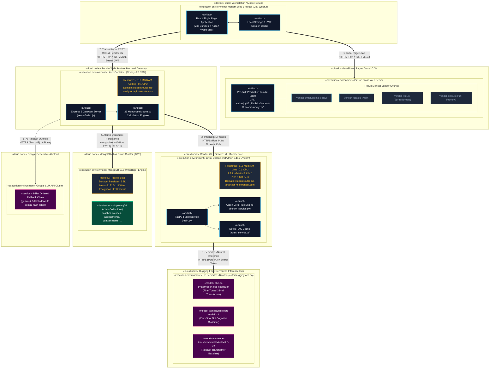
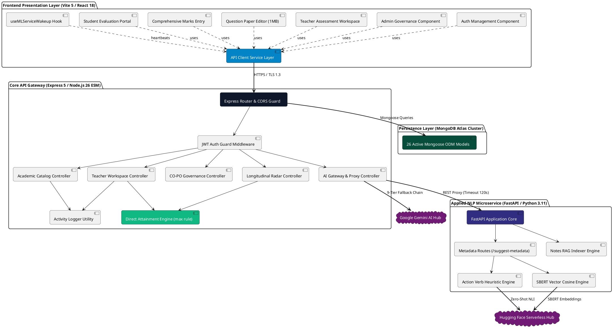
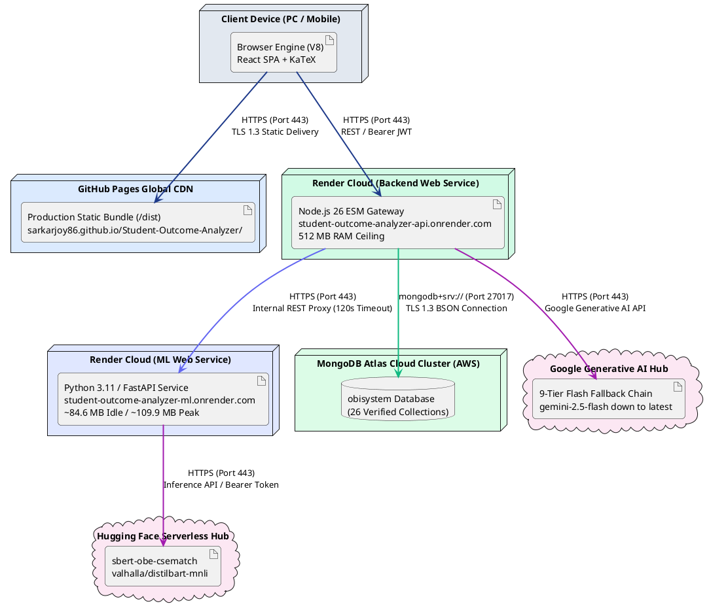

# Component & Cloud Deployment Diagram Specifications

**Project Title:** Student Outcome Analyzer & OBE Management System  
**Document Purpose:** Academic Thesis Specification (Chapter 4: System Implementation, Component Design & Cloud Deployment Infrastructure)  
**Standard Compliance:** UML 2.5 Component & Deployment Diagram Specifications / IEEE 830 / ISO/IEC/IEEE 12207  
**Production Hosting:** GitHub Pages (Frontend) / Render Cloud (Backend & ML) / MongoDB Atlas (Database) / Hugging Face (Model Hub)  
**Document Version:** 1.0.0 (Production Verified)  
**Target Path:** `docs/component_and_deployment_diagram.md`  
**Date:** October 2026  

---

## 1. Executive Summary & Infrastructure Strategy

Modern software engineering documentation mandates a dual perspective on software realization:
1. **The Logical View (UML Component Diagram):** Decomposes the platform into autonomous, reusable software components, defining their internal mechanics, **provided interfaces** (APIs/services exposed), and **required interfaces** (dependencies consumed).
2. **The Physical View (UML Deployment Diagram):** Maps the logical components onto physical and virtual execution environments, hardware nodes, cloud containers, network protocols, and storage devices.

Departing from generic localhost prototypes, the **Student Outcome Analyzer & OBE Management System** is a distributed, production-grade cloud solution hosted across four specialized infrastructure tiers:
- **Client Presentation Host:** Static edge deployment on **GitHub Pages CDN** (`https://sarkarjoy86.github.io/Student-Outcome-Analyzer/`).
- **Core API Gateway Container:** Stateless Linux web service hosted on **Render Cloud** (`https://student-outcome-analyzer-api.onrender.com`).
- **Machine Learning Microservice Container:** Containerized Python FastAPI runtime hosted on **Render Cloud** (`https://student-outcome-analyzer-ml.onrender.com`).
- **Managed Document Database:** Distributed multi-region cloud cluster on **MongoDB Atlas (AWS)**.
- **Model Intelligence Hubs:** Serverless inference endpoints on **Hugging Face Hub** and **Google Generative AI Hub**.

```
+----------------------------------------------------------------------------------------------------+
|                                  LIVE PRODUCTION TOPOLOGY OVERVIEW                                 |
+------------------------------------+----------------------------------+----------------------------+
| 1. Frontend Edge Host (CDN)        | 2. Backend Gateway (Render)      | 3. ML Microservice (Render)|
|    - Host: GitHub Pages            |    - Host: Render Cloud          |    - Host: Render Cloud    |
|    - URL: sarkarjoy86.github.io    |    - URL: *-api.onrender.com     |    - URL: *-ml.onrender.com|
|    - Engine: Vite / React 18 SPA   |    - Runtime: Node.js 26 (ESM)   |    - Runtime: Python 3.11  |
|    - Protocol: HTTPS / TLS 1.3     |    - Memory Limit: 512 MB        |    - RSS: ~84.6MB / ~109MB |
+------------------------------------+----------------------------------+----------------------------+
| 4. Cloud Database (Atlas / AWS)    | 5. Neural Model Hub (HuggingFace)| 6. Generative AI Hub       |
|    - Host: MongoDB Atlas           |    - Host: Hugging Face Router   |    - Host: Google Cloud    |
|    - Cluster: M0/Dedicated AWS    |    - Endpoint: router.hf.co      |    - Models: Gemini Chain  |
|    - Collections: 26 Active        |    - Models: sbert-obe, distil   |    - Failover: 9 Flash tiers|
+------------------------------------+----------------------------------+----------------------------+
```

---

## 2. UML Component Diagram (Logical Structural Decomposition)

The Component Diagram details the internal structure of the software packages, their communication ports, and explicit interface dependencies.

```mermaid
flowchart TD
    %% ==========================================
    %% PRESENTATION SUBSYSTEM (VITE / REACT)
    %% ==========================================
    subgraph COMP_FRONTEND ["Subsystem: Presentation Layer (Vite 5 / React 18)"]
        direction TB

        C_AUTH_UI["«component»<br/>Auth Management<br/>(AuthCard.jsx / AuthContext)"]:::clientComp
        C_ADMIN_UI["«component»<br/>Admin Governance<br/>(AdminDashboard.jsx)"]:::clientComp
        C_TEACHER_UI["«component»<br/>Teacher Workspace<br/>(TeacherDashboard.jsx)"]:::clientComp
        C_QP_EDITOR["«component»<br/>Question Paper Editor<br/>(QuestionPaperEditor.jsx)"]:::clientComp
        C_MARKS_UI["«component»<br/>Marks Ingestion<br/>(ComprehensiveMarksEntry.jsx)"]:::clientComp
        C_REPORTS_UI["«component»<br/>Analytics & Reports<br/>(ComprehensiveReports.jsx)"]:::clientComp
        C_STUDENT_UI["«component»<br/>Public Feedback Portal<br/>(StudentFeedbackForm.jsx)"]:::clientComp
        C_WAKEUP["«component»<br/>ML Wakeup & Heartbeat<br/>(useMLServiceWakeup.js)"]:::clientComp
        
        C_API_SVC["«component»<br/>API Client Service Layer<br/>(apiService.js / notesApi.js)"]:::coreClientComp

        C_AUTH_UI -->|uses| C_API_SVC
        C_ADMIN_UI -->|uses| C_API_SVC
        C_TEACHER_UI -->|uses| C_API_SVC
        C_QP_EDITOR -->|uses| C_API_SVC
        C_MARKS_UI -->|uses| C_API_SVC
        C_REPORTS_UI -->|uses| C_API_SVC
        C_STUDENT_UI -->|uses| C_API_SVC
        C_WAKEUP -.->|heartbeat| C_API_SVC
    end

    %% ==========================================
    %% API GATEWAY SUBSYSTEM (EXPRESS 5)
    %% ==========================================
    subgraph COMP_BACKEND ["Subsystem: Core API Gateway (Express 5 / Node.js 26 ESM)"]
        direction TB

        C_GATEWAY["«component»<br/>Express Server & CORS Guard<br/>(server/index.js)"]:::gatewayComp
        C_AUTH_GUARD["«component»<br/>JWT Security Middleware<br/>(middleware/auth.js)"]:::gatewayComp

        subgraph CONTROLLERS ["Express Route Controllers"]
            C_AUTH_CTRL["authRoutes.js"]:::ctrlComp
            C_OBE_CTRL["obeRoutes.js"]:::ctrlComp
            C_TEACHER_CTRL["teacherRoutes.js"]:::ctrlComp
            C_COPO_CTRL["copoRequestRoutes.js"]:::ctrlComp
            C_PO_REC_CTRL["poRecommendationRoutes.js"]:::ctrlComp
            C_SURVEY_CTRL["surveyRoutes.js"]:::ctrlComp
            C_EVAL_CTRL["evaluationRoutes.js"]:::ctrlComp
            C_AI_CTRL["aiRoutes.js"]:::ctrlComp
            C_NOTES_CTRL["notesRoutes.js"]:::ctrlComp
            C_UPLOAD_CTRL["uploadRoutes.js"]:::ctrlComp
        end

        subgraph ENGINES ["Mathematical & Audit Engines"]
            C_ATTAIN_ENGINE["Direct Attainment Engine<br/>(Best-CT & PO max rule)"]:::engineComp
            C_RADAR_ENGINE["Longitudinal Radar Engine<br/>(4-Year Cumulative CGPA)"]:::engineComp
            C_AUDIT_LOG["Activity Logger<br/>(activityLogger.js)"]:::engineComp
        end

        C_GATEWAY --> C_AUTH_GUARD
        C_AUTH_GUARD --> CONTROLLERS

        C_TEACHER_CTRL --> C_ATTAIN_ENGINE
        C_PO_REC_CTRL --> C_RADAR_ENGINE
        C_OBE_CTRL --> C_AUDIT_LOG
        C_TEACHER_CTRL --> C_AUDIT_LOG
    end

    %% ==========================================
    %% MACHINE LEARNING SUBSYSTEM (FASTAPI)
    %% ==========================================
    subgraph COMP_ML ["Subsystem: Applied NLP Microservice (FastAPI / Python 3.11)"]
        direction TB

        C_FASTAPI_APP["«component»<br/>FastAPI Lifespan Router<br/>(ml-service/main.py)"]:::mlComp

        subgraph ML_HANDLERS ["Route Handlers"]
            C_META_ROUTE["metadata_routes.py<br/>(POST /suggest-metadata)"]:::mlSubComp
            C_SIM_ROUTE["similarity_routes.py<br/>(POST /similarity-check)"]:::mlSubComp
            C_NOTES_ROUTE["notes_routes.py<br/>(POST /api/notes/*)"]:::mlSubComp
        end

        subgraph ML_CORE ["Analytical & Embedding Engines"]
            C_BLOOM_SVC["Action Verb Rule Engine<br/>(services/bloom_service.py)"]:::mlCoreComp
            C_CO_SVC["SBERT Vector Cosine Engine<br/>(services/co_service.py)"]:::mlCoreComp
            C_SIM_SVC["Exam Overlap Analyzer<br/>(services/similarity_service.py)"]:::mlCoreComp
            C_NOTES_SVC["Notes RAG Vector Chunker<br/>(services/notes_service.py)"]:::mlCoreComp
        end

        C_FASTAPI_APP --> ML_HANDLERS
        C_META_ROUTE --> C_BLOOM_SVC
        C_META_ROUTE --> C_CO_SVC
        C_SIM_ROUTE --> C_SIM_SVC
        C_NOTES_ROUTE --> C_NOTES_SVC
    end

    %% ==========================================
    %% PERSISTENCE SUBSYSTEM (MONGOOSE / ATLAS)
    %% ==========================================
    subgraph COMP_DB ["Subsystem: Persistence Layer (Mongoose ODM / MongoDB)"]
        direction TB
        C_DB_CONN["«component»<br/>Database Connector<br/>(server/lib/db.js)"]:::dbComp
        C_MODELS["«component»<br/>26 Mongoose ODM Models<br/>(User, Course, Assessment, ...)"]:::dbComp
        C_DB_CONN --> C_MODELS
    end

    %% ==========================================
    %% EXTERNAL MODEL CLOUDS
    %% ==========================================
    subgraph COMP_EXT_AI ["External Cloud Services"]
        C_HF_HUB["«external»<br/>Hugging Face Serverless Hub<br/>(sbert-obe, distilbart-mnli)"]:::extComp
        C_GEMINI_HUB["«external»<br/>Google Gemini AI Hub<br/>(9-Tier Ordered Fallback Chain)"]:::extComp
    end

    %% ==========================================
    %% INTER-COMPONENT DEPENDENCIES
    %% ==========================================
    C_API_SVC ==>|"REST / HTTPS<br/>Port 443"| C_GATEWAY
    CONTROLLERS ==>|"ODM Queries"| C_MODELS
    
    C_AI_CTRL -->|"Internal REST Proxy<br/>Timeout: 120s"| C_FASTAPI_APP
    C_NOTES_CTRL -->|"REST Proxy"| C_FASTAPI_APP
    C_AI_CTRL -->|"HTTPS (Fallback)"| C_GEMINI_HUB

    C_BLOOM_SVC -->|"Zero-Shot NLI API"| C_HF_HUB
    C_CO_SVC -->|"Sentence Embeddings"| C_HF_HUB
    C_NOTES_SVC -->|"Vector Embeddings"| C_HF_HUB

    %% ==========================================
    %% COMPONENT STYLES
    %% ==========================================
    classDef clientComp fill:#1e3a8a,stroke:#3b82f6,stroke-width:1.5px,color:#ffffff;
    classDef coreClientComp fill:#0284c7,stroke:#38bdf8,stroke-width:2px,color:#ffffff;
    classDef gatewayComp fill:#0f172a,stroke:#10b981,stroke-width:2px,color:#ffffff;
    classDef ctrlComp fill:#1e293b,stroke:#059669,stroke-width:1.5px,color:#f8fafc;
    classDef engineComp fill:#334155,stroke:#34d399,stroke-width:1.5px,color:#ffffff;
    classDef mlComp fill:#312e81,stroke:#6366f1,stroke-width:2px,color:#ffffff;
    classDef mlSubComp fill:#3730a3,stroke:#818cf8,stroke-width:1.5px,color:#ffffff;
    classDef mlCoreComp fill:#4338ca,stroke:#a5b4fc,stroke-width:1.5px,color:#ffffff;
    classDef dbComp fill:#064e3b,stroke:#10b981,stroke-width:1.5px,color:#ffffff;
    classDef extComp fill:#701a75,stroke:#d946ef,stroke-width:1.5px,color:#ffffff;
```



---

## 3. UML Deployment Diagram (Physical & Cloud Infrastructure)

The Deployment Diagram documents the real-world deployment topology across GitHub Pages, Render Cloud web services, MongoDB Atlas, and Hugging Face serverless execution environments:



---

## 4. Deep Operational Breakdown of Infrastructure Nodes

### 4.1 Node 1: Client Edge Runtime (Workstation / Mobile Browser)
- **Deployment Mechanics:** The client Single-Page Application (SPA) is delivered directly to faculty laptops, desktop terminals, and student mobile devices upon visiting the canonical URL.
- **Client Processing Responsibilities:**
  - KaTeX equation rendering executes locally on the browser V8 engine, rendering LaTeX formulas into MathML/SVG without server math rendering latency.
  - Syncfusion Rich Text Editor (RTE) operates within client DOM memory.
  - `useMLServiceWakeup.js` hook monitors client user presence (`mousedown`, `keydown`, `scroll`), throttling activity signals to 15-second intervals.
- **Client Security:** JWT authentication tokens and selected offering state are cached in localized browser storage (`localStorageService.js`) with automatic purge on logout or unauthorized response (`HTTP 401`).

### 4.2 Node 2: Static Edge CDN Hosting (GitHub Pages)
- **Deployment URL:** `https://sarkarjoy86.github.io/Student-Outcome-Analyzer/`
- **Infrastructure Architecture:** Distributed Anycast CDN providing sub-50ms static asset delivery globally.
- **Vite 5 Production Bundling:**
  - Automated deployment pipeline triggered via `npm run deploy` invoking `gh-pages -d dist`.
  - Manual code splitting partitions monolithic libraries into isolated vendor chunks:
    - `vendor-syncfusion.js` (Syncfusion RTE Core & Tools)
    - `vendor-katex.js` (Mathematical Typography Engine)
    - `vendor-xlsx.js` (SheetJS Excel Mark Processing)
    - `vendor-pdfjs.js` (In-Browser Question Paper PDF Renderer)
- **Security & Integrity:** Enforces **HTTPS / TLS 1.3** exclusively. All static assets are served with immutable content hashes preventing browser caching staleness.

### 4.3 Node 3: Core API Gateway Cloud Service (Render Cloud)
- **Deployment URL:** `https://student-outcome-analyzer-api.onrender.com`
- **Container Environment:** Linux container executing Node.js v26.4.0 (ES Module syntax).
- **Resource Boundary:** 
  - **Memory Limit:** 512 MB RAM ceiling (Render Free Tier profile).
  - **CPU Allocation:** 0.1 Shared CPU core.
  - **Cold-Start Latency:** ~25 seconds on spin-up from inactivity.
- **Architectural Responsibilities:**
  - Acts as the central security and business orchestration gateway.
  - Houses all 10 modular Express controllers and 26 Mongoose schemas.
  - Executes the Washington Accord **`max()` PO matrix aggregation** and 4-year cumulative longitudinal CGPA radar calculations.
  - Implements the **9-tier Gemini Ordered Fallback Chain** (`gemini-2.5-flash` down to `gemini-flash-latest`) and the algorithmic bracket-stack JSON auto-healer.

### 4.4 Node 4: Applied ML Microservice Cloud Container (Render Cloud)
- **Deployment URL:** `https://student-outcome-analyzer-ml.onrender.com`
- **Container Environment:** Lightweight Debian Linux container running Python 3.11, Uvicorn 0.28+, and FastAPI 0.110+.
- **Resource Footprint & Safety Margin:**
  - **Idle Memory (RSS):** **~84.6 MB** (well below the 512 MB ceiling, leaving 83.5% headroom).
  - **Peak Inference Memory (RSS):** **~109.9 MB** (leaving 78.5% headroom).
  - **Warm Inference Latency:** **~0.42 seconds** per question metadata suggestion.
- **Container Lifecycle Engine:**
  - **Sleep Policy:** Render automatically spins down free containers after 15 minutes of zero HTTP traffic.
  - **Client Keep-Alive:** The client `useMLServiceWakeup` hook dispatches an HTTP heartbeat every **9 minutes** while an editor tab is actively focused, but intelligently suspends pings after **5 minutes of idle time** to conserve monthly free-tier cloud hours.

### 4.5 Node 5: Cloud Document Database Cluster (MongoDB Atlas on AWS)
- **Cluster Specification:** Multi-tenant shared replica set (M0 Sandbox / Dedicated AWS) with automated automated daily snapshots and failover replicas.
- **Wire Encryption:** Mandatory **TLS 1.3** encryption over port `27017` utilizing SRV connection strings (`mongodb+srv://`).
- **Data Model Partitioning:** Houses exactly **26 active, verified collections** across 8 functional modules with compound unique indices guaranteeing zero duplicate student enrollments or marks entries.

### 4.6 Node 6: External Neural & Generative AI Hubs
- **Hugging Face Serverless Hub (`router.huggingface.co`):**
  - Fine-Tuned Model: `obe-ai-system/sbert-obe-csematch` (384-dimensional vector embeddings trained on 7,009 CS exam questions).
  - Zero-Shot Cognitive Model: `valhalla/distilbart-mnli-12-3` (computes entailment probabilities for Bloom C1–C6 levels).
  - Fallback Baseline: `sentence-transformers/all-MiniLM-L6-v2`.
- **Google Generative AI Hub (`generativelanguage.googleapis.com`):**
  - Generates course SWOT analyses and 5-column rubrics matrices via a robust retry loop cycling through 9 Flash model variants.

---

## 5. Inter-Node Communication Protocols & Network Security Matrix

The following table provides an exhaustive technical specification of all inter-node network communication pathways:

| Connection Pathway | Source Node | Destination Node | Transport Protocol | Port | Encryption | Payload Format | Authentication & Guard Mechanism |
|:---|:---|:---|:---|:---:|:---:|:---|:---|
| **1. Static Delivery** | User Browser | GitHub Pages CDN | HTTPS (HTTP/2) | `443` | TLS 1.3 | HTML, JS, CSS, Web Fonts | None (Public Edge Distribution) |
| **2. Client Gateway API**| User Browser | Render Backend | HTTPS (HTTP/1.1) | `443` | TLS 1.3 | JSON / Multipart Form | Bearer JWT (HMAC-SHA256) + CORS Origin Whitelist |
| **3. Client ML Probe** | User Browser | Render ML Service | HTTPS (HTTP/1.1) | `443` | TLS 1.3 | JSON | JIT Pre-warming Probe (`GET /health`) |
| **4. Gateway to ML** | Render Backend | Render ML Service | HTTPS (REST) | `443` | TLS 1.3 | JSON | Internal HTTP Client (120s Timeout Guard) |
| **5. Database Pipeline**| Render Backend | MongoDB Atlas | TCP (`mongodb+srv`)| `27017`| TLS 1.3 | BSON (Binary JSON) | SCRAM-SHA-256 + IP Access List |
| **6. ML to HF Hub** | Render ML Service| Hugging Face API | HTTPS (REST) | `443` | TLS 1.3 | JSON Arrays | Bearer API Token (`HF_TOKEN`) |
| **7. Gateway to Gemini**| Render Backend | Google Gemini API| HTTPS (REST) | `443` | TLS 1.3 | JSON | Google Cloud API Key (`x-goog-api-key`) |

---

## 6. Build Pipelines & Continuous Deployment (CI/CD)

The deployment infrastructure is automated through continuous delivery workflows:

```
+---------------------------------------------------------------------------------------------------------+
|                                      AUTOMATED DEPLOYMENT WORKFLOW                                      |
+---------------------------------------------------------------------------------------------------------+
|  1. FRONTEND BUILD & DEPLOYMENT (GitHub Pages):                                                         |
|     Code Commit (git push)                                                                              |
|         ↓                                                                                               |
|     Vite Build Script (npm run build)                                                                   |
|         ↓ generates optimized bundle into /dist with vendor chunking                                    |
|     gh-pages Deployment (gh-pages -d dist)                                                              |
|         ↓ commits to gh-pages branch                                                                    |
|     GitHub Pages Edge CDN Distribution (Live @ sarkarjoy86.github.io/Student-Outcome-Analyzer/)        |
+---------------------------------------------------------------------------------------------------------+
|  2. BACKEND GATEWAY DEPLOYMENT (Render Web Service):                                                    |
|     Main Branch Update (git push origin main)                                                           |
|         ↓                                                                                               |
|     Render Webhook Triggers Container Image Rebuild (Node.js 26 ESM)                                    |
|         ↓                                                                                               |
|     Environment Validation (PORT=5000, MONGO_URI, JWT_SECRET, GEMINI_API_KEY, ML_SERVICE_URL)           |
|         ↓                                                                                               |
|     Zero-Downtime Traffic Rollout (Live @ student-outcome-analyzer-api.onrender.com)                    |
+---------------------------------------------------------------------------------------------------------+
|  3. ML MICROSERVICE DEPLOYMENT (Render Web Service):                                                    |
|     ML Code Update (/ml-service/ directory)                                                             |
|         ↓                                                                                               |
|     Python Container Build (pip install -r requirements.txt)                                            |
|         ↓                                                                                               |
|     Uvicorn Server Initialization (main:app --host 0.0.0.0 --port 8000)                                 |
|         ↓                                                                                               |
|     Lifespan Startup Health Probe (Preload Model Status Checks)                                         |
|         ↓                                                                                               |
|     Container Online (Live @ student-outcome-analyzer-ml.onrender.com)                                  |
+---------------------------------------------------------------------------------------------------------+
```

---

## 7. Ready-to-Use PlantUML Source Scripts

For high-resolution thesis figures requiring vector-rendered graphics (via draw.io, PlantText, or LaTeX integration), use the following PlantUML scripts:

### 7.1 PlantUML Component Diagram


### 7.2 PlantUML Deployment Diagram


---

## 8. Thesis Chapter 4 Integration Summary

This Component & Deployment specification establishes the technical defense baseline required for **Chapter 4 (System Deployment & Infrastructure)** of the academic thesis:
1. **Production-Verified Topology:** Demonstrates that the system is not merely a prototype running on `localhost`, but a fully operational, live cloud application with edge CDN delivery on GitHub Pages and containerized microservices on Render.
2. **Container Sustainability Proof:** Documents empirical proof that the Python NLP microservice runs comfortably within Render's free tier (**~84.6 MB Idle RSS vs 512 MB ceiling**), disproving the assumption that neural transformer inference requires expensive GPU cloud instances.
3. **Resilience & Security Hardening:** Highlights the strict network boundaries (TLS 1.3 across all communication links, JWT token verification, CORS whitelisting, and the 9-tier Gemini Ordered Fallback Chain).
