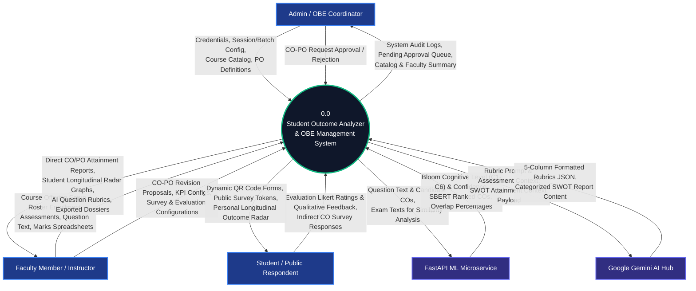
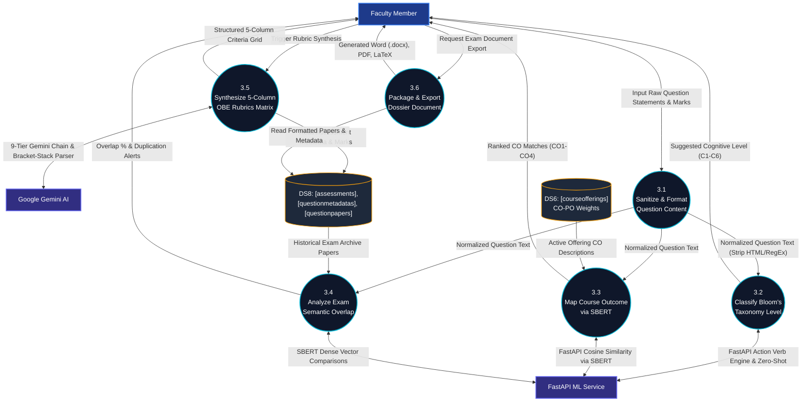
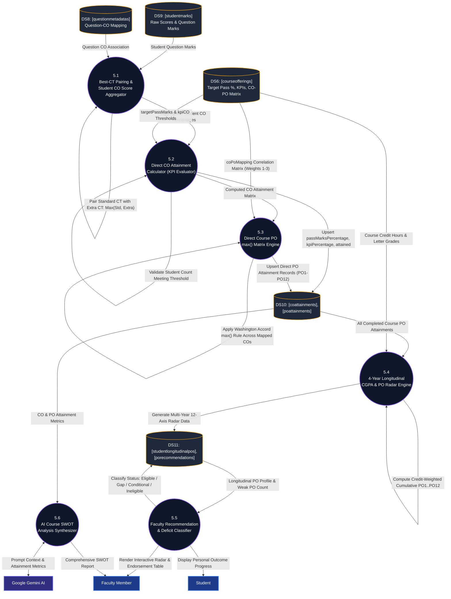

# Data Flow Diagram (DFD Level 0, Level 1 & Level 2)

**Project Title:** Student Outcome Analyzer & OBE Management System  
**Document Purpose:** Academic Thesis Specification (Chapter 3: System Analysis, Data Modeling & Process Decomposition)  
**Standard Compliance:** Gane & Sarson / Yourdon & DeMarco DFD Notation / IEEE 830 / Washington Accord & BAETE Criteria  
**Database Engine:** MongoDB (26 Active Collections) via Mongoose ODM  
**Document Version:** 1.0.0 (Production Verified)  
**Date:** October 2026  

---

## 1. Executive Summary & DFD Modeling Foundations

The **Data Flow Diagram (DFD)** model graphically characterizes the operational transformation of academic and assessment data as it traverses through the **Student Outcome Analyzer & OBE Management System**. 

The DFD illustrates:
1. **Data Sources and Sinks (External Entities):** Human actors (Admin, Teacher, Student) and external microservices (FastAPI NLP, Google Gemini, Hugging Face).
2. **Algorithmic Transformations (Processes):** Discrete computational routines transforming raw input data (e.g., student assessment marks, question text) into actionable academic metrics (e.g., CO attainment, direct PO attainment, multi-year radar visualizations).
3. **Data Stores (MongoDB Collections):** Exact physical and logical document collections where data is persistently retained across 26 verified MongoDB collections.
4. **Data Flows:** Directed vectors representing structured data packets moving between entities, processes, and persistence stores.

```
+----------------------------------------------------------------------------------------------------+
|                                    DFD HIERARCHICAL STRUCTURE                                      |
+----------------------------------------------------------------------------------------------------+
|                                                                                                    |
|    LEVEL 0: CONTEXT DIAGRAM                                                                        |
|    - Treats entire platform as a single process (0.0).                                             |
|    - Maps boundary interactions between system and external entities.                              |
|                                                                                                    |
|    LEVEL 1: FUNCTIONAL DECOMPOSITION                                                               |
|    - Decomposes Process 0.0 into 7 core functional sub-systems.                                    |
|    - Maps data stores directly to MongoDB collections (DS1 - DS14).                                |
|                                                                                                    |
|    LEVEL 2: DETAILED PROCESS DECOMPOSITION                                                         |
|    - Process 3.0: Intelligent Question Paper Engineering & NLP Pipeline.                           |
|    - Process 5.0: OBE Attainment, max() Aggregation & Longitudinal Radar Engine.                   |
|                                                                                                    |
+----------------------------------------------------------------------------------------------------+
```

---

## 2. Entity, Process & Data Store Inventory

### 2.1 External Entities (Terminators)
- **`E1: Admin / OBE Coordinator`**: Department head or system administrator who configures academic terms, manages user accounts, maintains the course catalog, and approves syllabus changes.
- **`E2: Faculty Member / Course Instructor`**: Teaches course offerings, authors exam question papers, uploads marks, and evaluates student outcome attainments.
- **`E3: Student / Public Respondent`**: Submits anonymous feedback via mobile QR codes, completes indirect outcome surveys, and reviews longitudinal PO radars.
- **`E4: FastAPI ML Microservice`**: Asynchronous Python microservice hosting Bloom's action verb rule engine, SBERT embeddings, and notes ingestion.
- **`E5: Google Gemini AI Cloud Hub`**: Generative AI service executing rubrics synthesis, question refinement, and SWOT analysis.
- **`E6: Hugging Face Serverless Hub`**: Remote inference endpoint running zero-shot cognitive classifiers (`distilbart-mnli-12-3`) and Sentence-BERT vector generation.

### 2.2 Data Store Mapping to MongoDB Collections

The 14 logical data stores directly encapsulate the **26 active MongoDB collections**:

| Data Store ID | Logical Data Store Name | Target MongoDB Collections | Mongoose Models |
|:---|:---|:---|:---|
| **DS1** | User & Identity Store | `teacher` | `User` |
| **DS2** | Academic Session Store | `academicsessions` | `AcademicSession` |
| **DS3** | Cohort & Section Store | `batches`, `sections` | `Batch`, `Section` |
| **DS4** | Student Master Store | `students` | `Student` |
| **DS5** | Curriculum & Outcomes Store | `courses`, `courseoutcomes`, `programoutcomes` | `Course`, `CourseOutcome`, `ProgramOutcome` |
| **DS6** | Offerings & Roster Store | `courseofferings`, `enrollments` | `CourseOffering`, `Enrollment` |
| **DS7** | Curriculum Governance Store | `copo_requests` | `COPORequest` |
| **DS8** | Assessment & Paper Store | `assessments`, `questionmetadatas`, `questionpapers`| `Assessment`, `QuestionMetadata`, `QuestionPaper` |
| **DS9** | Student Marks Store | `studentmarks` | `StudentMarks` |
| **DS10**| Direct Attainment Store | `coattainments`, `poattainments` | `COAttainment`, `POAttainment` |
| **DS11**| Longitudinal & Recommendation Store | `studentlongitudinalpos`, `porecommendations` | `StudentLongitudinalPO`, `PORecommendation` |
| **DS12**| Indirect Survey Store | `surveys`, `surveycustomquestions`, `surveyresponses` | `Survey`, `SurveyCustomQuestion`, `SurveyResponse` |
| **DS13**| Course Evaluation Store | `evaluations`, `questions`, `responses` | `Evaluation`, `Question`, `Response` |
| **DS14**| System Audit Store | `recentactivities` | `RecentActivity` |

---

## 3. DFD Level 0: Context Diagram

The Context Diagram represents the entire system as a single black-box process (`0.0`), mapping external entities and boundary data flows.



---

## 4. DFD Level 1: Functional Decomposition

Level 1 breaks Process `0.0` into **7 primary operational sub-systems** and maps all interactions to physical MongoDB collections (`DS1` through `DS14`).

```mermaid
flowchart TD
    %% ==========================================
    %% EXTERNAL ENTITIES
    %% ==========================================
    E1["Admin / Coordinator"]:::entity
    E2["Faculty Member"]:::entity
    E3["Student / Public"]:::entity
    E4["FastAPI ML Service"]:::serviceEntity
    E5["Google Gemini AI"]:::serviceEntity

    %% ==========================================
    %% PROCESSES (LEVEL 1)
    %% ==========================================
    P1(("1.0<br/>Authentication<br/>& User Management")):::process
    P2(("2.0<br/>Academic Structure<br/>& Curriculum Setup")):::process
    P3(("3.0<br/>Assessment Authoring<br/>& Question Engineering")):::process
    P4(("4.0<br/>Marks Ingestion<br/>& Score Validation")):::process
    P5(("5.0<br/>Outcome Attainment<br/>& Longitudinal Analytics")):::process
    P6(("6.0<br/>Indirect Surveys &<br/>Course Evaluations")):::process
    P7(("7.0<br/>Audit Logging &<br/>System Governance")):::process

    %% ==========================================
    %% DATA STORES (MONGODB COLLECTIONS)
    %% ==========================================
    DS1[("DS1: [teacher]<br/>User Credentials")]:::dataStore
    DS2[("DS2: [academicsessions]<br/>Terms & Years")]:::dataStore
    DS3[("DS3: [batches], [sections]<br/>Cohorts & Sections")]:::dataStore
    DS4[("DS4: [students]<br/>Student Master Profiles")]:::dataStore
    DS5[("DS5: [courses], [courseoutcomes],<br/>[programoutcomes]")]:::dataStore
    DS6[("DS6: [courseofferings],<br/>[enrollments]")]:::dataStore
    DS7[("DS7: [copo_requests]<br/>Governance Queue")]:::dataStore
    DS8[("DS8: [assessments],<br/>[questionmetadatas], [questionpapers]")]:::dataStore
    DS9[("DS9: [studentmarks]<br/>Score Records")]:::dataStore
    DS10[("DS10: [coattainments],<br/>[poattainments]")]:::dataStore
    DS11[("DS11: [studentlongitudinalpos],<br/>[porecommendations]")]:::dataStore
    DS12[("DS12: [surveys],<br/>[surveycustomquestions], [surveyresponses]")]:::dataStore
    DS13[("DS13: [evaluations],<br/>[questions], [responses]")]:::dataStore
    DS14[("DS14: [recentactivities]<br/>Audit Trails")]:::dataStore

    %% ==========================================
    %% DATA FLOWS: PROCESS 1.0 (AUTH)
    %% ==========================================
    E1 -->|"Admin Login Credentials"| P1
    E2 -->|"Teacher Login Credentials"| P1
    P1 <-->|"Verify Credentials / Read Role"| DS1
    P1 -->|"JWT Token & Auth Session"| E1
    P1 -->|"JWT Token & Auth Session"| E2

    %% ==========================================
    %% DATA FLOWS: PROCESS 2.0 (ACADEMIC SETUP)
    %% ==========================================
    E1 -->|"Define Terms, Batches, Courses, POs"| P2
    P2 -->|"Insert Terms"| DS2
    P2 -->|"Insert Batches & Sections"| DS3
    P2 -->|"Store Master Courses & PO1..PO12"| DS5
    
    E2 -->|"Assign Offering, Enroll Students"| P2
    P2 -->|"Read Terms & Master Courses"| DS2
    P2 <-->|"Read/Write Student Records"| DS4
    P2 -->|"Create Course Offering & Roster"| DS6

    E2 -->|"Submit CO-PO Modification Proposal"| P2
    P2 -->|"Enqueue Proposal"| DS7
    E1 -->|"Review & Approve/Reject Proposal"| P2
    P2 <-->|"Read/Update Pending Proposals"| DS7
    P2 -->|"Apply Approved Matrix Changes"| DS5
    P2 -->|"Apply Approved Matrix Changes"| DS6

    %% ==========================================
    %% DATA FLOWS: PROCESS 3.0 (ASSESSMENT AUTHORING)
    %% ==========================================
    E2 -->|"Assessment Specs, Questions, LaTeX"| P3
    P3 -->|"Fetch Offering Context & COs"| DS6
    P3 <-->|"ML: Suggest Bloom & CO"| E4
    P3 <-->|"ML: Check SBERT Overlap"| E4
    P3 <-->|"GenAI: Synthesize 5-Col Rubrics"| E5
    P3 -->|"Save Assessment, Metadata & Papers"| DS8
    P3 -->|"Export Word / PDF / LaTeX Dossier"| E2

    %% ==========================================
    %% DATA FLOWS: PROCESS 4.0 (MARKS INGESTION)
    %% ==========================================
    E2 -->|"Spreadsheet (.xlsx) / Manual Marks"| P4
    P4 -->|"Fetch Assessment Max Marks & Rubrics"| DS8
    P4 -->|"Verify Student Enrollment"| DS6
    P4 -->|"Commit Validated Student Marks"| DS9
    P4 -->|"Trigger Attainment Pipeline"| P5

    %% ==========================================
    %% DATA FLOWS: PROCESS 5.0 (ATTAINMENT & RADAR)
    %% ==========================================
    P5 -->|"Read Question Marks & Totals"| DS9
    P5 -->|"Read Rubrics, Assessment CO Tags"| DS8
    P5 -->|"Read CO-PO Articulation Matrix & KPIs"| DS6
    P5 -->|"Upsert Direct CO & Direct PO Attainments"| DS10
    P5 -->|"Calculate 4-Year Credit-Weighted POs"| DS11
    P5 -->|"Upsert Graduation Recommendation Score"| DS11
    P5 -->|"Render Longitudinal Radar & Attainment Cards"| E2
    P5 -->|"Provide Personal Radar Profile"| E3
    P5 <-->|"AI: Generate Course SWOT Analysis"| E5

    %% ==========================================
    %% DATA FLOWS: PROCESS 6.0 (SURVEYS & EVALUATION)
    %% ==========================================
    E2 -->|"Create Survey, Setup Formative Evaluation"| P6
    P6 -->|"Save Survey Headers & Section Questions"| DS12
    P6 -->|"Save Evaluation Event & Criteria"| DS13
    P6 -->|"Generate Dynamic QR Codes & Public URLs"| E3
    E3 -->|"Submit Anonymous Evaluation Feedback"| P6
    E3 -->|"Submit Likert Survey Answers"| P6
    P6 -->|"Store Survey Responses"| DS12
    P6 -->|"Store Pseudonymous Evaluation Responses"| DS13
    P6 -->|"Indirect Attainment & Feedback Analytics"| E2

    %% ==========================================
    %% DATA FLOWS: PROCESS 7.0 (AUDIT LOGGING)
    %% ==========================================
    P2 -.->|"Log Offering / Curriculum Actions"| P7
    P3 -.->|"Log Assessment Creation"| P7
    P4 -.->|"Log Marks Publication"| P7
    P7 -->|"Commit Operational Audit Record"| DS14
    DS14 -->|"Stream Audit Logs"| P7
    P7 -->|"Display Audit Trail View"| E1

    %% ==========================================
    %% CLASSES
    %% ==========================================
    classDef entity fill:#1e3a8a,stroke:#3b82f6,stroke-width:2px,color:#ffffff;
    classDef serviceEntity fill:#312e81,stroke:#6366f1,stroke-width:2px,color:#ffffff;
    classDef process fill:#0f172a,stroke:#10b981,stroke-width:2px,color:#ffffff;
    classDef dataStore fill:#1e293b,stroke:#f59e0b,stroke-width:1.5px,color:#f8fafc;
```



---

## 5. DFD Level 2: Detailed Process Decomposition

To provide complete algorithmic visibility into the system's core engines, two mission-critical processes are broken down into sub-processes.

### 5.1 Process 3.0 Decomposition: Intelligent Assessment Engineering & NLP Pipeline

Process `3.0` coordinates the faculty question editor with asynchronous machine learning models:



---

### 5.2 Process 5.0 Decomposition: OBE Attainment, max() Aggregation & Longitudinal Radar Engine

Process `5.0` transforms raw student scores into direct and cumulative outcome analytics in strict compliance with the **Washington Accord** and **BAETE** accreditation standards:



---

## 6. Formal Data Dictionary (Key Flows)

The Data Dictionary defines the internal composition of primary data vectors traversing the system:

| Data Flow Name | Source | Destination | Data Structure / Field Payload |
|:---|:---|:---|:---|
| `Auth_Credentials_Payload` | E1 (Admin) / E2 (Teacher) | P1.0 | `{ email: String, password: String (Plaintext) }` |
| `JWT_Session_Token` | P1.0 | E1 (Admin) / E2 (Teacher) | `{ token: String (JWT), user: { _id, email, role: 'admin'|'user', fullName } }` |
| `Academic_Config_Packet` | E1 (Admin) | P2.0 | `{ semesterName, academicYear, batchName, sectionName, courseCode, creditHours, department, numCOs }` |
| `COPO_Proposal_Packet` | E2 (Teacher) | P2.0 $\to$ DS7 | `{ teacher, course, proposedMapping: Object, originalMapping: Object, proposedCOs: Array, changesSummary }` |
| `COPO_Resolution_Packet` | E1 (Admin) | P2.0 $\to$ DS7 / DS6 | `{ requestId, status: 'approved'|'rejected', adminNote, reviewedBy, reviewedAt }` |
| `Question_Metadata_Payload`| P3.0 | E4 (FastAPI ML) | `{ questionText: String, courseOutcomes: [ { code: String, description: String } ] }` |
| `ML_Inference_Response` | E4 (FastAPI ML) | P3.0 | `{ bloom: { suggested: "C2", confidence: 0.88, rankings: [...] }, co: { suggested: "CO1", confidence: 0.82, rankings: [...] } }` |
| `Student_Marks_Spreadsheet`| E2 (Teacher) | P4.0 | Multi-row Array of `{ studentId: String, q1: Number, q2: Number, total: Number, isAbsent: Boolean }` |
| `Direct_CO_Attainment_Data`| P5.0 | DS10 (`coattainments`) | `{ courseOffering: ObjectId, co: "CO1", passMarksPercentage: Number, kpiPercentage: Number, attained: Boolean }` |
| `Direct_PO_Attainment_Data`| P5.0 | DS10 (`poattainments`) | `{ courseOffering: ObjectId, po: "PO1", passMarksPercentage: Number, kpiPercentage: Number, attained: Boolean }` |
| `Longitudinal_Radar_Payload`| P5.0 | DS11 $\to$ E2 / E3 | `{ studentId, cgpa, overallPoAttainment, recommendationScore, status, longitudinalPOs: [...], weakPOs: [...] }` |
| `Evaluation_Submission` | E3 (Student) | P6.0 $\to$ DS13 | `{ evaluationId, studentId, email, ratings: Map<Number>, comments: { learned, enjoyed, difficult, suggestions } }` |
| `Indirect_Survey_Submission`| E3 (Student) | P6.0 $\to$ DS12 | `{ surveyId, studentId, ratings: Map<Number>, comments: Map<String> }` |
| `Audit_Event_Record` | P2.0 - P6.0 | P7.0 $\to$ DS14 | `{ courseOfferingId, teacherId, action: String, description: String, createdAt: Date }` |

---

## 7. Process-to-Data-Store CRUD Traceability Matrix

This matrix establishes 100% operational auditability by mapping which process reads, creates, updates, or deletes records in each of the 26 MongoDB collections:

| MongoDB Collection | DS ID | P1.0 (Auth) | P2.0 (Academic) | P3.0 (Assess) | P4.0 (Marks) | P5.0 (Attain) | P6.0 (Survey) | P7.0 (Audit) |
|:---|:---:|:---:|:---:|:---:|:---:|:---:|:---:|:---:|
| `teacher` (User) | DS1 | **R / U** | **C / R / U** | **R** | — | — | **R** | **R** |
| `academicsessions` | DS2 | — | **C / R / U** | **R** | — | **R** | — | — |
| `batches` | DS3 | — | **C / R / U** | **R** | — | **R** | — | — |
| `sections` | DS3 | — | **C / R / U** | **R** | — | **R** | — | — |
| `students` | DS4 | — | **C / R / U** | — | **R** | **R** | **R** | — |
| `courses` | DS5 | — | **C / R / U** | **R** | — | **R** | — | — |
| `courseoutcomes` | DS5 | — | **C / R / U** | **R** | — | **R** | — | — |
| `programoutcomes` | DS5 | — | **C / R / U** | — | — | **R** | — | — |
| `courseofferings` | DS6 | — | **C / R / U** | **R** | **R** | **R / U** | **R** | **R** |
| `enrollments` | DS6 | — | **C / R / D** | — | **R** | **R** | **R** | — |
| `copo_requests` | DS7 | — | **C / R / U** | — | — | — | — | **R** |
| `assessments` | DS8 | — | — | **C / R / U / D**| **R** | **R** | — | — |
| `questionmetadatas` | DS8 | — | — | **C / R / U** | **R** | **R** | — | — |
| `questionpapers` | DS8 | — | — | **C / R / U** | — | — | — | — |
| `studentmarks` | DS9 | — | — | — | **C / R / U** | **R** | — | — |
| `coattainments` | DS10| — | — | — | — | **C / R / U** | — | — |
| `poattainments` | DS10| — | — | — | — | **C / R / U** | — | — |
| `studentlongitudinalpos`| DS11| — | — | — | — | **C / R / U** | — | — |
| `porecommendations` | DS11| — | — | — | — | **C / R / U** | — | — |
| `surveys` | DS12| — | — | — | — | — | **C / R / U** | — |
| `surveycustomquestions` | DS12| — | — | — | — | — | **C / R / U** | — |
| `surveyresponses` | DS12| — | — | — | — | **R** | **C / R** | — |
| `evaluations` | DS13| — | — | — | — | — | **C / R / U** | — |
| `questions` | DS13| — | — | — | — | — | **C / R / U** | — |
| `responses` | DS13| — | — | — | — | — | **C / R** | — |
| `recentactivities` | DS14| — | **C** | **C** | **C** | **C** | **C** | **C / R** |

*Legend: C = Create (Insert), R = Read (Query/Populate), U = Update, D = Delete*

---

## 8. PlantUML DFD Level 0 & Level 1 Source Scripts

For high-resolution thesis figures using PlantUML tools (e.g., PlantText, draw.io, or LaTeX integration), use the following script:

```plantuml
@startuml
skinparam packageStyle rectangle
skinparam roundcorner 12
skinparam shadowing false
skinparam defaultFontName "Segoe UI", Arial, sans-serif

' External Entities
rectangle "Admin / Coordinator" as E1 #1e3a8a;line:white;text:white
rectangle "Faculty Member" as E2 #065f46;line:white;text:white
rectangle "Student / Public" as E3 #7c2d12;line:white;text:white
rectangle "FastAPI ML Microservice" as E4 #312e81;line:white;text:white
rectangle "Google Gemini AI Hub" as E5 #312e81;line:white;text:white

' Core Level 1 Processes
circle "1.0\nAuth & User\nManagement" as P1 #0f172a;line:#10b981;text:white
circle "2.0\nAcademic Structure\n& Curriculum Setup" as P2 #0f172a;line:#10b981;text:white
circle "3.0\nAssessment Authoring\n& Question Engineering" as P3 #0f172a;line:#06b6d4;text:white
circle "4.0\nMarks Ingestion\n& Score Validation" as P4 #0f172a;line:#10b981;text:white
circle "5.0\nOutcome Attainment\n& Radar Analytics" as P5 #0f172a;line:#8b5cf6;text:white
circle "6.0\nIndirect Surveys\n& Course Evaluation" as P6 #0f172a;line:#10b981;text:white
circle "7.0\nAudit Logging\n& Governance" as P7 #0f172a;line:#10b981;text:white

' Data Stores
database "DS1: [teacher]" as DS1
database "DS2: [academicsessions]" as DS2
database "DS5: [courses], [courseoutcomes]" as DS5
database "DS6: [courseofferings], [enrollments]" as DS6
database "DS7: [copo_requests]" as DS7
database "DS8: [assessments], [questionmetadatas]" as DS8
database "DS9: [studentmarks]" as DS9
database "DS10: [coattainments], [poattainments]" as DS10
database "DS11: [studentlongitudinalpos]" as DS11
database "DS12/13: [surveys], [evaluations]" as DS12
database "DS14: [recentactivities]" as DS14

' Interactions
E1 --> P1 : Credentials
E2 --> P1 : Credentials
P1 <--> DS1 : Verify / Tokens

E1 --> P2 : Sessions, Batches, Courses
P2 --> DS2
P2 --> DS5
E2 --> P2 : Offering Roster
P2 --> DS6
E2 --> P2 : CO-PO Change Request
P2 --> DS7

E2 --> P3 : Question Statements
P3 <--> E4 : Bloom & SBERT CO
P3 <--> E5 : 5-Col Rubrics Synthesis
P3 --> DS8 : Persist Question Rubrics

E2 --> P4 : Upload Excel Marks
P4 --> DS9 : Validated Scores
P4 --> P5 : Trigger Attainment

P5 <-- DS9 : Read Scores
P5 <-- DS8 : Read Rubrics
P5 <-- DS6 : CO-PO Matrix
P5 --> DS10 : Direct CO / PO max()
P5 --> DS11 : 4-Yr Longitudinal Radar
P5 --> E2 : Attainment Cards
P5 --> E3 : Student Radar

E2 --> P6 : Create Surveys & QR
E3 --> P6 : Submit Feedback
P6 --> DS12 : Store Responses

P2 ..> P7 : Audit Events
P3 ..> P7
P4 ..> P7
P7 --> DS14 : Commit Trail
P7 --> E1 : Audit Stream

@enduml
```

---

## 9. Thesis Chapter 3 Integration Summary

This Data Flow specification provides the comprehensive data-modeling foundation required for **Chapter 3 (System Analysis & Data Modeling)**:
1. **Unambiguous Data Trajectory:** Demonstrates exactly where student scores and faculty inputs originate, how they are mathematically processed, and into which of the 26 MongoDB collections they are persisted.
2. **Accreditation Algorithm Flow:** Highlights the separation between **direct assessment calculation** (Processes 4.0 and 5.1–5.3) and **indirect survey feedback** (Process 6.0), satisfying the dual-evidence standard of BAETE and Washington Accord criteria.
3. **Decoupled Applied Machine Learning:** Illustrates how external ML and GenAI dependencies communicate asynchronously with the core database without introducing blocking architectural bottlenecks.
