# Database ER Diagram and Schema Specifications

**Project:** Student Outcome Analyzer & OBE Management System  
**Documentation Purpose:** Academic Thesis Specification (Chapters 3 & 4: System Architecture & Data Modeling)  
**Database Engine:** MongoDB (Document Store) with Mongoose ODM  
**Target Database:** `obisystem`  
**Active Collections:** 26  
**Document Version:** 1.0.0 (Production Verified)  
**Date:** October 2026  

---

## 1. Executive Summary & Database Architecture

The **Student Outcome Analyzer** utilizes a document-oriented database architecture managed via **MongoDB** and **Mongoose ODM**. The schema design balances relational normalization (via ObjectId foreign references with Mongoose `.populate()`) and document-oriented embedding (for atomic assessment question marks, longitudinal radar points, and rubric matrices).

Following an exhaustive static/dynamic audit and pruning of legacy schemas, the database contains exactly **26 active, verified collections**, categorized into **8 core functional modules**:

```
+----------------------------------------------------------------------------------------------------+
|                                    OBE SYSTEM DATABASE ARCHITECTURE                                |
+------------------------------------+----------------------------------+----------------------------+
| 1. Identity & Access Management    | 2. Academic Cohort Structure     | 3. Curriculum & Offerings  |
|    - teacher (User)                |    - academicsessions            |    - courses               |
|                                    |    - batches                     |    - courseofferings       |
|                                    |    - sections                    |    - enrollments           |
|                                    |    - students                    |                            |
+------------------------------------+----------------------------------+----------------------------+
| 4. OBE Framework & Governance      | 5. Assessment & Marks Engine     | 6. Attainment & Analytics  |
|    - programoutcomes               |    - assessments                 |    - coattainments         |
|    - courseoutcomes                |    - questionmetadatas           |    - poattainments         |
|    - copo_requests                 |    - questionpapers              |    - studentlongitudinalpos|
|                                    |    - studentmarks                |    - porecommendations     |
+------------------------------------+----------------------------------+----------------------------+
| 7. Survey & Course Evaluation      | 8. System Auditing & Logging                                  |
|    - surveys / surveycustomquestions / surveyresponses                | - recentactivities         |
|    - evaluations / questions / responses                              |                            |
+-----------------------------------------------------------------------+----------------------------+
```

---

## 2. Global Entity-Relationship (ER) Diagram

The following Mermaid diagram provides the comprehensive Entity-Relationship specification for all 26 collections, detailing primary keys (`PK`), foreign keys (`FK`), and relational cardinality across modules.

```mermaid
erDiagram
    %% ==========================================
    %% MODULE 1: IDENTITY & ACCESS MANAGEMENT
    %% ==========================================
    TEACHER {
        ObjectId _id PK
        string fullName
        string email "UK, indexed"
        string hashedPassword
        string role "admin | user"
        boolean isLoggedIn
        date lastLoginAt
        date lastActiveAt
        date createdAt
    }

    %% ==========================================
    %% MODULE 2: ACADEMIC COHORT HIERARCHY
    %% ==========================================
    ACADEMIC_SESSION {
        ObjectId _id PK
        string semesterName "e.g. Spring 2025"
        number academicYear "e.g. 2025"
        string status "active | completed | inactive"
        date createdAt
    }

    BATCH {
        ObjectId _id PK
        string batchName "UK, e.g. Batch 54"
        date createdAt
    }

    SECTION {
        ObjectId _id PK
        ObjectId batchId FK "ref: Batch"
        string sectionName "e.g. Section A"
        date createdAt
    }

    STUDENT {
        ObjectId _id PK
        string studentId "UK, e.g. 201-15-13492"
        string studentName
        ObjectId batchId FK "ref: Batch"
        ObjectId sectionId FK "ref: Section"
        string email
        date createdAt
    }

    %% ==========================================
    %% MODULE 3: CURRICULUM & COURSE OFFERINGS
    %% ==========================================
    COURSE {
        ObjectId _id PK
        string courseCode "UK, e.g. CSE 213"
        string courseName
        number creditHours
        string department
        number numCOs
        string level
        string term
        Mixed coPoMapping
        date createdAt
    }

    COURSE_OFFERING {
        ObjectId _id PK
        ObjectId course FK "ref: Course"
        ObjectId batch FK "ref: Batch"
        ObjectId teacher FK "ref: User (teacher)"
        ObjectId semester FK "ref: AcademicSession"
        string section
        number academicYear
        Mixed coPoMapping
        number targetPassMarks
        number kpiCO
        number kpiPO
        date createdAt
    }

    ENROLLMENT {
        ObjectId _id PK
        ObjectId student FK "ref: Student"
        ObjectId courseOffering FK "ref: CourseOffering"
        string enrollmentType "regular | retake"
        date createdAt
    }

    %% ==========================================
    %% MODULE 4: OBE FRAMEWORK & GOVERNANCE
    %% ==========================================
    PROGRAM_OUTCOME {
        ObjectId _id PK
        string code "UK, e.g. PO1..PO12"
        string description
        date createdAt
    }

    COURSE_OUTCOME {
        ObjectId _id PK
        ObjectId course FK "ref: Course"
        string code "e.g. CO1"
        string description
        date createdAt
    }

    COPO_REQUEST {
        ObjectId _id PK
        ObjectId teacher FK "ref: User (teacher)"
        ObjectId course FK "ref: Course"
        ObjectId courseOffering FK "ref: CourseOffering"
        string teacherName
        string teacherEmail
        string courseCode
        string courseName
        string requestType "edit_mapping | add_co | add_co_with_mapping"
        Mixed proposedMapping
        Mixed originalMapping
        array proposedCOs
        array editedCOs
        array deletedCOs
        string changesSummary
        string status "pending | in_review | approved | rejected"
        string adminNote
        date submittedAt
        date reviewedAt
        string reviewedBy
        boolean dismissedByTeacher
    }

    %% ==========================================
    %% MODULE 5: ASSESSMENT & MARKS ENGINE
    %% ==========================================
    ASSESSMENT {
        ObjectId _id PK
        ObjectId courseOffering FK "ref: CourseOffering"
        string type "cts | midTerm | final | assignments | attendance | performance | presentation | participation | projectReport"
        string name
        number maxMarks
        string co
        number numQuestions
        string examDuration
        date deadline
        string level
        string term
        string status "Draft | Published | Evaluated"
        boolean isExtraCT
        string parentCTName
        ObjectId parentCTId FK "ref: Assessment (self-reference)"
        date createdAt
    }

    QUESTION_METADATA {
        ObjectId _id PK
        ObjectId assessment FK "ref: Assessment, UK"
        ObjectId courseOffering FK "ref: CourseOffering"
        array questions "Embedded items: qNo, maxMarks, CO, bloom"
        date createdAt
    }

    QUESTION_PAPER {
        ObjectId _id PK
        ObjectId assessment FK "ref: Assessment, UK"
        ObjectId courseOffering FK "ref: CourseOffering"
        string content "HTML/LaTeX/Markdown formatted"
        ObjectId createdBy FK "ref: User (teacher)"
        date createdAt
    }

    STUDENT_MARKS {
        ObjectId _id PK
        ObjectId student FK "ref: Student"
        ObjectId assessment FK "ref: Assessment"
        ObjectId courseOffering FK "ref: CourseOffering"
        array questionMarks "Embedded marks per item"
        number totalMark
        boolean isAbsent
        date createdAt
    }

    %% ==========================================
    %% MODULE 6: ATTAINMENT & ANALYTICS
    %% ==========================================
    CO_ATTAINMENT {
        ObjectId _id PK
        ObjectId courseOffering FK "ref: CourseOffering"
        string co "e.g. CO1"
        number passMarksPercentage
        number kpiPercentage
        boolean attained
        date updatedAt
    }

    PO_ATTAINMENT {
        ObjectId _id PK
        ObjectId courseOffering FK "ref: CourseOffering"
        string po "e.g. PO1"
        number passMarksPercentage
        number kpiPercentage
        boolean attained
        date updatedAt
    }

    STUDENT_LONGITUDINAL_PO {
        ObjectId _id PK
        ObjectId student FK "ref: Student, UK"
        string studentId "indexed"
        string studentName
        string email
        string batch
        string section
        number threshold
        number cgpa
        number totalAttemptedCredits
        number overallPoAttainment
        number recommendationScore
        string recommendationStatus
        string badgeColor
        number weakPOCount
        array weakPOs
        map poAttainments
        array longitudinalPOs
        array completedCourses
        number completedCoursesCount
        string facultyNotes
        ObjectId evaluatedBy FK "ref: User (teacher)"
        date lastCalculatedAt
    }

    PO_RECOMMENDATION {
        ObjectId _id PK
        ObjectId student FK "ref: Student, UK"
        string studentIdStr "indexed"
        number threshold
        number cgpa
        number overallPoAttainment
        number recommendationScore
        string status
        array weakPOs
        map poAttainments
        string facultyNotes
        ObjectId evaluatedBy FK "ref: User (teacher)"
        date updatedAt
    }

    %% ==========================================
    %% MODULE 7: SURVEY & COURSE EVALUATION
    %% ==========================================
    SURVEY {
        ObjectId _id PK
        ObjectId courseOfferingId FK "ref: CourseOffering, UK"
        ObjectId teacherId FK "ref: User (teacher)"
        string surveyId "UK, indexed"
        string title
        string description
        date openDate
        date closeDate
        string status "Draft | Published"
        string qrCode
        string publicLink
        date createdAt
    }

    SURVEY_CUSTOM_QUESTION {
        ObjectId _id PK
        ObjectId surveyId FK "ref: Survey"
        string text
        string section "Section 1..5"
        string coMapping
        number order
    }

    SURVEY_RESPONSE {
        ObjectId _id PK
        ObjectId surveyId FK "ref: Survey"
        ObjectId studentId FK "ref: Student"
        string studentName
        string email
        map ratings "Keyed rating scores"
        map comments "Keyed qualitative feedback"
        date submittedAt
    }

    EVALUATION {
        ObjectId _id PK
        ObjectId courseOfferingId FK "ref: CourseOffering"
        ObjectId teacherId FK "ref: User (teacher)"
        string evaluationId "UK, indexed"
        string title
        string description
        array questions "Embedded question definitions"
        date openDate
        date closeDate
        string status "Draft | Published"
        string qrCode
        string publicLink
        date createdAt
    }

    QUESTION {
        ObjectId _id PK
        ObjectId evaluationId FK "ref: Evaluation"
        string text
        string section
        number order
    }

    RESPONSE {
        ObjectId _id PK
        ObjectId evaluationId FK "ref: Evaluation"
        ObjectId studentId FK "ref: Student"
        string studentName
        string email
        map ratings
        object comments
        map ratingsGrouped
        date submittedAt
    }

    %% ==========================================
    %% MODULE 8: SYSTEM AUDIT & ACTIVITY LOGGING
    %% ==========================================
    RECENT_ACTIVITY {
        ObjectId _id PK
        ObjectId courseOfferingId FK "ref: CourseOffering"
        ObjectId teacherId FK "ref: User (teacher)"
        string action
        string description
        date createdAt
    }

    %% ==========================================
    %% RELATIONSHIP MAPPINGS (CARDINALITY)
    %% ==========================================
    BATCH ||--o{ SECTION : "has sections"
    BATCH ||--o{ STUDENT : "encompasses"
    SECTION ||--o{ STUDENT : "contains students"

    COURSE ||--o{ COURSE_OUTCOME : "defines"
    COURSE ||--o{ COURSE_OFFERING : "instantiated by"
    BATCH ||--o{ COURSE_OFFERING : "enrolled in"
    TEACHER ||--o{ COURSE_OFFERING : "taught by"
    ACADEMIC_SESSION ||--o{ COURSE_OFFERING : "held during"

    STUDENT ||--o{ ENROLLMENT : "participates in"
    COURSE_OFFERING ||--o{ ENROLLMENT : "accepts enrollment"

    TEACHER ||--o{ COPO_REQUEST : "proposes"
    COURSE ||--o{ COPO_REQUEST : "targets"
    COURSE_OFFERING |o--o{ COPO_REQUEST : "optionally bound to"

    COURSE_OFFERING ||--o{ ASSESSMENT : "administers"
    ASSESSMENT |o--o{ ASSESSMENT : "parent CT reference"
    ASSESSMENT ||--|| QUESTION_METADATA : "configures rubric"
    COURSE_OFFERING ||--o{ QUESTION_METADATA : "scopes"
    ASSESSMENT ||--o| QUESTION_PAPER : "possesses paper"
    COURSE_OFFERING ||--o{ QUESTION_PAPER : "belongs to"
    TEACHER ||--o{ QUESTION_PAPER : "authored by"

    STUDENT ||--o{ STUDENT_MARKS : "earns marks"
    ASSESSMENT ||--o{ STUDENT_MARKS : "graded under"
    COURSE_OFFERING ||--o{ STUDENT_MARKS : "registered within"

    COURSE_OFFERING ||--o{ CO_ATTAINMENT : "calculates direct CO"
    COURSE_OFFERING ||--o{ PO_ATTAINMENT : "computes direct PO"

    STUDENT ||--|| STUDENT_LONGITUDINAL_PO : "tracks multi-year PO"
    TEACHER |o--o{ STUDENT_LONGITUDINAL_PO : "evaluated by"
    STUDENT ||--|| PO_RECOMMENDATION : "qualifies for"
    TEACHER |o--o{ PO_RECOMMENDATION : "endorsed by"

    COURSE_OFFERING ||--|| SURVEY : "conducts indirect survey"
    TEACHER ||--o{ SURVEY : "manages survey"
    SURVEY ||--o{ SURVEY_CUSTOM_QUESTION : "configures questions"
    SURVEY ||--o{ SURVEY_RESPONSE : "receives survey answers"
    STUDENT ||--o{ SURVEY_RESPONSE : "answers survey"

    COURSE_OFFERING ||--o{ EVALUATION : "sponsors evaluation"
    TEACHER ||--o{ EVALUATION : "initiates evaluation"
    EVALUATION ||--o{ QUESTION : "structures feedback"
    EVALUATION ||--o{ RESPONSE : "accumulates student feedback"
    STUDENT ||--o{ RESPONSE : "submits course rating"

    COURSE_OFFERING ||--o{ RECENT_ACTIVITY : "contextualizes"
    TEACHER ||--o{ RECENT_ACTIVITY : "triggers action"
```



---

## 3. Modular Architecture Breakdown

The 26 collections are systematically organized into eight specialized architectural modules:

```
+--------------------------------------------------------------------------------------------------+
| # | Module Name                     | Collections Included                                       |
+---+---------------------------------+------------------------------------------------------------+
| 1 | Identity & Access Management    | teacher (User)                                             |
| 2 | Academic Cohort Structure       | academicsessions, batches, sections, students              |
| 3 | Curriculum & Course Offerings   | courses, courseofferings, enrollments                      |
| 4 | OBE Framework & Governance      | programoutcomes, courseoutcomes, copo_requests             |
| 5 | Assessment & Marks Engine       | assessments, questionmetadatas, questionpapers,            |
|   |                                 | studentmarks                                               |
| 6 | Attainment & Analytics          | coattainments, poattainments, studentlongitudinalpos,       |
|   |                                 | porecommendations                                          |
| 7 | Survey & Course Evaluation      | surveys, surveycustomquestions, surveyresponses,           |
|   |                                 | evaluations, questions, responses                          |
| 8 | System Auditing & Logging       | recentactivities                                           |
+--------------------------------------------------------------------------------------------------+
```

---

## 4. Comprehensive Collection Schema Specifications

### Module 1: Identity & Access Management

#### 1. `teacher` (Mongoose Model: `User`)
*Manages faculty members, departmental coordinators, and administrators with role-based access control.*

| Field Name | Data Type | Constraints / Default | Foreign Reference / Target | Description |
|:---|:---|:---|:---|:---|
| `_id` | `ObjectId` | Primary Key, Auto | — | Unique internal MongoDB identifier. |
| `fullName` | `String` | Required, Trim | — | Faculty / Administrator full legal name. |
| `email` | `String` | Required, Unique, Lowercase, Trim | — | Institutional login email address. |
| `hashedPassword` | `String` | Required | — | Bcrypt salted and hashed password string. |
| `role` | `String` | Enum: `['admin', 'user']`, Default: `'user'` | — | System permission level (admin or faculty user). |
| `isLoggedIn` | `Boolean` | Default: `false` | — | Current active login session status flag. |
| `lastLoginAt` | `Date` | Default: `null` | — | Timestamp of most recent user login. |
| `lastActiveAt` | `Date` | Default: `null` | — | Timestamp of most recent user HTTP request. |
| `createdAt` | `Date` | Default: `Date.now` | — | Account creation timestamp. |

*Indexes:*
- `{ email: 1 }` (Unique)

---

### Module 2: Academic Cohort Structure

#### 2. `academicsessions` (Mongoose Model: `AcademicSession`)
*Defines discrete university academic terms (semesters) across calendar years.*

| Field Name | Data Type | Constraints / Default | Foreign Reference / Target | Description |
|:---|:---|:---|:---|:---|
| `_id` | `ObjectId` | Primary Key, Auto | — | Unique internal session ID. |
| `semesterName` | `String` | Required, Trim | — | Academic semester designation (e.g., "Spring 2025"). |
| `academicYear` | `Number` | Required | — | Calendar year of the session (e.g., 2025). |
| `status` | `String` | Enum: `['active', 'completed', 'inactive']`, Default: `'active'` | — | Lifecycle state of the academic term. |
| `createdAt` | `Date` | Default: `Date.now` | — | Creation timestamp. |

#### 3. `batches` (Mongoose Model: `Batch`)
*Represents an intake cohort of students admitted together into the department.*

| Field Name | Data Type | Constraints / Default | Foreign Reference / Target | Description |
|:---|:---|:---|:---|:---|
| `_id` | `ObjectId` | Primary Key, Auto | — | Unique batch ID. |
| `batchName` | `String` | Required, Unique, Trim | — | Cohort identifier (e.g., "Batch 54"). |
| `createdAt` | `Date` | Default: `Date.now` | — | Creation timestamp. |

*Virtuals:*
- `name`: Maps seamlessly to `batchName` for backward and forward API compatibility.

#### 4. `sections` (Mongoose Model: `Section`)
*Represents class divisions/sections operating within an intake batch.*

| Field Name | Data Type | Constraints / Default | Foreign Reference / Target | Description |
|:---|:---|:---|:---|:---|
| `_id` | `ObjectId` | Primary Key, Auto | — | Unique section ID. |
| `batchId` | `ObjectId` | Required | `ref: 'Batch'` | Reference to parent batch/cohort. |
| `sectionName` | `String` | Required, Trim | — | Section letter/label (e.g., "A", "B", "C"). |
| `createdAt` | `Date` | Default: `Date.now` | — | Creation timestamp. |

*Indexes:*
- `{ batchId: 1, sectionName: 1 }` (Unique compound index)

#### 5. `students` (Mongoose Model: `Student`)
*Master student profile records containing biographical and cohort affiliations.*

| Field Name | Data Type | Constraints / Default | Foreign Reference / Target | Description |
|:---|:---|:---|:---|:---|
| `_id` | `ObjectId` | Primary Key, Auto | — | Internal MongoDB student ID. |
| `studentId` | `String` | Required, Unique, Trim | — | Official University Student ID (e.g., "201-15-13492"). |
| `studentName` | `String` | Required, Trim | — | Student's full registered name. |
| `batchId` | `ObjectId` | Default: `null` | `ref: 'Batch'` | Associated intake batch. |
| `sectionId` | `ObjectId` | Default: `null` | `ref: 'Section'` | Associated class section. |
| `email` | `String` | Default: `''`, Trim | — | Student institutional email address. |
| `createdAt` | `Date` | Default: `Date.now` | — | Record creation timestamp. |

*Virtuals:*
- `name`: Alias for `studentName`.
- `batch`: Alias for `batchId`.

---

### Module 3: Curriculum & Course Offerings

#### 6. `courses` (Mongoose Model: `Course`)
*Departmental master catalog of all approved syllabus courses and default outcome matrices.*

| Field Name | Data Type | Constraints / Default | Foreign Reference / Target | Description |
|:---|:---|:---|:---|:---|
| `_id` | `ObjectId` | Primary Key, Auto | — | Unique master course ID. |
| `courseCode` | `String` | Required, Unique, Trim | — | Universal course code (e.g., "CSE 213"). |
| `courseName` | `String` | Required, Trim | — | Official title (e.g., "Object Oriented Programming"). |
| `creditHours` | `Number` | Required, Default: `3` | — | Academic credits assigned to course. |
| `department` | `String` | Required, Trim | — | Academic department offering the course. |
| `numCOs` | `Number` | Required, Default: `4` | — | Number of targeted Course Outcomes. |
| `level` | `String` | Default: `'1'`, Trim | — | Academic level (e.g., Level 1, 2, 3, 4). |
| `term` | `String` | Default: `'I'`, Trim | — | Academic term (e.g., Term I, Term II). |
| `coPoMapping` | `Mixed (Object)` | Default: `{}` | — | Default baseline CO-to-PO correlation weight matrix (values 1–3). |
| `createdAt` | `Date` | Default: `Date.now` | — | Catalog entry creation timestamp. |

*Indexes:*
- `{ courseCode: 1 }` (Unique)

#### 7. `courseofferings` (Mongoose Model: `CourseOffering`)
*Active semester deployment linking a syllabus course to a designated teacher, batch, and section.*

| Field Name | Data Type | Constraints / Default | Foreign Reference / Target | Description |
|:---|:---|:---|:---|:---|
| `_id` | `ObjectId` | Primary Key, Auto | — | Unique offering ID. |
| `course` | `ObjectId` | Required | `ref: 'Course'` | Master syllabus course being taught. |
| `batch` | `ObjectId` | Default: `null` | `ref: 'Batch'` | Target student cohort batch. |
| `teacher` | `ObjectId` | Default: `null` | `ref: 'User'` (`teacher`) | Assigned faculty member / instructor. |
| `semester` | `ObjectId` | Default: `null` | `ref: 'AcademicSession'` | Academic session semester. |
| `section` | `String` | Required, Trim | — | Section identifier (e.g., "A"). |
| `academicYear` | `Number` | Default: `null` | — | Year of offering execution. |
| `coPoMapping` | `Mixed (Object)` | Default: `{}` | — | Semester-specific active CO-to-PO articulation matrix. |
| `targetPassMarks` | `Number` | Default: `40` | — | Minimum student pass percentage threshold (e.g., 40%). |
| `kpiCO` | `Number` | Default: `50` | — | Target KPI percentage of students meeting threshold for CO attainment. |
| `kpiPO` | `Number` | Default: `50` | — | Target KPI percentage for PO attainment. |
| `createdAt` | `Date` | Default: `Date.now` | — | Offering initialization timestamp. |

#### 8. `enrollments` (Mongoose Model: `Enrollment`)
*Junction collection maintaining course registration of individual students into course offerings.*

| Field Name | Data Type | Constraints / Default | Foreign Reference / Target | Description |
|:---|:---|:---|:---|:---|
| `_id` | `ObjectId` | Primary Key, Auto | — | Unique enrollment ID. |
| `student` | `ObjectId` | Required | `ref: 'Student'` | Registered student. |
| `courseOffering` | `ObjectId` | Required | `ref: 'CourseOffering'` | Offering instance enrolled into. |
| `enrollmentType` | `String` | Enum: `['regular', 'retake']`, Default: `'regular'` | — | Registration classification. |
| `createdAt` | `Date` | Default: `Date.now` | — | Enrollment timestamp. |

*Indexes:*
- `{ student: 1, courseOffering: 1 }` (Unique compound index)

---

### Module 4: OBE Framework & Governance

#### 9. `programoutcomes` (Mongoose Model: `ProgramOutcome`)
*Accreditation-mandated departmental Program Outcomes (Washington Accord / BAETE PO1–PO12).*

| Field Name | Data Type | Constraints / Default | Foreign Reference / Target | Description |
|:---|:---|:---|:---|:---|
| `_id` | `ObjectId` | Primary Key, Auto | — | Unique PO record ID. |
| `code` | `String` | Required, Unique, Trim | — | Outcome identifier code (e.g., "PO1", "PO2"). |
| `description` | `String` | Required, Trim | — | Comprehensive statement of graduate attribute. |
| `createdAt` | `Date` | Default: `Date.now` | — | Creation timestamp. |

*Indexes:*
- `{ code: 1 }` (Unique)

#### 10. `courseoutcomes` (Mongoose Model: `CourseOutcome`)
*Granular Course Outcomes articulating specific knowledge and skills gained from a course.*

| Field Name | Data Type | Constraints / Default | Foreign Reference / Target | Description |
|:---|:---|:---|:---|:---|
| `_id` | `ObjectId` | Primary Key, Auto | — | Unique CO record ID. |
| `course` | `ObjectId` | Required | `ref: 'Course'` | Master syllabus course parent. |
| `code` | `String` | Required, Trim | — | Course Outcome code (e.g., "CO1", "CO2"). |
| `description` | `String` | Required, Trim | — | Learning outcome statement with Bloom action verb. |
| `createdAt` | `Date` | Default: `Date.now` | — | Creation timestamp. |

#### 11. `copo_requests` (Mongoose Model: `COPORequest`)
*Formal administrative workflow tracking faculty amendment requests to CO definitions and CO-PO matrices.*

| Field Name | Data Type | Constraints / Default | Foreign Reference / Target | Description |
|:---|:---|:---|:---|:---|
| `_id` | `ObjectId` | Primary Key, Auto | — | Unique request tracking ID. |
| `teacher` | `ObjectId` | Required | `ref: 'User'` (`teacher`) | Requesting instructor. |
| `teacherName` | `String` | Required, Trim | — | Cached faculty name for fast display. |
| `teacherEmail` | `String` | Trim | — | Contact email of instructor. |
| `course` | `ObjectId` | Required | `ref: 'Course'` | Master course affected. |
| `courseCode` | `String` | Trim | — | Cached course code. |
| `courseName` | `String` | Trim | — | Cached course title. |
| `courseOffering` | `ObjectId` | Default: `null` | `ref: 'CourseOffering'` | Offering instance if initiated from semester view. |
| `requestType` | `String` | Enum: `['edit_mapping', 'add_co', 'add_co_with_mapping']`, Required | — | Nature of requested curriculum modification. |
| `proposedMapping` | `Mixed` | Default: `null` | — | Proposed CO-PO articulation table snapshot. |
| `originalMapping` | `Mixed` | Default: `null` | — | Snapshot before edits for delta diffing. |
| `proposedCOs` | `Array<Object>` | Embedded `{ code, description }` | — | New proposed CO statements. |
| `editedCOs` | `Array<Object>` | Embedded `{ code, description }` | — | Revised existing CO statements. |
| `deletedCOs` | `Array<String>` | Embedded strings | — | CO codes targeted for deletion. |
| `changesSummary` | `String` | Default: `''` | — | Faculty justification and explanation of changes. |
| `status` | `String` | Enum: `['pending', 'in_review', 'approved', 'rejected']`, Default: `'pending'` | — | Administrative governance approval status. |
| `adminNote` | `String` | Default: `''` | — | Review remarks from academic committee. |
| `submittedAt` | `Date` | Default: `Date.now` | — | Submission timestamp. |
| `reviewedAt` | `Date` | Default: `null` | — | Decision timestamp. |
| `reviewedBy` | `String` | Default: `null` | — | Reviewer user identifier or name. |
| `dismissedByTeacher` | `Boolean` | Default: `false` | — | Flag indicating teacher acknowledged the resolution. |

*Indexes:*
- `{ status: 1, submittedAt: -1 }`
- `{ teacher: 1, course: 1, status: 1 }`

---

### Module 5: Assessment Engineering & Question Bank

#### 12. `assessments` (Mongoose Model: `Assessment`)
*Comprehensive evaluation events (CTs, Mid-Term, Final, Assignments) created for a course offering.*

| Field Name | Data Type | Constraints / Default | Foreign Reference / Target | Description |
|:---|:---|:---|:---|:---|
| `_id` | `ObjectId` | Primary Key, Auto | — | Unique assessment ID. |
| `courseOffering` | `ObjectId` | Required | `ref: 'CourseOffering'` | Target course offering. |
| `type` | `String` | Enum: `['cts', 'midTerm', 'final', 'assignments', 'attendance', 'performance', 'presentation', 'participation', 'projectReport']`, Required | — | Academic assessment category. |
| `name` | `String` | Required, Trim | — | Display title (e.g., "Class Test 1", "Mid Term Exam"). |
| `maxMarks` | `Number` | Required, Min: `0` | — | Total available marks for the assessment. |
| `co` | `String` | Default: `''`, Trim | — | Associated primary Course Outcome code (if single-CO). |
| `numQuestions` | `Number` | Default: `0` | — | Count of question sub-parts. |
| `examDuration` | `String` | Default: `''` | — | Allocated test duration (e.g., "45 mins", "2 hours"). |
| `deadline` | `Date` | Default: `null` | — | Submission or exam conduction deadline. |
| `level` | `String` | Default: `''` | — | Academic level classification. |
| `term` | `String` | Default: `''` | — | Academic term classification. |
| `status` | `String` | Enum: `['Draft', 'Published', 'Evaluated']`, Default: `'Draft'` | — | Assessment lifecycle state. |
| `isExtraCT` | `Boolean` | Default: `false` | — | Indicates makeup/extra CT for best-N selection. |
| `parentCTName` | `String` | Default: `''`, Trim | — | Display title of parent CT replaced or supplemented. |
| `parentCTId` | `ObjectId` | Default: `null` | `ref: 'Assessment'` (Self) | Foreign key pointing to parent assessment. |
| `createdAt` | `Date` | Default: `Date.now` | — | Record creation timestamp. |

#### 13. `questionmetadatas` (Mongoose Model: `QuestionMetadata`)
*Granular itemized breakdown of question papers, mapping each question item to COs and Bloom levels.*

| Field Name | Data Type | Constraints / Default | Foreign Reference / Target | Description |
|:---|:---|:---|:---|:---|
| `_id` | `ObjectId` | Primary Key, Auto | — | Unique metadata ID. |
| `assessment` | `ObjectId` | Required, Unique | `ref: 'Assessment'` | Parent assessment event. |
| `courseOffering` | `ObjectId` | Required | `ref: 'CourseOffering'` | Parent course offering. |
| `questions` | `Array<Object>` | Embedded Sub-documents | — | Itemized question array (detailed below). |
| `questions.questionNumber` | `String` | Required | — | Item label (e.g., "1(a)", "2", "3(b)"). |
| `questions.maxMarks` | `Number` | Required, Min: `0` | — | Maximum marks allocated to question item. |
| `questions.co` | `String` | Default: `'NONE'` | — | Mapped Course Outcome (e.g., "CO1", "CO2"). |
| `questions.bloom` | `String` | Default: `''` | — | Bloom's Taxonomy domain (e.g., "Remember", "Apply"). |
| `createdAt` | `Date` | Default: `Date.now` | — | Creation timestamp. |

*Indexes:*
- `{ assessment: 1 }` (Unique)

#### 14. `questionpapers` (Mongoose Model: `QuestionPaper`)
*Stores generated, AI-assisted, or formatted examination question paper documents.*

| Field Name | Data Type | Constraints / Default | Foreign Reference / Target | Description |
|:---|:---|:---|:---|:---|
| `_id` | `ObjectId` | Primary Key, Auto | — | Unique paper ID. |
| `assessment` | `ObjectId` | Required, Unique | `ref: 'Assessment'` | Associated assessment. |
| `courseOffering` | `ObjectId` | Required | `ref: 'CourseOffering'` | Associated course offering. |
| `content` | `String` | Default: `''` | — | Formatted rich text/LaTeX/Markdown of examination paper. |
| `createdBy` | `ObjectId` | Required | `ref: 'User'` (`teacher`) | Authoring instructor. |
| `createdAt` | `Date` | Default: `Date.now` | — | Creation timestamp. |

*Indexes:*
- `{ assessment: 1 }` (Unique)

#### 15. `studentmarks` (Mongoose Model: `StudentMarks`)
*Individual student marks entered for an assessment, including question-level itemized breakdown.*

| Field Name | Data Type | Constraints / Default | Foreign Reference / Target | Description |
|:---|:---|:---|:---|:---|
| `_id` | `ObjectId` | Primary Key, Auto | — | Unique marks entry ID. |
| `student` | `ObjectId` | Required | `ref: 'Student'` | Evaluated student. |
| `assessment` | `ObjectId` | Required | `ref: 'Assessment'` | Specific assessment taken. |
| `courseOffering` | `ObjectId` | Required | `ref: 'CourseOffering'` | Course offering context. |
| `questionMarks` | `Array<Object>` | Embedded Sub-documents | — | Itemized score list (detailed below). |
| `questionMarks.questionNumber` | `String` | Required | — | Question item number (e.g., "1(a)"). |
| `questionMarks.mark` | `Number` | Default: `0` | — | Obtained score on this question. |
| `questionMarks.isAbsent` | `Boolean` | Default: `false` | — | Specific item absence flag. |
| `totalMark` | `Number` | Default: `0` | — | Summed total marks achieved on assessment. |
| `isAbsent` | `Boolean` | Default: `false` | — | Overall student absence status on assessment. |
| `createdAt` | `Date` | Default: `Date.now` | — | Entry timestamp. |

*Indexes:*
- `{ student: 1, assessment: 1 }` (Unique compound index)

---

### Module 6: Attainment & Analytics

#### 16. `coattainments` (Mongoose Model: `COAttainment`)
*Course Outcome direct attainment calculations for an offering, validating against institutional pass marks & KPIs.*

| Field Name | Data Type | Constraints / Default | Foreign Reference / Target | Description |
|:---|:---|:---|:---|:---|
| `_id` | `ObjectId` | Primary Key, Auto | — | Unique CO attainment record ID. |
| `courseOffering` | `ObjectId` | Required | `ref: 'CourseOffering'` | Course offering analyzed. |
| `co` | `String` | Required | — | Course Outcome code (e.g., "CO1"). |
| `passMarksPercentage` | `Number` | Default: `0` | — | Minimum student pass mark percentage threshold used. |
| `kpiPercentage` | `Number` | Default: `0` | — | Actual percentage of students who attained threshold. |
| `attained` | `Boolean` | Default: `false` | — | Whether KPI benchmark was satisfied (`kpiPercentage >= targetKPI`). |
| `updatedAt` | `Date` | Default: `Date.now` | — | Last re-computation timestamp. |

*Indexes:*
- `{ courseOffering: 1, co: 1 }` (Unique compound index)

#### 17. `poattainments` (Mongoose Model: `POAttainment`)
*Program Outcome direct attainment computed for an individual course offering via its CO-PO correlation weights.*

| Field Name | Data Type | Constraints / Default | Foreign Reference / Target | Description |
|:---|:---|:---|:---|:---|
| `_id` | `ObjectId` | Primary Key, Auto | — | Unique PO attainment record ID. |
| `courseOffering` | `ObjectId` | Required | `ref: 'CourseOffering'` | Course offering analyzed. |
| `po` | `String` | Required | — | Program Outcome code (e.g., "PO1"). |
| `passMarksPercentage` | `Number` | Default: `0` | — | Pass mark threshold percentage applied. |
| `kpiPercentage` | `Number` | Default: `0` | — | Calculated PO attainment percentage. |
| `attained` | `Boolean` | Default: `false` | — | Target KPI attainment achieved flag. |
| `updatedAt` | `Date` | Default: `Date.now` | — | Computation timestamp. |

*Indexes:*
- `{ courseOffering: 1, po: 1 }` (Unique compound index)

#### 18. `studentlongitudinalpos` (Mongoose Model: `StudentLongitudinalPO`)
*Longitudinal 4-year cumulative PO attainment analytics tracked per individual student across their entire degree path.*

| Field Name | Data Type | Constraints / Default | Foreign Reference / Target | Description |
|:---|:---|:---|:---|:---|
| `_id` | `ObjectId` | Primary Key, Auto | — | Unique record ID. |
| `student` | `ObjectId` | Required, Unique | `ref: 'Student'` | Tracked student. |
| `studentId` | `String` | Required, Indexed | — | University student ID string. |
| `studentName` | `String` | Default: `''` | — | Cached student name. |
| `email` | `String` | Default: `''` | — | Cached student email. |
| `batch` | `String` | Default: `'N/A'` | — | Batch identifier. |
| `section` | `String` | Default: `'N/A'` | — | Section identifier. |
| `threshold` | `Number` | Default: `60` | — | Institutional passing threshold percentage (default 60%). |
| `cgpa` | `Number` | Default: `0` | — | Cumulative Grade Point Average. |
| `totalAttemptedCredits` | `Number` | Default: `0` | — | Sum of credit hours completed. |
| `overallPoAttainment` | `Number` | Default: `0` | — | Weighted average PO attainment across all 12 POs. |
| `recommendationScore` | `Number` | Default: `0` | — | Calculated composite recommendation readiness metric. |
| `recommendationStatus` | `String` | Enum: 4 states (Eligible, Not Recommended, Conditional, Ineligible) | — | Formal recommendation status classification. |
| `badgeColor` | `String` | Default: `'red'` | — | Visual UI badge color coding ('green', 'blue', 'orange', 'red'). |
| `weakPOCount` | `Number` | Default: `0` | — | Number of POs falling below the threshold. |
| `weakPOs` | `Array<Object>` | Embedded `{ po, attainment, description, gapPercentage }` | — | List of identified deficit PO areas. |
| `poAttainments` | `Map<Number>` | Default: `{}` | — | Key-value dictionary of numeric attainment for PO1..PO12. |
| `longitudinalPOs` | `Array<Object>` | Embedded detailed PO breakdown with credit weightings | — | Longitudinal radar data array across PO1..PO12. |
| `completedCourses` | `Array<Object>` | Embedded completed courses array | — | Full course performance history (grades, CO/PO attainment, credits). |
| `completedCoursesCount` | `Number` | Default: `0` | — | Count of completed courses evaluated. |
| `facultyNotes` | `String` | Default: `''` | — | Qualitative remarks and endorsement from department faculty. |
| `evaluatedBy` | `ObjectId` | Default: `null` | `ref: 'User'` (`teacher`) | Faculty reviewer who last certified or edited record. |
| `lastCalculatedAt` | `Date` | Default: `Date.now` | — | Analytical processing timestamp. |

*Indexes:*
- `{ student: 1 }` (Unique)
- `{ studentId: 1 }`

#### 19. `porecommendations` (Mongoose Model: `PORecommendation`)
*High-level faculty recommendation engine evaluating student graduation, honors, and recommendation eligibility.*

| Field Name | Data Type | Constraints / Default | Foreign Reference / Target | Description |
|:---|:---|:---|:---|:---|
| `_id` | `ObjectId` | Primary Key, Auto | — | Unique recommendation record ID. |
| `student` | `ObjectId` | Required, Unique | `ref: 'Student'` | Evaluated student. |
| `studentIdStr` | `String` | Required, Indexed | — | Student ID string. |
| `threshold` | `Number` | Default: `60` | — | Target PO threshold. |
| `cgpa` | `Number` | Default: `0` | — | Student CGPA. |
| `overallPoAttainment` | `Number` | Default: `0` | — | Calculated overall PO score. |
| `recommendationScore` | `Number` | Default: `0` | — | Composite eligibility score. |
| `status` | `String` | Enum: 4 states (Eligible, Not Recommended, Conditional, Ineligible) | — | Recommendation decision label. |
| `weakPOs` | `Array<Object>` | Embedded `{ po, attainment, description }` | — | List of deficit POs. |
| `poAttainments` | `Map<Number>` | Default: `{}` | — | Map of individual PO attainments. |
| `facultyNotes` | `String` | Default: `''` | — | Advisor endorsement notes. |
| `evaluatedBy` | `ObjectId` | Default: `null` | `ref: 'User'` (`teacher`) | Evaluating faculty user. |
| `updatedAt` | `Date` | Default: `Date.now` | — | Modification timestamp. |

*Indexes:*
- `{ student: 1 }` (Unique)
- `{ studentIdStr: 1 }`

---

### Module 7: Survey & Course Evaluation

#### 20. `surveys` (Mongoose Model: `Survey`)
*Indirect Course Survey sessions with QR code and shareable links for indirect attainment assessment.*

| Field Name | Data Type | Constraints / Default | Foreign Reference / Target | Description |
|:---|:---|:---|:---|:---|
| `_id` | `ObjectId` | Primary Key, Auto | — | Unique survey ID. |
| `courseOfferingId` | `ObjectId` | Required, Unique | `ref: 'CourseOffering'` | Offering surveyed (1-to-1 relationship). |
| `teacherId` | `ObjectId` | Required | `ref: 'User'` (`teacher`) | Managing instructor. |
| `surveyId` | `String` | Required, Unique, Trim | — | Short human-readable public survey token. |
| `title` | `String` | Required, Trim | — | Survey header title. |
| `description` | `String` | Default: `''`, Trim | — | Survey guidance and student instructions. |
| `openDate` | `Date` | Required | — | Survey availability start date. |
| `closeDate` | `Date` | Required | — | Survey expiration date. |
| `status` | `String` | Enum: `['Draft', 'Published']`, Default: `'Draft'` | — | Survey distribution state. |
| `qrCode` | `String` | Default: `''` | — | Generated Base64 data URL for QR code access. |
| `publicLink` | `String` | Default: `''` | — | Shareable URL endpoint for student access. |
| `createdAt` | `Date` | Default: `Date.now` | — | Survey creation timestamp. |

*Indexes:*
- `{ courseOfferingId: 1 }` (Unique)
- `{ surveyId: 1 }` (Unique)

#### 21. `surveycustomquestions` (Mongoose Model: `SurveyCustomQuestion`)
*Dynamic customizable survey questions with sectional categorization and direct CO linkage.*

| Field Name | Data Type | Constraints / Default | Foreign Reference / Target | Description |
|:---|:---|:---|:---|:---|
| `_id` | `ObjectId` | Primary Key, Auto | — | Unique custom question ID. |
| `surveyId` | `ObjectId` | Required | `ref: 'Survey'` | Parent survey instance. |
| `text` | `String` | Required, Trim | — | Question prompt text. |
| `section` | `String` | Enum: `['Section 1', 'Section 2', 'Section 3', 'Section 4', 'Section 5']`, Required | — | Academic survey section division. |
| `coMapping` | `String` | Default: `''` | — | Explicit Course Outcome mapped (e.g., "CO1"). |
| `order` | `Number` | Required | — | Display sorting sequence index. |

#### 22. `surveyresponses` (Mongoose Model: `SurveyResponse`)
*Individual student submissions containing numerical ratings and qualitative survey comments.*

| Field Name | Data Type | Constraints / Default | Foreign Reference / Target | Description |
|:---|:---|:---|:---|:---|
| `_id` | `ObjectId` | Primary Key, Auto | — | Unique response submission ID. |
| `surveyId` | `ObjectId` | Required | `ref: 'Survey'` | Target survey answered. |
| `studentId` | `ObjectId` | Required | `ref: 'Student'` | Submitting student. |
| `studentName` | `String` | Default: `''`, Trim | — | Submitting student name. |
| `email` | `String` | Trim | — | Submitting student email. |
| `ratings` | `Map<Number>` | Required | — | Key-value map of question identifier to numeric score. |
| `comments` | `Map<String>` | Default: `{}` | — | Key-value map of text comments provided. |
| `submittedAt` | `Date` | Default: `Date.now` | — | Submission timestamp. |

#### 23. `evaluations` (Mongoose Model: `Evaluation`)
*Formative and summative course/instructor evaluation sessions supporting QR code mobile access.*

| Field Name | Data Type | Constraints / Default | Foreign Reference / Target | Description |
|:---|:---|:---|:---|:---|
| `_id` | `ObjectId` | Primary Key, Auto | — | Unique evaluation ID. |
| `courseOfferingId` | `ObjectId` | Required | `ref: 'CourseOffering'` | Target course offering. |
| `teacherId` | `ObjectId` | Required | `ref: 'User'` (`teacher`) | Instructor being evaluated. |
| `evaluationId` | `String` | Required, Unique, Trim | — | Unique evaluation token code. |
| `title` | `String` | Required, Trim | — | Evaluation title. |
| `description` | `String` | Default: `''`, Trim | — | Evaluation guidelines. |
| `questions` | `Array<Object>` | Embedded Sub-documents | — | Array of embedded `{ text, section, order }` questions. |
| `openDate` | `Date` | Required | — | Evaluation start date. |
| `closeDate` | `Date` | Required | — | Evaluation closing date. |
| `status` | `String` | Enum: `['Draft', 'Published']`, Default: `'Draft'` | — | Publication state. |
| `qrCode` | `String` | Default: `''` | — | QR code data image string. |
| `publicLink` | `String` | Default: `''` | — | Direct browser access URL. |
| `createdAt` | `Date` | Default: `Date.now` | — | Creation timestamp. |

*Indexes:*
- `{ evaluationId: 1 }` (Unique)

#### 24. `questions` (Mongoose Model: `Question`)
*Standalone question catalog items belonging to an evaluation session.*

| Field Name | Data Type | Constraints / Default | Foreign Reference / Target | Description |
|:---|:---|:---|:---|:---|
| `_id` | `ObjectId` | Primary Key, Auto | — | Unique question ID. |
| `evaluationId` | `ObjectId` | Required | `ref: 'Evaluation'` | Parent evaluation session. |
| `text` | `String` | Required, Trim | — | Question prompt statement. |
| `section` | `String` | Required, Default: `'Section 1'` | — | Evaluation category / section. |
| `order` | `Number` | Required | — | Ordering index. |

#### 25. `responses` (Mongoose Model: `Response`)
*Individual student feedback submission containing Likert ratings and categorized textual feedback.*

| Field Name | Data Type | Constraints / Default | Foreign Reference / Target | Description |
|:---|:---|:---|:---|:---|
| `_id` | `ObjectId` | Primary Key, Auto | — | Unique response ID. |
| `evaluationId` | `ObjectId` | Required | `ref: 'Evaluation'` | Target evaluation session. |
| `studentId` | `ObjectId` | Required | `ref: 'Student'` | Submitting student. |
| `studentName` | `String` | Default: `''`, Trim | — | Student name. |
| `email` | `String` | Required, Trim | — | Student email. |
| `ratings` | `Map<Number>` | Required | — | Rating scale mapping (1–5) per question. |
| `comments` | `Object` | Default sub-fields: `learned`, `enjoyed`, `difficult`, `improved`, `teacherSuggestions`, `deptSuggestions`, `additionalComments`, `suggestions` | — | Structured qualitative comments across pedagogical dimensions. |
| `ratingsGrouped` | `Map<Array>` | Optional | — | Section-grouped question rating breakdown. |
| `submittedAt` | `Date` | Default: `Date.now` | — | Submission timestamp. |

---

### Module 8: System Auditing & Logging

#### 26. `recentactivities` (Mongoose Model: `RecentActivity`)
*Granular audit trail capturing chronological actions performed by instructors within course offerings.*

| Field Name | Data Type | Constraints / Default | Foreign Reference / Target | Description |
|:---|:---|:---|:---|:---|
| `_id` | `ObjectId` | Primary Key, Auto | — | Unique audit log ID. |
| `courseOfferingId` | `ObjectId` | Required | `ref: 'CourseOffering'` | Offering context where action occurred. |
| `teacherId` | `ObjectId` | Required | `ref: 'User'` (`teacher`) | Faculty member who executed the action. |
| `action` | `String` | Required, Trim | — | Action verb (e.g., "Created Assessment", "Published Marks", "Updated CO-PO"). |
| `description` | `String` | Required, Trim | — | Narrative description containing relevant parameters. |
| `createdAt` | `Date` | Default: `Date.now` | — | Action timestamp. |

---

## 5. Relational Integrity & Key Constraints Matrix

| Parent Collection | Child Collection | Foreign Key Field | Cardinality | Mongoose Ref | Integrity Rule / Behavior |
|:---|:---|:---|:---|:---|:---|
| `batches` | `sections` | `batchId` | 1-to-Many | `Batch` | Cascaded via batch enrollment; Unique `{batchId, sectionName}`. |
| `batches` | `students` | `batchId` | 1-to-Many | `Batch` | Students grouped by cohort. |
| `sections` | `students` | `sectionId` | 1-to-Many | `Section` | Students assigned to class section. |
| `courses` | `courseoutcomes` | `course` | 1-to-Many | `Course` | COs belong to syllabus master. |
| `courses` | `courseofferings` | `course` | 1-to-Many | `Course` | Offering is an active execution of Course. |
| `teacher` (`User`) | `courseofferings` | `teacher` | 1-to-Many | `User` | Instructor assigned to teach offering. |
| `batches` | `courseofferings` | `batch` | 1-to-Many | `Batch` | Cohort taking the course offering. |
| `academicsessions` | `courseofferings` | `semester` | 1-to-Many | `AcademicSession` | Offering scheduled in a semester. |
| `students` | `enrollments` | `student` | 1-to-Many | `Student` | Student registered; Unique `{student, courseOffering}`. |
| `courseofferings` | `enrollments` | `courseOffering` | 1-to-Many | `CourseOffering` | Offering roster of enrolled students. |
| `courseofferings` | `assessments` | `courseOffering` | 1-to-Many | `CourseOffering` | Assessments created for course. |
| `assessments` | `assessments` | `parentCTId` | 1-to-Many (Self) | `Assessment` | Self-reference for makeup/extra class tests. |
| `assessments` | `questionmetadatas` | `assessment` | 1-to-1 | `Assessment` | Itemized rubric configuration; Unique `{assessment}`. |
| `assessments` | `questionpapers` | `assessment` | 1-to-1 | `Assessment` | Question paper document; Unique `{assessment}`. |
| `students` | `studentmarks` | `student` | 1-to-Many | `Student` | Marks earned; Unique `{student, assessment}`. |
| `assessments` | `studentmarks` | `assessment` | 1-to-Many | `Assessment` | Assessment mark records. |
| `courseofferings` | `coattainments` | `courseOffering` | 1-to-Many | `CourseOffering` | Direct CO attainment; Unique `{courseOffering, co}`. |
| `courseofferings` | `poattainments` | `courseOffering` | 1-to-Many | `CourseOffering` | Direct PO attainment; Unique `{courseOffering, po}`. |
| `students` | `studentlongitudinalpos` | `student` | 1-to-1 | `Student` | 4-year cumulative PO tracker; Unique `{student}`. |
| `students` | `porecommendations` | `student` | 1-to-1 | `Student` | Recommendation qualification; Unique `{student}`. |
| `courseofferings` | `surveys` | `courseOfferingId` | 1-to-1 | `CourseOffering` | Course indirect survey session; Unique `{courseOfferingId}`. |
| `surveys` | `surveycustomquestions` | `surveyId` | 1-to-Many | `Survey` | Custom Section 5 survey questions. |
| `surveys` | `surveyresponses` | `surveyId` | 1-to-Many | `Survey` | Student indirect survey answers. |
| `students` | `surveyresponses` | `studentId` | 1-to-Many | `Student` | Submitting student for survey. |
| `courseofferings` | `evaluations` | `courseOfferingId` | 1-to-Many | `CourseOffering` | Course evaluation feedback event. |
| `evaluations` | `questions` | `evaluationId` | 1-to-Many | `Evaluation` | Formative evaluation question items. |
| `evaluations` | `responses` | `evaluationId` | 1-to-Many | `Evaluation` | Student feedback submission. |
| `students` | `responses` | `studentId` | 1-to-Many | `Student` | Submitting student for evaluation. |
| `courseofferings` | `recentactivities` | `courseOfferingId` | 1-to-Many | `CourseOffering` | Audit events scoped to offering. |
| `teacher` (`User`) | `recentactivities` | `teacherId` | 1-to-Many | `User` | Instructor who performed action. |
| `teacher` (`User`) | `copo_requests` | `teacher` | 1-to-Many | `User` | Instructor proposing CO-PO modification. |
| `courses` | `copo_requests` | `course` | 1-to-Many | `Course` | Syllabus course targeted for change. |

---

## 6. End-to-End OBE Computation Data Flow

The relationship between the collections powers a 4-stage pedagogical and analytical pipeline:

```
+---------------------------------------------------------------------------------------------------------+
|                                    OUTCOME ATTAINMENT COMPUTATION PIPELINE                              |
+---------------------------------------------------------------------------------------------------------+
|  STAGE 1: Assessment Definition & Rubric Mapping                                                        |
|  [Course] + [CourseOutcome]                                                                             |
|      ↓                                                                                                  |
|  [CourseOffering] → [Assessment] → [QuestionMetadata] (Maps each Question No. → CO and Bloom level)   |
+---------------------------------------------------------------------------------------------------------+
|  STAGE 2: Marks Ingestion & Itemized Aggregation                                                        |
|  [Student] + [Enrollment]                                                                               |
|      ↓                                                                                                  |
|  [StudentMarks] (Records QuestionMarks[ ] and totalMark per student per assessment)                     |
+---------------------------------------------------------------------------------------------------------+
|  STAGE 3: Direct CO and PO Course-Level Attainment                                                      |
|  [StudentMarks] + [QuestionMetadata] + [CourseOffering.targetPassMarks, kpiCO, kpiPO]                   |
|      ↓                                                                                                  |
|  [COAttainment] (Calculates % of students achieving threshold for each CO)                             |
|      ↓ via CourseOffering.coPoMapping Matrix                                                            |
|  [POAttainment] (Weighted matrix product of CO attainments into PO1..PO12)                             |
+---------------------------------------------------------------------------------------------------------+
|  STAGE 4: Longitudinal Program Tracking & Student Recommendation                                        |
|  [POAttainment] across all completed course offerings + [Student.creditHours, CGPA]                     |
|      ↓                                                                                                  |
|  [StudentLongitudinalPO] (Cumulative multi-year radar tracking, deficit gap analysis, weak POs)         |
|      ↓                                                                                                  |
|  [PORecommendation] (Final faculty recommendation readiness score: Eligible / Conditional / Gap)       |
+---------------------------------------------------------------------------------------------------------+
```
