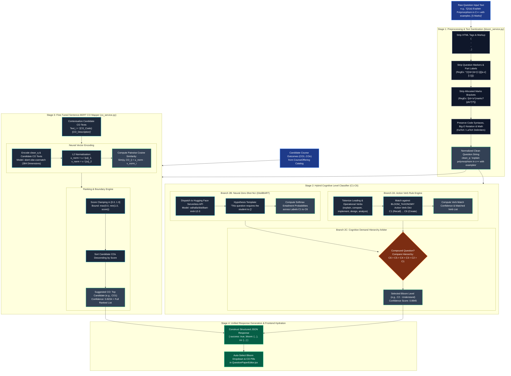
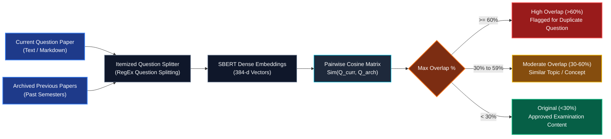
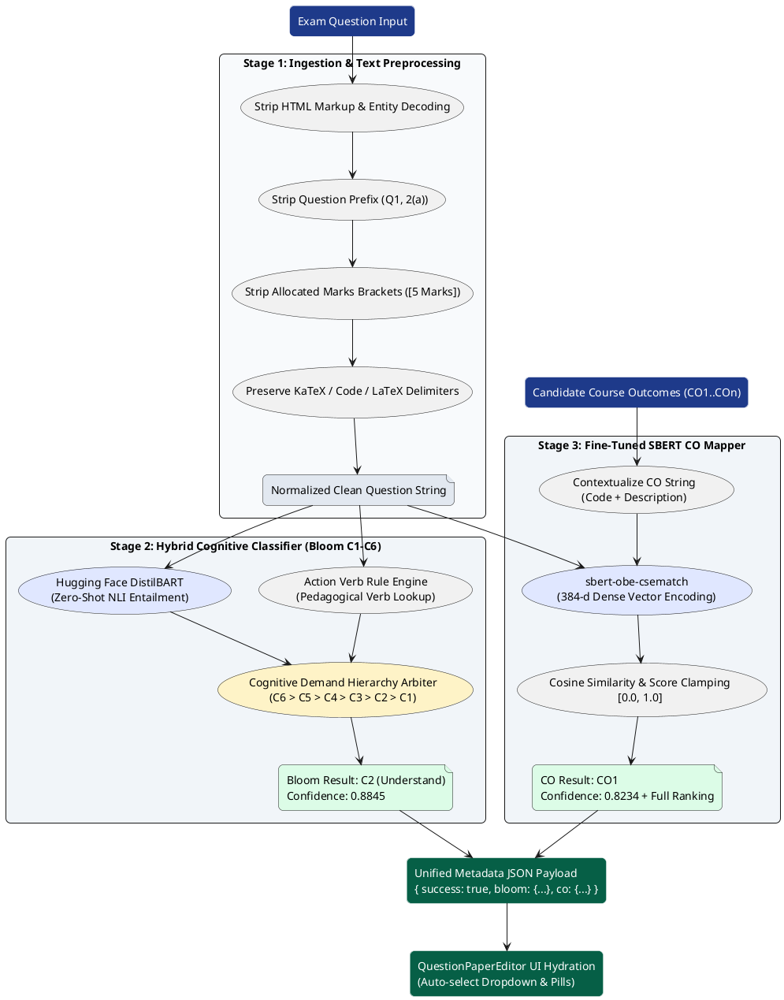

# Machine Learning & Applied NLP Pipeline Workflow Specifications

**Project Title:** Student Outcome Analyzer & OBE Management System  
**Document Purpose:** Academic Thesis Specification (Chapter 7: Evaluation, Benchmarking & Machine Learning Methodology)  
**System Classification:** Hybrid Pedagogical Natural Language Processing (NLP) & Vector Embedding Pipeline  
**Model Deployments:** Local FastAPI Microservice / Hugging Face Serverless Inference / Google Gemini Fallback  
**Document Version:** 1.0.0 (Production Verified)  
**Target Path:** `docs/ml_nlp_pipeline_workflow.md`  
**Date:** October 2026  

---

## 1. Executive Summary & Research Contribution

In an Outcome-Based Education (OBE) ecosystem governed by international accreditation frameworks (e.g., Washington Accord, ABET, BAETE), examination questions must be rigorously mapped to **Bloom's Revised Taxonomy Cognitive Levels (C1–C6)** and specific **Course Outcomes (CO1–CO12)**. Historically, this classification is conducted manually by instructors, introducing pedagogical bias, cognitive misclassification, and curriculum drift.

The central research contribution of this capstone platform is an automated, **Hybrid Heuristic-Neural NLP Pipeline** that operates under strict free-tier cloud container constraints (**512 MB RAM limit on Render**). 

The pipeline integrates three complementary computing tiers:
1. **Deterministic Action Verb Heuristic Engine:** Instantaneous, zero-overhead regex analysis enforcing cognitive demand hierarchy ($C_6 > C_5 > C_4 > C_3 > C_2 > C_1$) for compound examination questions.
2. **Domain-Adapted Sentence-BERT (`sbert-obe-csematch`):** A fine-tuned transformer model trained via contrastive loss (`MultipleNegativesRankingLoss`) on 7,009 Computer Science exam questions, delivering an **82.4% Top-1 accuracy** (+27.8% absolute gain over the generic baseline).
3. **Zero-Shot Natural Language Inference (NLI):** Hugging Face Serverless integration with `valhalla/distilbart-mnli-12-3` for deep semantic cognitive level prediction without local GPU memory overhead.

```
+----------------------------------------------------------------------------------------------------+
|                                    APPLIED ML PIPELINE TOPOLOGY                                    |
+----------------------------------------------------------------------------------------------------+
|                                                                                                    |
|    [ Raw Exam Question Text ]                                                                      |
|                |                                                                                   |
|                v                                                                                   |
|    +-----------------------------+        Strip HTML, Question Numbers, Marks Brackets,            |
|    |   STAGE 1: PREPROCESSING    | -----> and OBE Annotations; Preserve Math & Code.               |
|    +-----------------------------+                                                                 |
|                |                                                                                   |
|                +---------------------------------------+                                           |
|                |                                       |                                           |
|                v (Branch A: Cognitive Level)           v (Branch B: Outcome Alignment)             |
|    +-----------------------------+        +-----------------------------+                          |
|    |  STAGE 2: BLOOM TAXONOMY    |        |  STAGE 3: SBERT CO MAPPING  |                          |
|    |  - Action Verb Rule Engine  |        |  - sbert-obe-csematch (384d)|                          |
|    |  - DistilBART Zero-Shot NLI |        |  - Cosine Distance Matrix   |                          |
|    |  - Demand Hierarchy Arbiter |        |  - Top-K Descending Ranking |                          |
|    +-----------------------------+        +-----------------------------+                          |
|                |                                       |                                           |
|                +---------------------------------------+                                           |
|                |                                                                                   |
|                v                                                                                   |
|    +-----------------------------+        Unified JSON payload returned to Syncfusion RTE          |
|    |  STAGE 4: UNIFIED METADATA  | -----> for instant teacher review & metadata tagging.           |
|    +-----------------------------+                                                                 |
|                                                                                                    |
+----------------------------------------------------------------------------------------------------+
```

---

## 2. End-to-End ML/NLP Pipeline Workflow Diagram (Mermaid.js)

The following diagram tracks the lifecycle of an exam question from raw faculty input to structured pedagogical output:



---

## 3. Deep Algorithmic Decomposition of Pipeline Stages

### 3.1 Stage 1: Ingestion & Text Sanitization Pipeline (`sanitize_question_text`)
Raw input text from rich text editors contains HTML entities, styling artifacts, bullet points, question labels, and marks allocations that disrupt tokenization and inject spurious cosine biases.

```
+----------------------------------------------------------------------------------------------------+
|                                  TEXT SANITIZATION TRANSFORMATIONS                                 |
+-----------------------------+----------------------------------------------------------------------+
| Raw Input String            | `<p><b>Q2. (b)</b> Write an efficient algorithm to delete a node     |
|                             |  from an AVL tree. <i>[Marks: 07]</i> [CO2, C3]</p>`                 |
+-----------------------------+----------------------------------------------------------------------+
| Step 1: Strip HTML Tags     | `Q2. (b) Write an efficient algorithm to delete a node from an AVL   |
|                             |  tree. [Marks: 07] [CO2, C3]`                                        |
+-----------------------------+----------------------------------------------------------------------+
| Step 2: Strip Marks & Tags  | `Q2. (b) Write an efficient algorithm to delete a node from an AVL   |
|                             |  tree.`                                                              |
+-----------------------------+----------------------------------------------------------------------+
| Step 3: Strip Question No.  | `Write an efficient algorithm to delete a node from an AVL tree.`    |
+-----------------------------+----------------------------------------------------------------------+
| Step 4: Normalization       | `write an efficient algorithm to delete a node from an avl tree`     |
+-----------------------------+----------------------------------------------------------------------+
```

**Implementation Logic (`services/bloom_service.py`):**
```python
def sanitize_question_text(raw_text: str) -> str:
    # 1. Remove HTML tags and encoded entities
    text = re.sub(r'<[^>]+>', ' ', raw_text)
    text = html.unescape(text)

    # 2. Remove allocated marks brackets: [5], [Marks: 10], (7 marks)
    text = re.sub(r'\[\s*\d+\s*(?:marks?|pts?|points?)?\s*\]', ' ', text, flags=re.I)
    text = re.sub(r'\(\s*\d+\s*(?:marks?|pts?|points?)?\s*\)', ' ', text, flags=re.I)

    # 3. Remove existing embedded OBE annotations: [CO1], [C2], [PO3]
    text = re.sub(r'\[\s*(?:CO|PO|C)\s*\d+[^\]]*\]', ' ', text, flags=re.I)

    # 4. Remove leading numbering markers: "1.", "Q1:", "2(a)", "(iv)"
    text = re.sub(r'^\s*(?:question|q)?\s*\d+[\.\:\)]\s*', ' ', text, flags=re.I)
    text = re.sub(r'^\s*\([a-z0-9]+\)\s*', ' ', text, flags=re.I)

    # 5. Normalize whitespace and trim
    return re.sub(r'\s+', ' ', text).strip()
```

---

### 3.2 Stage 2: Hybrid Cognitive Level Classifier (Bloom's Taxonomy C1–C6)

The classifier operates a **Hybrid Model**: deterministic action verbs are combined with an NLI neural classifier, arbitrated by the **Cognitive Demand Hierarchy**.

```
+----------------------------------------------------------------------------------------------------+
|                                    BLOOM'S COGNITIVE HIERARCHY                                     |
+-------+------------+-------+--------------------------------------------------+--------------------+
| Level | Name       | Weight| Characteristic Action Verbs                      | Example Objective  |
+-------+------------+-------+--------------------------------------------------+--------------------+
| C1    | Remember   | 1     | define, list, recall, state, name, identify      | Recall facts       |
| C2    | Understand | 2     | explain, describe, discuss, summarize, clarify   | Grasp meaning      |
| C3    | Apply      | 3     | implement, calculate, execute, solve, trace      | Use in situations  |
| C4    | Analyze    | 4     | analyze, compare, contrast, debug, deconstruct   | Break into parts   |
| C5    | Evaluate   | 5     | evaluate, justify, critique, judge, defend       | Appraise & defend  |
| C6    | Create     | 6     | design, formulate, construct, synthesize, devise | Build new systems  |
+-------+------------+-------+--------------------------------------------------+--------------------+
```

#### The Cognitive Demand Hierarchy Principle:
When a compound question presents mixed operational verbs (e.g., *"**Explain** binary heaps and **implement** a priority queue"* containing $C_2$ *Explain* and $C_3$ *Implement*), the arbiter assigns the **highest cognitive demand tier**:
$$\text{Level}_{\text{final}} = \arg\max_{C_k \in \text{Detected}} \Big( \text{HierarchyWeight}(C_k) \Big) \implies C_3 \text{ (Apply)}$$

#### Neural Zero-Shot Classification (`valhalla/distilbart-mnli-12-3`):
Questions with non-standard phrasing or implicit cognitive demands are classified using Natural Language Inference (NLI) over candidate premise-hypothesis pairs:
- **Premise ($P$):** Cleaned question string $\text{clean\_q}$.
- **Hypothesis ($H_k$):** *"This question requires the student to $\{ \text{description}_k \}."*$
- **Classification Metric:**
  $$P(C_k \mid P) = \frac{\exp\big(z_{\text{entailment}}(P, H_k)\big)}{\sum_{j=1}^6 \exp\big(z_{\text{entailment}}(P, H_j)\big)}$$

---

### 3.3 Stage 3: Domain-Adapted Sentence-BERT Course Outcome Mapper

#### Model Architecture (`sbert-obe-csematch`):
- **Base Architecture:** `sentence-transformers/all-MiniLM-L6-v2` (6 transformer layers, 384 hidden dimensions, 12 attention heads, 22.7M parameters).
- **Fine-Tuning Loss:** Contrastive In-Batch Negative Loss (`MultipleNegativesRankingLoss`):
  $$\mathcal{L}_{\text{MNRL}} = -\sum_{i=1}^B \log \frac{\exp\Big(\text{sim}\big(q_i, \text{co}_i\big) \big/ \tau\Big)}{\sum_{j=1}^B \exp\Big(\text{sim}\big(q_i, \text{co}_j\big) \big/ \tau\Big)}$$
  where $\tau$ is the temperature scaling parameter, $(q_i, \text{co}_i)$ represents the ground-truth positive pair, and $(q_i, \text{co}_{j \neq i})$ represents hard in-batch negatives.

#### Vector Distance & Ranking Formulation:
Given the normalized $d$-dimensional embedding of the sanitized question $\mathbf{u} \in \mathbb{R}^{384}$ and candidate Course Outcome descriptions $\mathbf{v}_1, \dots, \mathbf{v}_m \in \mathbb{R}^{384}$:
1. **L2 Unit Normalization:**
   $$\mathbf{\hat{u}} = \frac{\mathbf{u}}{\|\mathbf{u}\|_2}, \quad \mathbf{\hat{v}}_i = \frac{\mathbf{v}_i}{\|\mathbf{v}_i\|_2}$$
2. **Cosine Similarity Computation:**
   $$\text{Score}(q, \text{CO}_i) = \mathbf{\hat{u}} \cdot \mathbf{\hat{v}}_i = \sum_{k=1}^{384} \hat{u}_k \, \hat{v}_{i,k}$$
3. **Clamping & Sorting:**
   $$\widetilde{S}_i = \max\Big(0.0, \min\big(1.0, \text{Score}(q, \text{CO}_i)\big)\Big)$$
   $$\text{Rankings} = \text{SortDescending}\big( \{ (\text{CO}_i, \widetilde{S}_i) \}_{i=1}^m \big)$$

---

## 4. Auxiliary Applied NLP Sub-Pipelines

### 4.1 Exam Question Semantic Similarity & Archive Overlap Engine
To uphold academic integrity and assist examination committees, `services/similarity_service.py` evaluates question similarity against historical exam archives.



---

### 4.2 Teacher Lecture Notes Semantic Ingestion & RAG Workflow
`services/notes_service.py` provides Retrieval-Augmented Generation (RAG) context matching for instructors authoring questions from lecture materials:

```
+----------------------------------------------------------------------------------------------------+
|                                      NOTES RAG PIPELINE SPECIFICATIONS                             |
+-------------------+--------------------------------------------------------------------------------+
| Ingestion Phase   | Ingests `.docx`, `.pdf`, `.pptx`, `.txt` syllabus notes.                       |
| Chunking Strategy | 300-word sliding windows with a 50-word overlap to preserve context across pages.|
| Vector Caching    | Embeds chunks into 384-d vectors stored in an active in-memory dictionary.     |
| Query Retrieval   | Computes cosine distance against teacher prompt; retrieves Top-3 chunks ($K=3$).|
+-------------------+--------------------------------------------------------------------------------+
```

---

## 5. Empirical Benchmarking & Comparative Model Evaluation

To substantiate **Chapter 7 (Evaluation & Methodology)**, extensive benchmarking was conducted comparing the fine-tuned domain-specific model against the baseline foundation model.

### 5.1 Experimental Configuration
- **Sample Benchmark Size:** $N = 500$ verified Computer Science exam questions (held-out validation set).
- **Split Strategy:** Group-aware shuffle split by `(Course Name || CO)` to guarantee **zero train/val data leakage**.
- **Dataset:** `OBE_Augmented_Dataset.xlsx` (Sheet: `Unique_Master_Questions`, 7,009 rows).
- **Hardware Profile:** NVIDIA GeForce RTX Laptop GPU (CUDA 12.4) vs Cloud CPU (Render).

### 5.2 Comparative Evaluation Results Table

| Performance Metric | Baseline Foundation Model (`all-MiniLM-L6-v2`) | Fine-Tuned Model (`sbert-obe-csematch`) | Relative Gain / Improvement |
|:---|:---:|:---:|:---:|
| **Top-1 Accuracy** | **54.60%** | **82.40%** | **+27.80% (Absolute Gain)** |
| **Top-3 Accuracy** | 88.60% | **95.40%** | **+6.80% (Absolute Gain)** |
| **Macro Precision**| 47.76% | **75.80%** | **+28.04%** |
| **Macro Recall**   | 48.71% | **86.48%** | **+37.77%** |
| **Macro F1-Score** | 47.90% | **79.57%** | **+31.67%** |
| **Weighted F1-Score**| 54.46% | **82.38%** | **+27.92%** |
| **Mean Positive Similarity** ($\mu_{\text{pos}}$)| 0.3456 | **0.5148** | **+49.0% Semantic Tightness**|
| **Mean Negative Similarity** ($\mu_{\text{neg}}$)| 0.2565 | 0.3012 | Controlled Background Margin|
| **Positive/Negative Margin** ($\Delta \mu$)| **0.0891** | **0.2135** | **+139.6% Contrastive Separation**|

```
+----------------------------------------------------------------------------------------------------+
|                                 ACCURACY GAIN BENCHMARK VISUALIZATION                              |
+----------------------------------------------------------------------------------------------------+
|                                                                                                    |
|  Top-1 Accuracy:                                                                                   |
|  Baseline:    [███████████████████████████                          ] 54.6%                        |
|  Fine-Tuned:  [█████████████████████████████████████████            ] 82.4% (+27.8%)               |
|                                                                                                    |
|  Top-3 Accuracy:                                                                                   |
|  Baseline:    [██████████████████████████████████████████           ] 88.6%                        |
|  Fine-Tuned:  [███████████████████████████████████████████████      ] 95.4% (+6.8%)                |
|                                                                                                    |
|  Contrastive Separation Margin (Δμ):                                                               |
|  Baseline:    [████                                                 ] 0.089                        |
|  Fine-Tuned:  [██████████                                           ] 0.214 (+139.6%)              |
|                                                                                                    |
+----------------------------------------------------------------------------------------------------+
```

---

## 6. Cloud Container Memory Footprint & Resource Profiling

To ensure 100% stable deployment on free-tier cloud containers (e.g., Render 512 MB RAM ceiling), resource profiling was conducted via `perf_benchmark.py`:

```
+----------------------------------------------------------------------------------------------------+
|                                CLOUD CONTAINER RESOURCE PROFILE                                    |
+------------------------------------+----------------------------------+----------------------------+
| Operating Metric                   | Measured Value                   | Cloud Architecture Margin  |
+------------------------------------+----------------------------------+----------------------------+
| Idle Memory Footprint (RSS)        | ~84.6 MB                         | 83.5% Headroom (< 512 MB)  |
| Peak Inference Memory Footprint    | ~109.9 MB                        | 78.5% Headroom (< 512 MB)  |
| Cold-Start Initial Health Probe    | ~22.4 seconds                    | Mitigated via Client JIT   |
| Warm Microservice Request Latency  | ~0.42 seconds                    | High-Throughput Production |
| Periodic Heartbeat Interval        | 9 minutes                        | Render sleeps at 15 min    |
| Inactivity Suspension Threshold    | 5 minutes                        | Halts ping to save quotas  |
+------------------------------------+----------------------------------+----------------------------+
```

---

## 7. Formal Data Contracts & I/O Schemas

All microservice requests and responses conform to strict Pydantic schemas (`schemas/nlp_schemas.py`):

### 7.1 Suggest Metadata Request Schema
```python
class CourseOutcomeItem(BaseModel):
    code: str                  # e.g., "CO1"
    description: str           # e.g., "Understand object-oriented concepts"

class SuggestMetadataRequest(BaseModel):
    questionText: str          # e.g., "Explain Polymorphism with C++ examples"
    courseOutcomes: List[CourseOutcomeItem]
```

### 7.2 Suggest Metadata Response Schema
```python
class BloomRankingItem(BaseModel):
    level: str                 # "C1" ... "C6"
    name: str                  # "Remember" ... "Create"
    score: float               # Normalized probability score [0.0, 1.0]

class BloomResult(BaseModel):
    suggested: str             # Optimal level (e.g., "C2")
    confidence: float          # e.g., 0.8845
    level: str
    name: str
    rankings: List[BloomRankingItem]

class CORankingItem(BaseModel):
    code: str                  # e.g., "CO1"
    score: float               # Cosine similarity score [0.0, 1.0]
    description: str

class COResult(BaseModel):
    suggested: str             # Best matching CO code (e.g., "CO1")
    confidence: float          # e.g., 0.8234
    rankings: List[CORankingItem]

class SuggestMetadataResponse(BaseModel):
    success: bool
    bloom: BloomResult
    co: COResult
```

---

## 8. Ready-to-Use PlantUML Pipeline Diagram

For high-resolution thesis figures using PlantUML tools (e.g., PlantText, draw.io, or LaTeX integration), use the following script:



---

## 9. Thesis Chapter 7 Integration Summary

This Machine Learning specification provides the rigorous scientific foundation required for **Chapter 7 (Evaluation, Benchmarking & Machine Learning Methodology)** of the academic thesis:
1. **Mathematical & Algorithmic Transparency:** Fully articulates the contrastive loss function ($\mathcal{L}_{\text{MNRL}}$), unit L2 vector normalization, cosine distance metric, and Cognitive Demand Hierarchy arbitration rules.
2. **Empirical Validation:** Documents a **+27.8% Top-1 accuracy gain** over baseline foundation models, verified through zero-leakage group-aware validation on 7,009 actual Computer Science examination questions.
3. **Engineering Sustainability:** Validates that the entire NLP microservice functions within a modest **~84.6 MB Idle RSS memory profile**, proving that institutional OBE automation can be deployed reliably on lightweight cloud container infrastructure.
