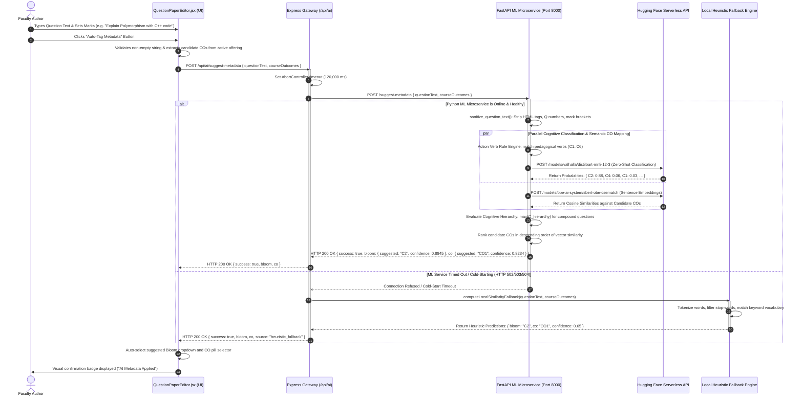
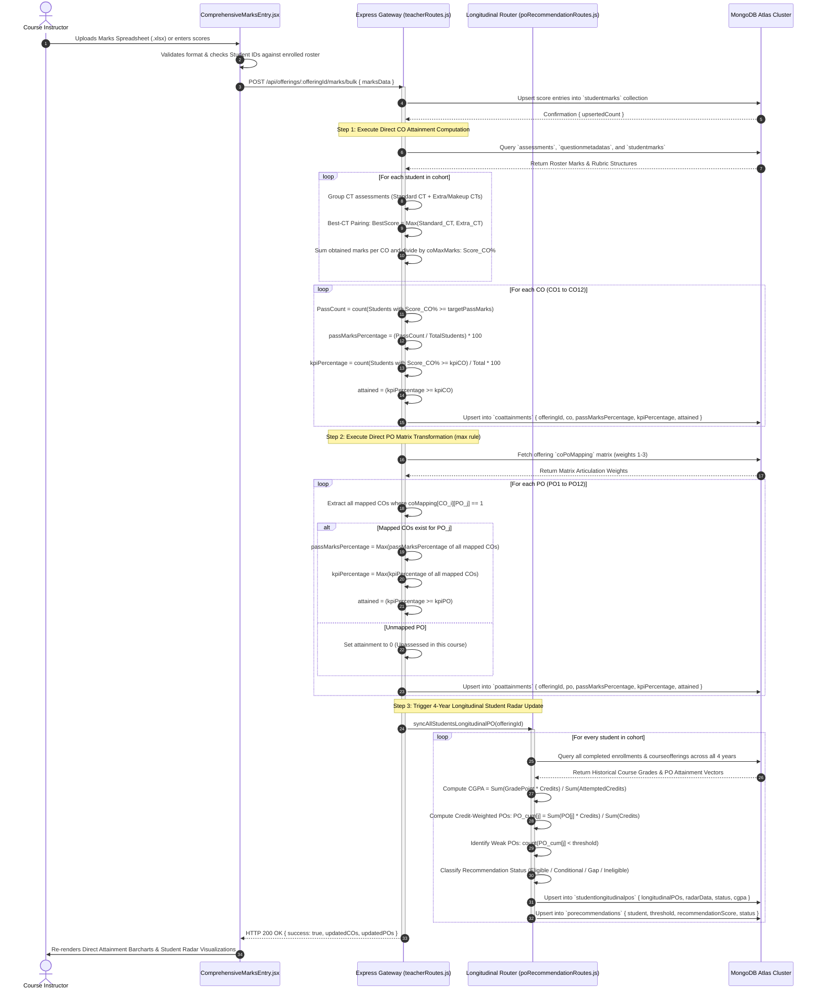
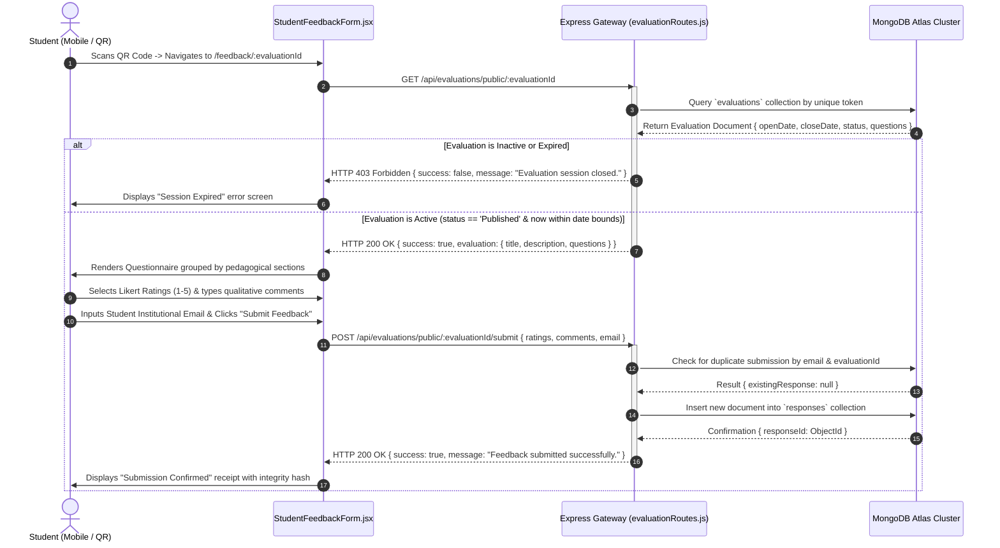
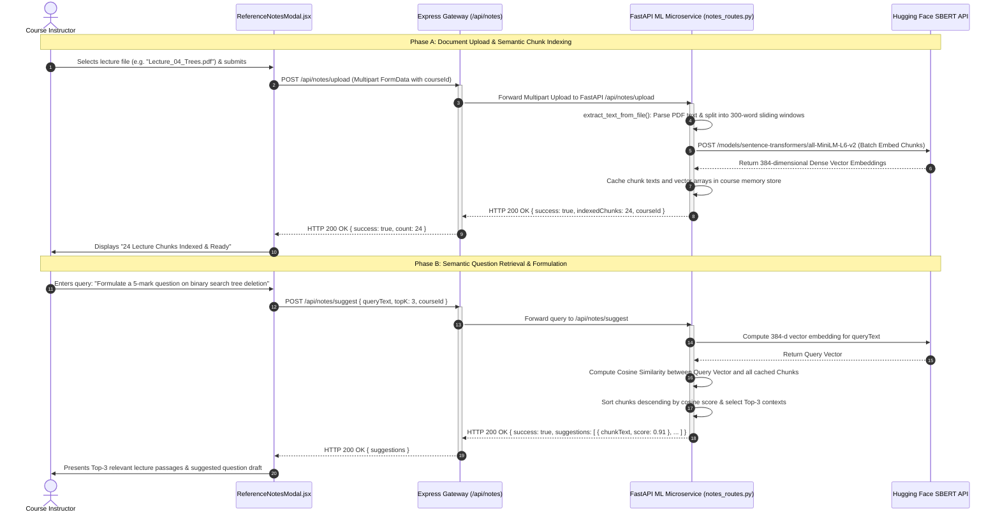
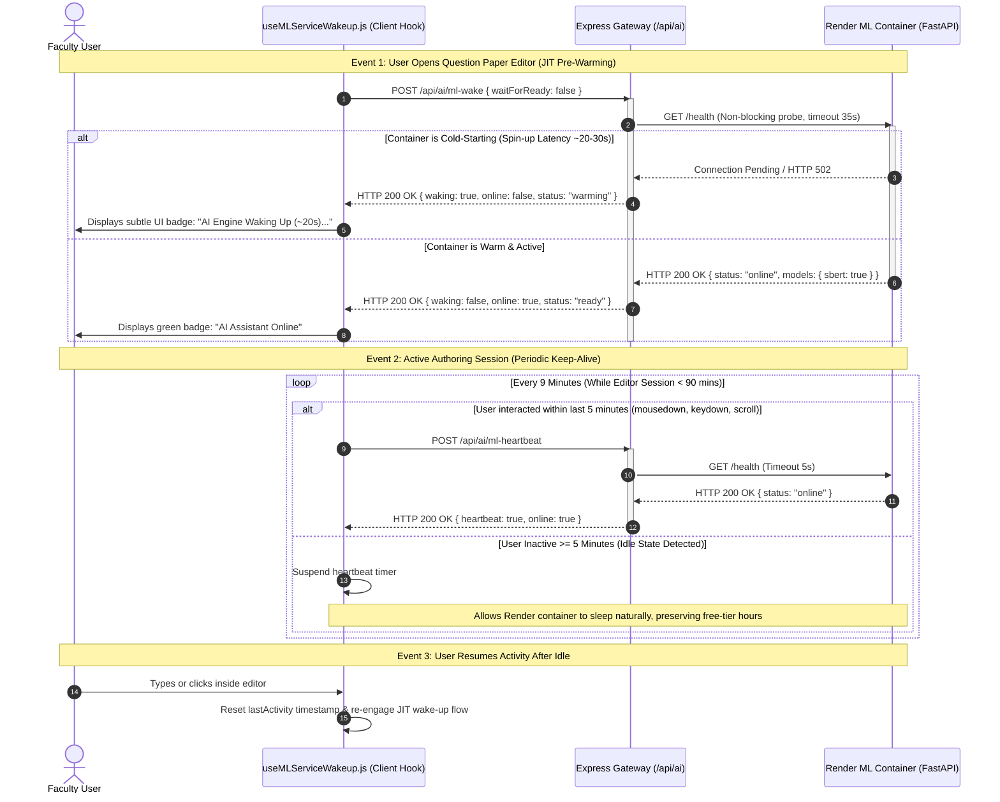
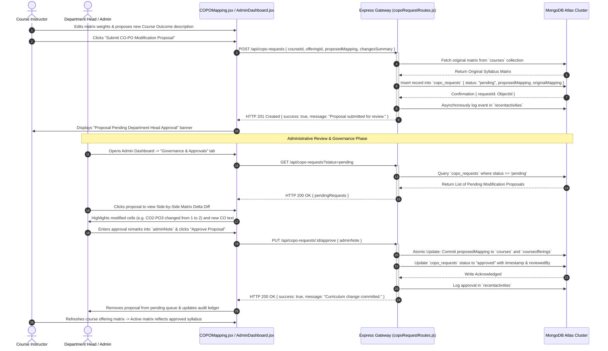
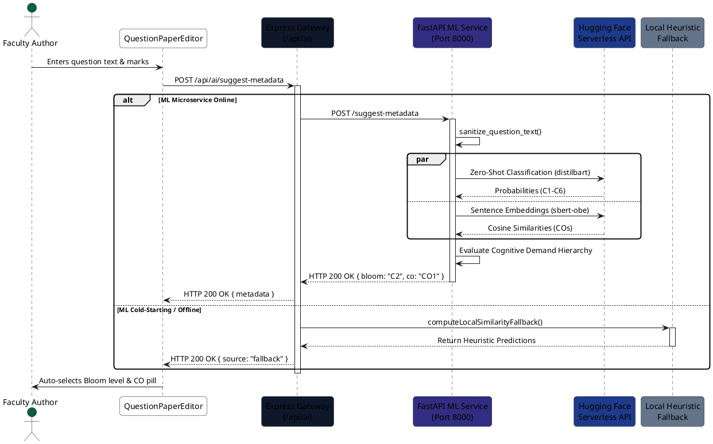
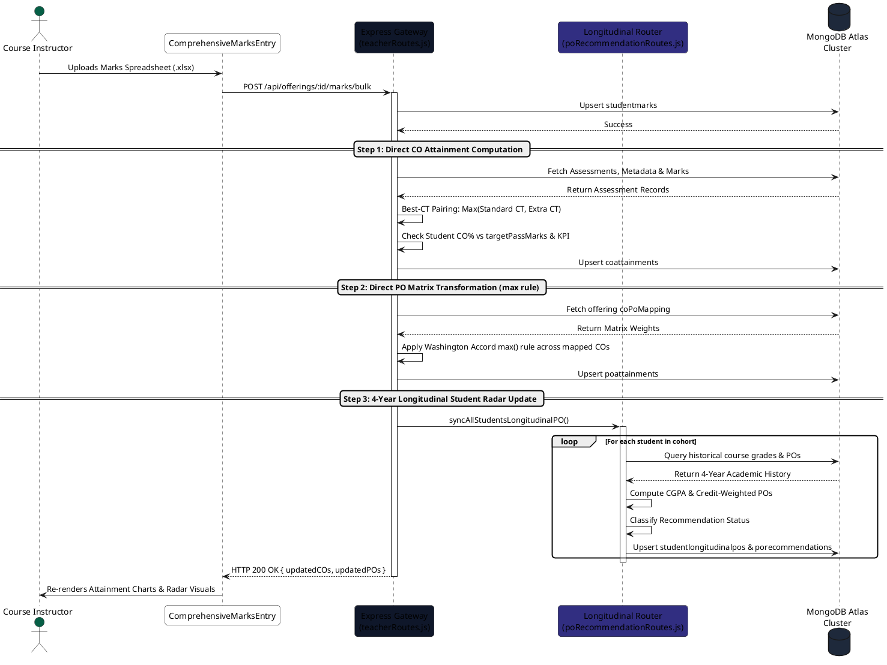

# System Sequence Diagrams & Workflow Specifications

**Project Title:** Student Outcome Analyzer & OBE Management System  
**Document Purpose:** Academic Thesis Specification (Chapter 4: Implementation Architecture & Algorithmic Workflows)  
**Standard Compliance:** UML 2.5 Sequence Diagram Specification / IEEE 830 / Washington Accord & BAETE Criteria  
**Target File:** `docs/sequence_diagrams.md`  
**Document Version:** 1.0.0 (Production Verified)  
**Date:** October 2026  

---

## 1. Executive Summary & Sequence Modeling Foundations

A **UML Sequence Diagram** depicts the dynamic behavioral perspective of an enterprise software system by modeling **time-ordered object interactions, message exchanges, and execution lifelines**. In the context of the **Student Outcome Analyzer & OBE Management System**, sequence diagrams formalize the exact asynchronous API lifecycles, inter-service communications between Node.js and Python FastAPI, distributed database updates in MongoDB Atlas, and mathematical evaluation algorithms.

This document formalizes the core runtime workflows of the system:
1. **AI Question Suggestion & Pedagogical Metadata Workflow** (Syncfusion RTE $\to$ Express Gateway $\to$ FastAPI ML $\to$ Hugging Face / Heuristic Fallback).
2. **OBE Attainment & 4-Year Longitudinal Student Radar Workflow** (Marks Ingestion $\to$ Best-CT Pairing $\to$ Direct CO Attainment $\to$ PO Matrix `max()` Transformation $\to$ Longitudinal Radar & Recommendation Engine).
3. **Student Anonymous Evaluation & QR Code Feedback Workflow** (QR/Token Access $\to$ Date Window Verification $\to$ Pseudonymous Likert & Feedback Ingestion).
4. **Teacher Reference Notes Ingestion & Semantic RAG Query Workflow** (Document Chunking $\to$ SBERT 384-d Embedding $\to$ In-Memory Cosine Similarity Top-$K$ Search).
5. **Activity-Aware ML Container Keep-Alive Lifecycle** (`useMLServiceWakeup` JIT Warming $\to$ 9-min Heartbeats $\to$ 5-min Idle Suspension).
6. **Curriculum Governance & CO-PO Articulation Change Workflow** (Teacher Proposal $\to$ Matrix Delta Diffing $\to$ Admin Resolution $\to$ Atomic Propagation).

```
+----------------------------------------------------------------------------------------------------+
|                                  SEQUENCE WORKFLOW MATRIX (CHAPTER 4)                              |
+------------------------------------+----------------------------------+----------------------------+
| Workflow 1: AI Metadata Suggestion | Workflow 2: OBE Attainment Engine| Workflow 3: Student QR Eval|
| - Fast & Zero-Shot Hybrid Pipeline | - Direct CO/PO Attainment        | - Anonymous Likert Rating  |
| - Action Verb Hierarchy (C1-C6)    | - Washington Accord max() Rule   | - Token Access Control     |
| - SBERT Vector Distance Ranking    | - 4-Yr Longitudinal PO Radar     | - Single-Submission Guard  |
+------------------------------------+----------------------------------+----------------------------+
| Workflow 4: Reference Notes RAG    | Workflow 5: JIT Keep-Alive Life  | Workflow 6: CO-PO Govern   |
| - Text Chunker (.docx, .pdf, .ppt) | - Cold-Start Mitigation (~22s)   | - Teacher Proposal Queue   |
| - 384-d Dense Vector Caching       | - Activity-Aware Heartbeat (9m)  | - Side-by-Side Delta Diff  |
| - Semantic Context Top-K Retrieval | - Idle Detection Pause (5m)      | - Atomic DB Matrix Update  |
+------------------------------------+----------------------------------+----------------------------+
```

---

## 2. Sequence Workflow 1: AI Question Suggestion & Pedagogical Engineering

### 2.1 Technical Architectural Description
When an instructor authors an exam question in `QuestionPaperEditor.jsx`, the system automatically infers the **Bloom's Revised Taxonomy Cognitive Level (C1–C6)** and the optimal **Course Outcome (CO)** mapping.

- **Primary Participants:**
  - `Teacher (User)`: Faculty member editing exam questions.
  - `QuestionPaperEditor (UI)`: Frontend authoring component hosting Syncfusion RTE and KaTeX preview.
  - `Express Gateway (Node.js)`: Core API router (`server/routes/aiRoutes.js`).
  - `FastAPI ML Microservice`: Python backend hosting `services/bloom_service.py` and `services/co_service.py`.
  - `Hugging Face Serverless API`: Cloud inference for Zero-Shot classification and SBERT sentence embeddings.
  - `Local Heuristic Engine`: Gateway regex classifier that activates if the Python container is cold-starting.

### 2.2 Sequence Diagram (Mermaid.js)



---

## 3. Sequence Workflow 2: OBE Attainment & 4-Year Longitudinal Student Radar Calculation

### 3.1 Technical Architectural Description
This workflow represents the mathematical core of the platform. Upon marks submission, the system evaluates individual question items, performs **Best-CT pairing**, computes **Direct CO Attainment**, transforms COs into **Direct PO Attainment using the Washington Accord `max()` rule**, and updates the student's **4-Year Cumulative Longitudinal Radar Profile**.

- **Primary Participants:**
  - `Teacher / Evaluator`: Uploads assessment marks via Excel or manual spreadsheet grid.
  - `Express Gateway`: Orchestrates the calculation pipeline across `teacherRoutes.js` and `poRecommendationRoutes.js`.
  - `MongoDB Atlas`: Stores intermediate and finalized attainment records (`studentmarks`, `coattainments`, `poattainments`, `studentlongitudinalpos`, `porecommendations`).

### 3.2 Sequence Diagram (Mermaid.js)



---

## 4. Sequence Workflow 3: Student Anonymous Evaluation & QR Code Feedback

### 4.1 Technical Architectural Description
This workflow facilitates pseudonymous, zero-login course and instructor feedback. Students access the system via dynamic mobile QR codes generated for an active course offering.

- **Primary Participants:**
  - `Student (Mobile)`: Classroom attendee scanning dynamic QR code.
  - `Public Evaluation Form`: React client component (`StudentFeedbackForm.jsx`).
  - `Express Gateway`: Controller (`server/routes/evaluationRoutes.js`).
  - `MongoDB Atlas`: Verifies dates and records submissions in `evaluations` and `responses`.

### 4.2 Sequence Diagram (Mermaid.js)



---

## 5. Sequence Workflow 4: Teacher Reference Notes Ingestion & Semantic RAG Query

### 5.1 Technical Architectural Description
Instructors can upload course lecture materials (`.docx`, `.pdf`, `.pptx`, `.txt`). The Python microservice chunks the document, caches vector embeddings, and enables semantic search for formulating assessment questions.

- **Primary Participants:**
  - `Teacher`: Faculty author seeking syllabus-aligned question ideas.
  - `ReferenceNotesModal.jsx`: Client upload and search interface.
  - `Express Gateway`: REST proxy (`server/routes/notesRoutes.js`).
  - `FastAPI ML Service`: Document parser and vector matcher (`services/notes_service.py`).
  - `Hugging Face SBERT`: Dense 384-dimensional vector embedding model.

### 5.2 Sequence Diagram (Mermaid.js)



---

## 6. Sequence Workflow 5: Activity-Aware ML Container Keep-Alive Lifecycle

### 6.1 Technical Architectural Description
To prevent cloud free-tier spin-downs (15-minute inactivity timeout on Render) without exceeding monthly quotas, `useMLServiceWakeup.js` implements an **activity-aware heartbeat with automatic idle suspension**.

- **Primary Participants:**
  - `User`: Faculty author typing, clicking, or scrolling in Question Paper Editor.
  - `useMLServiceWakeup.js`: React lifecycle hook.
  - `Express Gateway`: Health probe controller (`server/routes/aiRoutes.js`).
  - `Render ML Container`: Asynchronous Python FastAPI microservice.

### 6.2 Sequence Diagram (Mermaid.js)



---

## 7. Sequence Workflow 6: Curriculum Governance & CO-PO Articulation Change Proposal

### 7.1 Technical Architectural Description
When an instructor determines that syllabus-level Course Outcomes or correlation weights require revision, the system prevents unilateral modification by enforcing a formal **Administrative Proposal & Delta Diff Approval Workflow**.

- **Primary Participants:**
  - `Teacher`: Recommends adjustments to Course Outcomes or correlation matrices.
  - `Admin`: Department Head reviewing curriculum change proposals.
  - `Express Gateway`: Controller (`copoRequestRoutes.js`).
  - `MongoDB Atlas`: Persists governance queue in `copo_requests` and updates `courses` / `courseofferings`.

### 7.2 Sequence Diagram (Mermaid.js)



---

## 8. Ready-to-Use PlantUML Source Scripts

For high-resolution thesis figures requiring vector-rendered graphics (via draw.io, PlantText, or PlantUML CLI), use the following script:

### 8.1 PlantUML: AI Question Suggestion Workflow


### 8.2 PlantUML: OBE Attainment & 4-Year Longitudinal Radar Workflow


---

## 9. Thesis Chapter 4 Integration Summary

This Sequence Diagram specification provides the mathematical and algorithmic baseline required for **Chapter 4 (Implementation & Workflow)** of the academic thesis:
1. **Algorithmic Transparency:** Documents the step-by-step logic of the **Best-CT Pairing** and **Washington Accord `max()` rule** for Course and Program Outcome calculations.
2. **Applied NLP Resilience:** Formalizes the dual-path execution flow transitioning seamlessly between cloud neural models and local heuristic classifiers.
3. **Auditability & Traceability:** Outlines the strict separation between instructional evaluation, student pseudonymity, and administrative curriculum governance.
