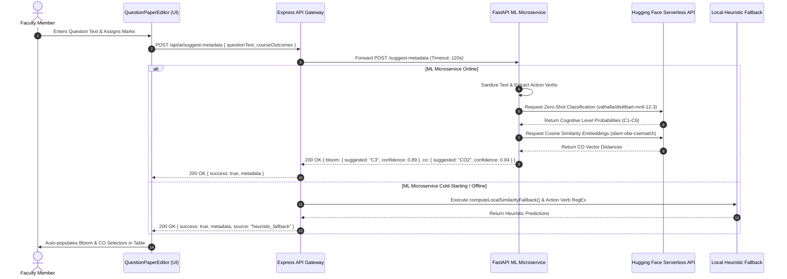
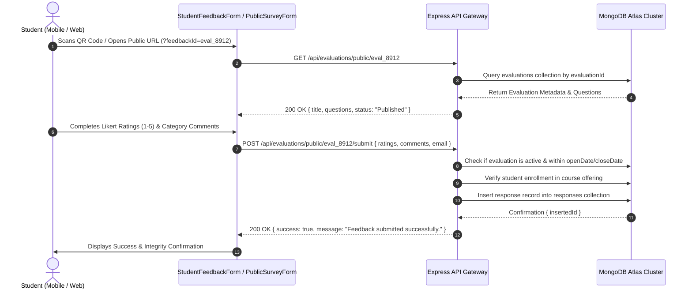
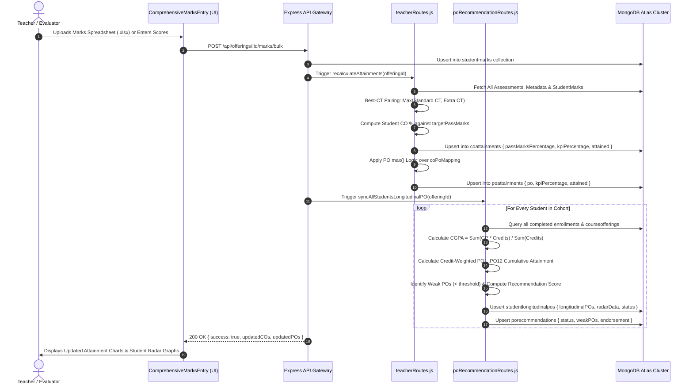
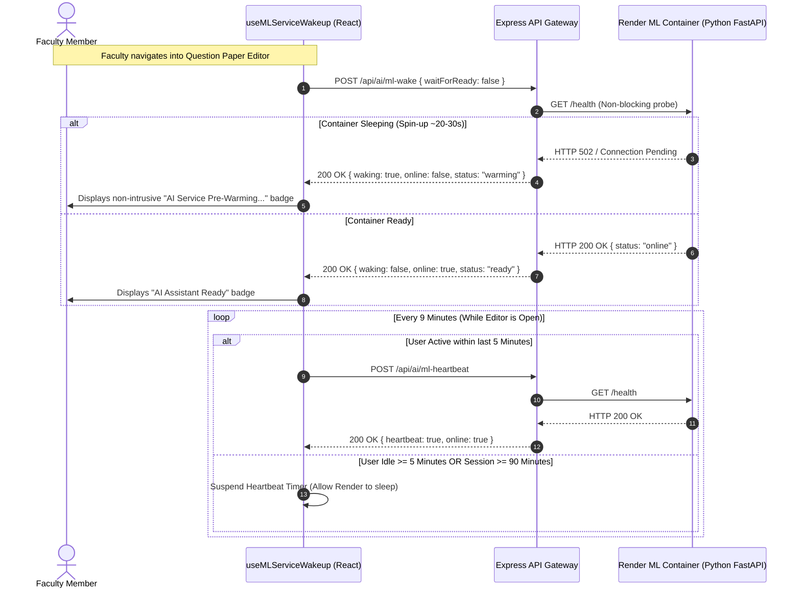
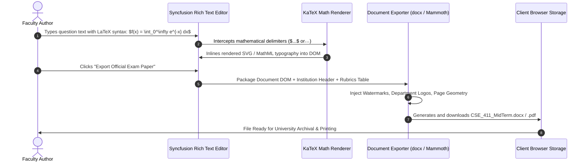
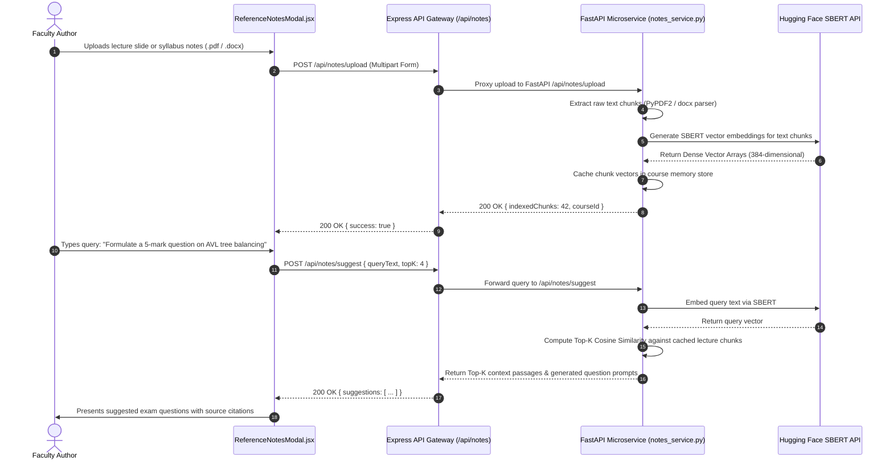

# System Architecture Specification

**Project Title:** Student Outcome Analyzer & OBE Management System  
**Document Purpose:** Academic Thesis Specification (Chapters 3 & 4: System Architecture & Technical Specifications)  
**System Classification:** Enterprise Educational Microservices & Applied NLP Architecture  
**Deployment Target:** Hybrid Edge / Render Cloud / MongoDB Atlas / Hugging Face Serverless  
**Document Version:** 2.0.0 (Production Verified)  
**Date:** October 2026  

---

## 1. Executive Architectural Strategy & Engineering Foundations

The **Student Outcome Analyzer & OBE Management System** is an enterprise-grade academic platform designed to automate and operationalize Outcome-Based Education (OBE) compliance in accordance with international accreditation frameworks (e.g., Washington Accord, ABET, BAETE). 

The platform departs from monolithic legacy educational software by adopting an event-aligned, decoupled **Microservices Architecture**. Computationally intensive Natural Language Processing (NLP) tasks and deep neural network inferences are isolated from high-throughput database transactions and transactional API endpoints.

```
+----------------------------------------------------------------------------------------------------+
|                                    DISTRIBUTED SYSTEM TOPOLOGY                                     |
+----------------------------------------------------------------------------------------------------+
|                                                                                                    |
|    +-----------------------------+        HTTPS / WSS        +--------------------------------+    |
|    |      CLIENT PRESENTATION    | <=======================> |       EXPRESS API GATEWAY      |    |
|    |      (Vite / React 18)      |                           |        (Node.js 26 / ESM)      |    |
|    +-----------------------------+                           +--------------------------------+    |
|                  |                                                      |          |               |
|                  | Web Traffic                                 Internal |          | Mongoose ODM  |
|                  | (Direct / QR)                                REST    |          | (TLS 1.3)     |
|                  v                                                      v          v               |
|    +-----------------------------+                           +------------+   +---------------+    |
|    |   STUDENT FEEDBACK PORTAL   |                           | FASTAPI ML |   | MONGODB ATLAS |    |
|    |     (Zero-Auth Public)      |                           |  SERVICE   |   | (26 Active    |    |
|    +-----------------------------+                           +------------+   |  Collections) |    |
|                                                                 |     |       +---------------+    |
|                                            Hugging Face Router  |     | Google Gemini SDK          |
|                                            (DistilBART / SBERT) |     | (Ordered Fallback Chain)   |
|                                                                 v     v                            |
|                                                   +-------------------------+                      |
|                                                   | EXTERNAL MODEL HUBS     |                      |
|                                                   | (HF Serverless & Google)|                      |
|                                                   +-------------------------+                      |
+----------------------------------------------------------------------------------------------------+
```

### 1.1 Core Engineering Principles

1. **Decoupled Microservice Topology:**
   - **Frontend Presentation Layer (`src/`):** A high-responsiveness Single-Page Application (SPA) built with Vite and React 18, featuring role-based component mounting and code-split vendor bundles.
   - **Core API Gateway (`server/`):** A stateless Express 5 / Node.js 26 backend managing business logic, transactional persistence, JWT authorization, and mathematical attainment engines.
   - **Applied ML Microservice (`ml-service/`):** An asynchronous Python 3.11 / FastAPI microservice dedicated to question metadata extraction, pedagogical Bloom’s Taxonomy classification, and semantic exam similarity analysis.
   - **Managed Persistence Layer:** A cloud-hosted MongoDB Atlas document store containing 26 verified, normalized collections.

2. **Zero-Data-Leakage Applied NLP:**
   - The NLP microservice runs inference without exposing institutional exam papers or proprietary question banks to public model fine-tuning sets.
   - The architecture implements a hybrid inference pipeline: immediate lexical and rule-based heuristic validation occurs locally, followed by fine-tuned Sentence-BERT (`sbert-obe-csematch`) vector embeddings and Hugging Face serverless execution over dedicated API endpoints.

3. **Strict Role-Segregated Tri-Panel Workflow:**
   - Single unified application with dynamic identity gating into three distinct user spaces:
     - **Admin Governance Panel:** Master syllabus catalog, department-wide batch/session scheduling, curriculum modification approvals, and faculty accounts.
     - **Teacher Pedagogical & Assessment Engineering Panel:** Course offering management, continuous assessment creation, Bloom/CO question tagging, automated rubrics generation, student marks ingestion, and direct CO/PO calculation.
     - **Student & Public Evaluation Panel:** Pseudonymous, zero-friction course evaluation and survey forms accessible via QR codes and direct tokens without requiring student authentication credentials.

4. **Low-Resource Container Optimization (Free-Tier Hardening):**
   - The Python ML microservice is architected to operate within a **strict 512 MB RAM ceiling** on Render cloud free-tier containers.
   - Offline fine-tuned Sentence-BERT models are hosted on Hugging Face Serverless Inference, keeping the local container footprint at **~84.6 MB Idle RSS** and **~109.9 MB Peak RSS**.
   - An intelligent client-side keep-alive hook (`useMLServiceWakeup`) maintains container warmth during active faculty question authoring while auto-suspending after 5 minutes of detected user inactivity to prevent cloud quota exhaustion.

5. **Layered Fault Tolerance & Fallback Hierarchy:**
   - The system guarantees zero application downtime. If the Python ML microservice is cold-starting or unreachable, the Express gateway automatically falls back to an offline rule-based heuristic engine and keyword-similarity analyzer.
   - Generative AI features (exam assistance, rubrics synthesis, SWOT reports) utilize a **9-tier Gemini Ordered Fallback Chain** (`gemini-2.5-flash` down to `gemini-flash-latest`) combined with bracket-stack JSON auto-healers.

---

## 2. Tri-Panel System Functional Specifications

The presentation layer partitions institutional responsibilities into three distinct operational domains:

```
+--------------------------------------------------------------------------------------------------+
|                                    TRI-PANEL WORKSPACE SPECS                                     |
+----------------------------------+----------------------------------+----------------------------+
| 1. ADMIN GOVERNANCE PANEL        | 2. TEACHER PEDAGOGICAL PANEL     | 3. STUDENT EVALUATION      |
|    (Role: 'admin')               |    (Role: 'user')                |    (Role: Public / Student)|
+----------------------------------+----------------------------------+----------------------------+
| - Master Syllabus & Catalogs     | - Course Offerings & Roster      | - Zero-Auth QR Code Landing|
| - Sessions, Batches & Sections   | - Continuous Assessment Engine   | - Anonymous Likert Ratings |
| - Faculty Account Provisioning   | - Rich Question Paper Editor     | - Quantitative Feedback    |
| - CO-PO Change Request Approval  | - Marks Ingestion (Excel / CSV)  | - Indirect Survey Forms    |
| - Program Outcome Definitions    | - Attainment & Radar Analytics   | - Token-Guarded Security   |
| - Institutional Audit Log View   | - Recommendation Matrix Engine   | - Single-Submission Guard  |
+----------------------------------+----------------------------------+----------------------------+
```

### 2.1 Admin Governance Panel (`src/components/admin/AdminDashboard.jsx`)
- **Security Barrier:** Protected by client-side router checks and backend JWT middleware enforcing `req.user.role === 'admin'`.
- **Core Responsibilities:**
  - **Academic Structure Management:** Creates and activates Academic Sessions (`academicsessions`), Batches (`batches`), Class Sections (`sections`), and Master Courses (`courses`).
  - **Faculty Provisioning:** Provisions instructor accounts (`teacher`), manages authorization roles, resets credentials, and reviews last active timestamps.
  - **Syllabus & Outcome Governance:** Defines departmental Program Outcomes (`programoutcomes`) PO1 through PO12. Reviews, approves, or rejects faculty-submitted `copo_requests` with automated delta diffing.
  - **Cross-Sectional Audit Logs:** Inspects real-time administrative and pedagogical events via `recentactivities`.

### 2.2 Teacher Pedagogical & Assessment Engineering Panel (`src/components/dashboard/TeacherDashboard.jsx`)
- **Security Barrier:** Enforces `req.user.role === 'user'` or `admin`. Scope is strictly restricted to assigned course offerings (`CourseOffering.teacher === req.user._id`).
- **Core Responsibilities:**
  - **Offerings Setup & Student Roster:** Binds master courses to assigned sessions and sections. Enrolls students via manual entry or bulk roster CSV uploads.
  - **CO-PO Articulation Matrix:** Customizes course-specific correlation matrices (weights 1–3). Dispatches formal modification requests to the department head if syllabus-level CO definitions require alteration.
  - **Assessment Engineering (`QuestionPaperEditor.jsx`):** A 1MB rich client authoring environment featuring:
    - Syncfusion Rich Text Editor with LaTeX formula rendering via KaTeX.
    - Automated question itemization (`QuestionMetadata`) with Bloom's Taxonomy and CO linkage.
    - AI-assisted question refinement and 5-column OBE rubrics generation.
    - SBERT semantic similarity comparison against historical archive papers.
    - Export engine generating print-ready Word (`.docx`), PDF, and LaTeX documents.
  - **Marks Ingestion & Validation:** Manual grid entry or intelligent multi-column Excel (`.xlsx`) parsing with fuzzy student ID mapping.
  - **Attainment Computation:** Instant calculation of Direct CO Attainment (`coattainments`), Direct PO Attainment (`poattainments`), and student-specific grade profiles.
  - **Longitudinal Radar & Recommendation Matrix:** 4-year cumulative program radar visualization per student across all degree credits, highlighting deficit gaps and certifying recommendation eligibility.

### 2.3 Student & Public Course Evaluation / Survey Panel (`StudentFeedbackForm.jsx` & `PublicSurveyForm.jsx`)
- **Security Barrier:** Publicly accessible via high-entropy token URL parameters (`?feedbackId=...` or `?surveyId=...`) or mobile-scanned QR codes. No account login required.
- **Core Responsibilities:**
  - **Formative / Summative Evaluation:** Displays instructor evaluation criteria partitioned into pedagogical sections.
  - **Anonymous Likert Feedback:** Gathers numerical Likert ratings (1–5) and multidimensional textual feedback (learned, enjoyed, difficult, teacher suggestions, department suggestions).
  - **Indirect Outcome Surveys:** Collects indirect student feedback mapped directly to specific Course Outcomes (COs) for indirect attainment calculations.
  - **Integrity Controls:** Enforces start/close date boundaries (`openDate`, `closeDate`) and client-side duplicate submission prevention.

---

## 3. Global System Architecture Diagram

The following verified Mermaid diagram maps the end-to-end topology across presentation panels, gateway routing, ML microservices, cloud inference providers, and database collections:

```mermaid
flowchart TD
    %% ==========================================
    %% PRESENTATION TIER
    %% ==========================================
    subgraph CLIENT_TIER["Presentation Tier (Vite / React 18 Single Page App)"]
        direction TB
        subgraph PANELS["Unified Presentation Panels"]
            ADMIN_UI["Admin Governance Panel<br/>(AdminDashboard.jsx)"]
            TEACHER_UI["Teacher Engineering Panel<br/>(TeacherDashboard.jsx / QuestionPaperEditor.jsx)"]
            STUDENT_UI["Student Feedback & Survey Portal<br/>(StudentFeedbackForm.jsx / PublicSurveyForm.jsx)"]
        end
        WAKEUP_HOOK["Client JIT Wakeup & Heartbeat Hook<br/>(useMLServiceWakeup.js)"]
        API_SERVICE["Client API Service Layer<br/>(src/services/apiService.js)"]
        
        ADMIN_UI --> API_SERVICE
        TEACHER_UI --> API_SERVICE
        STUDENT_UI --> API_SERVICE
        WAKEUP_HOOK -.->|"Heartbeat & JIT Wake"| API_SERVICE
    end

    %% ==========================================
    %% API GATEWAY TIER
    %% ==========================================
    subgraph GATEWAY_TIER["Core API Gateway Tier (Express 5 / Node.js 26 ESM)"]
        direction TB
        CORS_GUARD["CORS & Cookie Parser Guard<br/>(server/index.js)"]
        JWT_AUTH["JWT Authentication Guard<br/>(server/middleware/auth.js)"]
        
        subgraph ROUTE_MODULES["Express Route Controllers"]
            AUTH_ROUTE["/api/auth<br/>(authRoutes.js)"]
            OBE_ROUTE["/api (Catalog, Marks, Attainment)<br/>(obeRoutes.js)"]
            TEACHER_ROUTE["/api (Teacher Workspace & Attainment)<br/>(teacherRoutes.js)"]
            COPO_ROUTE["/api (Governance Requests)<br/>(copoRequestRoutes.js)"]
            PO_REC_ROUTE["/api (Longitudinal & Recommendations)<br/>(poRecommendationRoutes.js)"]
            SURVEY_ROUTE["/api (Indirect Surveys)<br/>(surveyRoutes.js)"]
            EVAL_ROUTE["/api (Course Evaluations)<br/>(evaluationRoutes.js)"]
            AI_GATEWAY["/api/ai (AI Gateway & Proxy)<br/>(aiRoutes.js)"]
            NOTES_ROUTE["/api/notes (Teacher Notes Proxy)<br/>(notesRoutes.js)"]
            UPLOAD_ROUTE["/api (Excel Ingestion)<br/>(uploadRoutes.js)"]
        end
        
        ACTIVITY_LOGGER["Activity Logger Utility<br/>(server/utils/activityLogger.js)"]
        CALC_ENGINE["Attainment & Radar Math Engine<br/>(PO max() & Longitudinal CGPA)"]

        CORS_GUARD --> JWT_AUTH
        JWT_AUTH --> AUTH_ROUTE
        JWT_AUTH --> OBE_ROUTE
        JWT_AUTH --> TEACHER_ROUTE
        JWT_AUTH --> COPO_ROUTE
        JWT_AUTH --> PO_REC_ROUTE
        JWT_AUTH --> SURVEY_ROUTE
        JWT_AUTH --> EVAL_ROUTE
        JWT_AUTH --> AI_GATEWAY
        JWT_AUTH --> NOTES_ROUTE
        JWT_AUTH --> UPLOAD_ROUTE

        TEACHER_ROUTE --> CALC_ENGINE
        PO_REC_ROUTE --> CALC_ENGINE
        OBE_ROUTE --> ACTIVITY_LOGGER
        TEACHER_ROUTE --> ACTIVITY_LOGGER
    end

    %% ==========================================
    %% MACHINE LEARNING MICROSERVICE TIER
    %% ==========================================
    subgraph ML_TIER["Machine Learning Microservice (FastAPI / Python 3.11)"]
        direction TB
        FASTAPI_CORE["FastAPI Application & Lifespan Router<br/>(ml-service/main.py)"]
        
        subgraph ML_ROUTERS["Microservice Route Handlers"]
            META_ROUTER["POST /suggest-metadata<br/>(metadata_routes.py)"]
            SIM_ROUTER["POST /similarity-check<br/>(similarity_routes.py)"]
            NOTES_ROUTER["POST /api/notes/*<br/>(notes_routes.py)"]
            HEALTH_ROUTER["GET /health<br/>(System Probe)"]
        end
        
        subgraph ML_ENGINES["Local NLP & Analytics Engines"]
            HEURISTIC_ENGINE["Action Verb Rule Engine<br/>(Cognitive Demand Hierarchy C1-C6)"]
            SANITIZER["Question Text Sanitizer<br/>(Regex / Markup Stripper)"]
            NOTES_INDEXER["Semantic Notes Ingestion & RAG<br/>(docx/pdf/pptx parser)"]
        end

        FASTAPI_CORE --> META_ROUTER
        FASTAPI_CORE --> SIM_ROUTER
        FASTAPI_CORE --> NOTES_ROUTER
        FASTAPI_CORE --> HEALTH_ROUTER

        META_ROUTER --> SANITIZER
        META_ROUTER --> HEURISTIC_ENGINE
        NOTES_ROUTER --> NOTES_INDEXER
    end

    %% ==========================================
    %% PERSISTENCE TIER
    %% ==========================================
    subgraph DB_TIER["Persistence Tier (MongoDB Atlas Cloud Cluster)"]
        direction TB
        MONGOOSE_ODM["Mongoose ODM Connector<br/>(server/lib/db.js)"]
        
        subgraph COLLECTIONS["26 Active Database Collections across 8 Modules"]
            C_AUTH["Identity: teacher (User)"]
            C_ACAD["Structure: academicsessions, batches, sections, students"]
            C_CURR["Curriculum: courses, courseofferings, enrollments"]
            C_OBE["Governance: programoutcomes, courseoutcomes, copo_requests"]
            C_ASMT["Assessments: assessments, questionmetadatas, questionpapers, studentmarks"]
            C_ATTAIN["Analytics: coattainments, poattainments, studentlongitudinalpos, porecommendations"]
            C_SURVEY["Surveys & Evals: surveys, surveycustomquestions, surveyresponses, evaluations, questions, responses"]
            C_AUDIT["Audit: recentactivities"]
        end

        MONGOOSE_ODM --> C_AUTH
        MONGOOSE_ODM --> C_ACAD
        MONGOOSE_ODM --> C_CURR
        MONGOOSE_ODM --> C_OBE
        MONGOOSE_ODM --> C_ASMT
        MONGOOSE_ODM --> C_ATTAIN
        MONGOOSE_ODM --> C_SURVEY
        MONGOOSE_ODM --> C_AUDIT
    end

    %% ==========================================
    %% EXTERNAL CLOUD SERVICES
    %% ==========================================
    subgraph CLOUD_HUBS["External Cloud Intelligence & Fallback Hubs"]
        direction TB
        subgraph HF_SERVERLESS["Hugging Face Serverless Hub"]
            HF_SBERT["Fine-Tuned SBERT Model<br/>(obe-ai-system/sbert-obe-csematch)"]
            HF_DISTILBART["Zero-Shot Bloom Classifier<br/>(valhalla/distilbart-mnli-12-3)"]
            HF_BACKUP["Base Sentence Transformer<br/>(sentence-transformers/all-MiniLM-L6-v2)"]
        end
        
        subgraph GOOGLE_GEMINI["Google Generative AI Hub"]
            GEMINI_CHAIN["9-Tier Ordered Fallback Chain<br/>(gemini-2.5-flash down to gemini-flash-latest)"]
            JSON_HEALER["Bracket-Stack JSON Auto-Healer<br/>(RegEx & Parser Repair)"]
        end
    end

    %% ==========================================
    %% INTER-SERVICE COMMUNICATION LINKS
    %% ==========================================
    API_SERVICE ==>|"REST / TLS 1.3"| CORS_GUARD
    ROUTE_MODULES ==>|"Mongoose Queries"| MONGOOSE_ODM
    
    AI_GATEWAY -->|"REST (Timeout 120s)"| FASTAPI_CORE
    NOTES_ROUTE -->|"REST Proxy"| FASTAPI_CORE
    AI_GATEWAY -->|"Failover HTTPS"| GEMINI_CHAIN
    
    META_ROUTER -->|"Vector Embedding API"| HF_SBERT
    META_ROUTER -->|"Zero-Shot Classification API"| HF_DISTILBART
    META_ROUTER -.->|"Cold-Start Failover"| HF_BACKUP
    SIM_ROUTER -->|"Cosine Similarity"| HF_SBERT

    GEMINI_CHAIN --> JSON_HEALER
    ACTIVITY_LOGGER --> C_AUDIT
```



---

## 4. Deep Layer Breakdown & Inter-Service Mechanics

### 4.1 Layer 1: Presentation & Client Runtime Tier (`src/`)
- **Technology Stack:** React 18.2.0, Vite 5.0.8, TailwindCSS 3.3.6, Lucide React, Recharts 2.10.3, KaTeX 0.18.1, Syncfusion RichTextEditor 33.2.13.
- **Architectural Mechanics:**
  - **Micro-Bundle Splitting:** `vite.config.js` defines isolated manual Rollup chunks (`vendor-syncfusion`, `vendor-katex`, `vendor-html2canvas`, `vendor-mammoth`, `vendor-pdfjs`, `vendor-xlsx`) ensuring initial page load stays under 350 KB.
  - **State Hydration & Persistence:** Application state is managed via React Context (`AuthContext.jsx`) and local storage synchronizers (`localStorageService.js`). Browser history events (`window.history.pushState`) are synchronized to preserve nested navigation across tab refreshes.
  - **Activity Tracking Engine:** `useMLServiceWakeup.js` attaches low-frequency event listeners (`mousedown`, `keydown`, `scroll`) throttled at 15-second intervals to detect user engagement with zero CPU overhead.

### 4.2 Layer 2: API Gateway & Business Orchestration Tier (`server/`)
- **Technology Stack:** Node.js 26.4.0 (ESM), Express 5.2.1, Mongoose 9.6.0, JSONWebToken 9.0.3, BcryptJS 3.0.3, CookieParser 1.4.7.
- **Architectural Mechanics:**
  - **Gateway Dispatching:** `server/index.js` acts as the single point of entry, routing requests into 10 modular controllers.
  - **Authentication Guard:** `server/middleware/auth.js` intercepts private endpoints, extracts bearer tokens from Authorization headers or HTTP-only cookies, verifies JWT signatures, and injects `req.user`.
  - **Transactional Attainment Engines:** 
    - `server/routes/teacherRoutes.js` executes the direct CO-PO attainment logic. Program Outcome attainment is computed using the accreditation-standard **`max()` aggregation principle**:
      $$\text{Attainment}(PO_j) = \max_{CO_i \in \text{Mapped}(PO_j)} \left( \text{Attainment}(CO_i) \right)$$
    - `server/routes/poRecommendationRoutes.js` computes 4-year cumulative longitudinal credit-weighted averages for every student:
      $$\text{Longitudinal Attainment}(PO_j) = \frac{\sum (\text{Attainment}_{c}(PO_j) \times \text{Credits}_c)}{\sum \text{Credits}_c}$$
  - **Audit Logging Dispatcher:** `server/utils/activityLogger.js` asynchronously commits operational records to `recentactivities` without blocking HTTP response cycles.

### 4.3 Layer 3: Applied Machine Learning & NLP Microservice (`ml-service/`)
- **Technology Stack:** Python 3.11, FastAPI 0.110+, Uvicorn 0.28+, Hugging Face Inference API, PyTorch (CPU/CUDA optional).
- **Architectural Mechanics:**
  - **Cognitive Demand Action Verb Rule Engine:** `services/bloom_service.py` implements a hierarchical pedagogical analyzer based on Bloom's Revised Taxonomy (C1 Remember through C6 Create). It evaluates compound questions by prioritizing higher-order cognitive demands ($C_6 > C_5 > C_4 > C_3 > C_2 > C_1$).
  - **Sanitization Pipeline:** Cleans input strings by stripping markup, LaTeX syntax, and assessment prefix tokens (`Q1(a)`, `Marks [5]`) prior to embedding.
  - **Course Outcome Mapping Engine:** `services/co_service.py` projects questions into the high-dimensional latent space of fine-tuned Sentence-BERT (`sbert-obe-csematch`) and computes cosine similarity against syllabus CO statements.
  - **Teacher Notes Ingestion & RAG:** `services/notes_service.py` extracts text from `.docx`, `.pdf`, `.pptx`, and `.txt` files, generates normalized chunk embeddings, and facilitates semantic question recommendations.

### 4.4 Layer 4: Cloud Persistence Tier (MongoDB Atlas)
- **Engine:** MongoDB v7.0+ Document Database hosted on AWS via MongoDB Atlas.
- **Data Models:** Exactly 26 active collections organized into 8 functional modules (as formalized in [`docs/database_er_diagram_and_schema.md`](file:///d:/Codes%20With%20Joy/Capstone%20Project%20Main%20Folder/Capstone%20Project%20Updated%20x22/docs/database_er_diagram_and_schema.md)).
- **Indexing & Constraints:**
  - High-performance compound unique indices enforce relational integrity (e.g., `{ student: 1, assessment: 1 }` on `studentmarks`, `{ courseOffering: 1, co: 1 }` on `coattainments`).
  - Native TTL and indexing strategies support real-time querying across student longitudinal datasets exceeding thousands of mark records.

### 4.5 Layer 5: Cloud Intelligence & Fallback Hubs
- **Hugging Face Serverless Inference:**
  - Primary Fine-Tuned Model: `obe-ai-system/sbert-obe-csematch`
  - Fallback Baseline Model: `sentence-transformers/all-MiniLM-L6-v2`
  - Zero-Shot Cognitive Classifier: `valhalla/distilbart-mnli-12-3`
- **Google Generative AI Infrastructure:**
  - Utilized for generative exam paper drafting, automatic rubrics matrix synthesis, and SWOT report generation.
  - Features an ordered 9-tier model failover chain resilient against free-tier rate limits (`429 Too Many Requests`).

---

## 5. End-to-End Execution Pipelines & Sequence Flows

### 5.1 Pipeline 1: AI Pedagogical Metadata Suggestion Flow (`POST /suggest-metadata`)

When a faculty member inputs or edits an exam question, the system automatically suggests the optimal Bloom's Taxonomy cognitive level and matching Course Outcome.



### 5.2 Pipeline 2: Student Course Evaluation & Pseudonymous Feedback Submission

Students submit course and instructor ratings anonymously via mobile devices using dynamic QR codes.



### 5.3 Pipeline 3: Complete OBE Attainment & 4-Year Longitudinal Student Radar Analytics

This pipeline demonstrates how student assessment marks propagate through CO/PO attainment into multi-year radar visualizations.



### 5.4 Pipeline 4: Activity-Aware ML Container Wakeup & Keep-Alive Lifecycle (`useMLServiceWakeup`)

To preserve free-tier cloud resources without degrading user experience, the client transparently warms the serverless ML container.



### 5.5 Pipeline 5: Exam Question Paper Authoring, LaTeX Formula Rendering & Document Export



### 5.6 Pipeline 6: Teacher Notes Semantic RAG Question Suggestion Flow



---

## 6. Security Architecture & Non-Functional System Optimization

### 6.1 Authentication, Authorization & Route Guards
- **Password Security:** Faculty passwords are salted and hashed using **Bcrypt** with 10 salt rounds. Plaintext passwords never touch persistence logs.
- **Stateless Session Gating:** Authentication yields a digitally signed **JSON Web Token (JWT)** encoded with the user's ID, role (`admin` or `user`), and email. Tokens have an active lifespan of 7 days.
- **Route Protection Middleware:** `server/middleware/auth.js` enforces two-tier authorization:
  1. `requireAuth`: Verifies token signature and checks if user exists in the active database.
  2. `requireAdmin`: Rejects non-administrator access with `HTTP 403 Forbidden`.
- **CORS Whitelist Policy:** The API Gateway rejects requests from unauthorized origins, strictly whitelisting local development origins (`http://127.0.0.1:3000`, `http://localhost:3000`) and the production deployment domain (`https://sarkarjoy86.github.io`).

### 6.2 Cloud Memory Profile & Resource Allocation Boundaries
Due to deployment on cloud containers subject to strict memory ceilings (such as Render's 512 MB free tier), the Python microservice was specifically engineered and profiled for low resource consumption:

```
+----------------------------------------------------------------------------------------------------+
|                                  ML CONTAINER RESOURCE BENCHMARKS                                  |
+------------------------------------+----------------------------------+----------------------------+
| Metric                             | Measured Local / Cloud Baseline  | Free Tier Safety Margin    |
+------------------------------------+----------------------------------+----------------------------+
| Idle Memory Consumption (RSS)      | ~84.6 MB                         | 83.5% Under Limit (512 MB) |
| Peak Inference Memory (RSS)        | ~109.9 MB                        | 78.5% Under Limit (512 MB) |
| First Inference Latency (Cold)     | ~22.4 seconds                    | Handled by JIT Pre-Warming |
| Subsequent Inference Latency (Warm)| ~0.42 seconds                    | Near-Instantaneous         |
| Active Container Idle-to-Sleep     | 15 minutes (Render baseline)     | Pauses heartbeats @ 5 min  |
+------------------------------------+----------------------------------+----------------------------+
```

### 6.3 Multi-Tier Resilience & Rate-Limit Mitigation
1. **Gemini Ordered Fallback Chain:**
   When invoking Generative AI endpoints for SWOT analysis or rubrics generation, server-side handlers in `server/routes/aiRoutes.js` sequentially cycle through 9 model endpoints:
   $$\text{gemini-2.5-flash} \longrightarrow \text{gemini-2.0-flash} \longrightarrow \text{gemini-1.5-flash} \longrightarrow \text{gemini-flash-latest} \longrightarrow \text{gemini-3.8-flash} \dots$$
2. **Bracket-Stack JSON Auto-Healer:**
   Generative AI JSON outputs often suffer from unescaped quotation marks or truncated closing brackets when model tokens exhaust output limits. The gateway implements an algorithmic parser that:
   - Strips markdown code block wrappers (````json ... ````).
   - Corrects trailing commas preceding array/object closures.
   - Maintains a bracket stack (`[`, `{`) to balance and heal malformed, truncated JSON responses automatically before parsing.
3. **Local Semantic Similarity Fallback:**
   If the Python ML microservice is unreachable, the gateway invokes `computeLocalSimilarityFallback()`, performing tokenized word-frequency overlap analysis and regex stopword filtering to ensure zero disruption to the exam paper authoring workflow.

---

## 7. Complete Repository Directory Mapping & Technology Stack Matrix

The following table provides an exhaustive, auditable catalog of every directory, configuration file, service, script, and component across the entire repository:

| Path / File | Category | Technology / Language | Operational Purpose & Architectural Role |
|:---|:---|:---|:---|
| `src/App.jsx` | Client Core | React 18 (JSX) | Master client router, role-based panel switcher, history synchronizer, and public evaluation URL interceptor. |
| `src/main.jsx` | Client Core | React 18 / DOM | SPA bootstrap entry point mounting the root application into `index.html`. |
| `src/index.css` | Styling | TailwindCSS / CSS3 | Global design tokens, glassmorphism utilities, scrollbars, and dark mode theme variables. |
| `src/components/admin/AdminDashboard.jsx` | Admin UI | React / Lucide / Recharts | Comprehensive admin governance workspace: session scheduling, course catalogs, faculty provisioning, CO-PO request approvals. |
| `src/components/dashboard/TeacherDashboard.jsx` | Teacher UI | React / Lucide / Recharts | Master faculty workspace: course offerings, continuous assessment trackers, marks entry, and direct CO-PO attainment visualizations. |
| `src/components/dashboard/Dashboard.jsx` | Teacher UI | React (JSX) | Offering overview dashboard displaying course metadata, enrolled student metrics, and assessment progress. |
| `src/components/dashboard/ResultsDashboard.jsx` | Analytics UI | React / Recharts | High-level summary dashboard presenting attainment cards, pass percentages, and KPI indicators. |
| `src/components/dashboard/ReferenceNotesModal.jsx`| Teacher Tool | React (JSX) | Modal dialog for uploading faculty lecture notes and querying AI-assisted question suggestions. |
| `src/components/marks/QuestionPaperEditor.jsx` | Authoring UI | React / Syncfusion / KaTeX | 1MB specialized assessment engineering environment with AI assistance, Bloom tagging, and SBERT similarity checks. |
| `src/components/marks/TableDesignModal.jsx` | Authoring UI | React (JSX) | Interactive modal for customizing exam question paper typography, borders, table layouts, and institution headers. |
| `src/components/marks/ComprehensiveMarksEntry.jsx`| Marks UI | React (JSX) | Full-screen tabular marks entry spreadsheet supporting question-by-question scoring and Excel upload. |
| `src/components/marks/ComprehensiveExcelUpload.jsx`| Ingestion UI | React / XLSX | Drag-and-drop Excel/CSV marks parser with column mapping, student ID validation, and error reporting. |
| `src/components/marks/UploadComponent.jsx` | Ingestion UI | React (JSX) | Generic file upload widget with progress indicators and format validation. |
| `src/components/marks/MarksEntry.jsx` | Marks UI | React (JSX) | Lightweight marks input interface for quick assessment grading. |
| `src/components/marks/baiustLogo.js` | Static Asset | JavaScript (Base64) | Embedded high-resolution vector/base64 university crest for PDF/Word question paper headers. |
| `src/components/course/COPOMapping.jsx` | OBE UI | React (JSX) | Interactive CO-PO articulation matrix editor (weights 1–3) with administrative change-request dispatching. |
| `src/components/course/AssessmentConfig.jsx` | Assessment UI | React (JSX) | Assessment creator configuring continuous evaluation types (CTs, Mid, Final, Assignments), marks, and CO tags. |
| `src/components/course/KPIConfig.jsx` | OBE UI | React (JSX) | Course-level KPI benchmark configurator (`targetPassMarks`, `kpiCO`, `kpiPO`). |
| `src/components/course/CourseInfo.jsx` | Course UI | React (JSX) | Presentation component displaying course credit hours, department, syllabus level, and term. |
| `src/components/course/ConfigurationStepper.jsx` | Navigation UI | React (JSX) | Step-by-step onboarding wizard guiding instructors through the course configuration lifecycle. |
| `src/components/reports/ComprehensiveReports.jsx` | Reporting UI | React / Recharts | Full institutional report generator: Direct Attainment, Indirect Attainment, Grade Distributions, and Export tools. |
| `src/components/reports/PORecommendationMatrix.jsx`| Analytics UI | React / Recharts | Longitudinal graduation recommendation engine with multi-year radar charts and faculty endorsement notes. |
| `src/components/reports/SWOTAnalysisReport.jsx` | AI Reporting UI | React / Recharts | Automated course SWOT analysis generator leveraging Google Gemini models and attainment metrics. |
| `src/components/reports/SelfAssessmentReport.jsx` | Compliance UI | React (JSX) | Accreditation Self-Assessment Report (SAR) compiler formatted for BAETE / Washington Accord submissions. |
| `src/components/reports/Results.jsx` | Reporting UI | React (JSX) | Tabular display of final computed student attainment and grade summaries. |
| `src/components/evaluation/CourseEvaluationManager.jsx`| Evaluation UI | React (JSX) | Faculty management interface for scheduling formative evaluations, generating QR codes, and viewing response rates. |
| `src/components/evaluation/EvaluationAnalytics.jsx`| Analytics UI | React / Recharts | Analytical dashboard visualizing course feedback scores, question averages, and sentiment breakdowns. |
| `src/components/evaluation/StudentFeedbackForm.jsx`| Public UI | React (JSX) | Zero-auth student evaluation submission form accessible via QR codes and direct tokens. |
| `src/components/survey/SurveyManagement.jsx` | Survey UI | React (JSX) | Faculty portal for creating, publishing, and managing indirect Course Outcome surveys. |
| `src/components/survey/PublicSurveyForm.jsx` | Public UI | React (JSX) | Public-facing student indirect survey questionnaire supporting Likert ratings across Sections 1 to 5. |
| `src/components/survey/SurveyAnalysis.jsx` | Analytics UI | React / Recharts | Quantitative indirect survey analysis tool aggregating student responses into indirect CO attainments. |
| `src/components/survey/CourseEvaluationByTeacher.jsx`| Survey UI | React (JSX) | Faculty self-assessment survey module comparing teacher expectations against student evaluations. |
| `src/components/survey/StudentFeedbackReport.jsx` | Reporting UI | React / Recharts | Comprehensive feedback report compiling qualitative comments and Likert averages for departmental review. |
| `src/components/survey/CourseSurvey.jsx` | Survey UI | React (JSX) | Compact survey component embedded within course overview dashboards. |
| `src/components/survey/surveyQuestions.js` | Config | JavaScript | Standardized bank of accreditation survey questions partitioned across 5 pedagogical sections. |
| `src/components/students/StudentManagement.jsx` | Roster UI | React (JSX) | Student roster management interface supporting batch filtering, search, and enrollment status updates. |
| `src/components/auth/AuthCard.jsx` | Auth UI | React (JSX) | Secure login card supporting role-aware authentication and real-time credential validation. |
| `src/components/layout/Sidebar.jsx` | Navigation UI | React (JSX) | Collapsible responsive navigation sidebar displaying active course offerings and system menus. |
| `src/components/layout/ProfileAvatar.jsx` | Layout UI | React (JSX) | Header avatar menu presenting active faculty identity, account settings, and logout triggers. |
| `src/components/layout/AdminProfileAvatar.jsx` | Layout UI | React (JSX) | Header avatar menu presenting administrator credentials and system maintenance options. |
| `src/components/ErrorBoundary.jsx` | Resilience UI | React (JSX) | React Error Boundary preventing application crashes by catching rendering exceptions and displaying recovery options. |
| `src/context/AuthContext.jsx` | State Management | React Context API | Global authentication provider managing user session tokens, login states, and role attributes. |
| `src/hooks/useMLServiceWakeup.js` | Client Hook | React Custom Hook | Intelligent keep-alive engine managing JIT container wakeups, 9-minute heartbeats, and 5-minute idle suspensions. |
| `src/services/apiService.js` | API Wrapper | JavaScript / Fetch | Centralized client HTTP service wrapping all REST API calls with error normalization and auth header injection. |
| `src/services/notesApi.js` | API Wrapper | JavaScript / Fetch | Dedicated client service handling lecture notes uploads, indexing status checks, and semantic question queries. |
| `src/services/localStorageService.js` | Client Utility | JavaScript | Typed abstraction over browser local storage with JSON serialization error handlers. |
| `src/utils/calculations.js` | Math Engine | JavaScript | Core mathematical routines for percentage calculations, standard deviations, and grade point lookups. |
| `src/utils/comprehensiveCalculations.js` | Math Engine | JavaScript | Advanced OBE engine calculating direct CO attainments, PO mappings, and indirect survey weightings. |
| `src/utils/chartDownload.js` | Export Utility | JavaScript / Canvas | High-resolution SVG and Canvas chart rasterizer exporting PNG/JPEG graphics for thesis documentation. |
| `src/utils/codeFormatter.js` | Format Utility | JavaScript | Code syntax highlighting and formatting helper for technical exam questions. |
| `src/utils/copoWordExporter.js` | Export Utility | JavaScript / docx | Programmatic Word (`.docx`) exporter generating formatted CO-PO articulation matrices with institutional styling. |
| `src/utils/courseOverviewExcelExporter.js` | Export Utility | JavaScript / xlsx-style| Multi-tab Excel exporter generating complete course dossiers (roster, marks, CO/PO attainment, and KPIs). |
| `src/utils/studentTableExcelExporter.js` | Export Utility | JavaScript / xlsx | Targeted Excel exporter generating tabular student attainment summaries. |
| `src/utils/excelParser.js` | Ingestion Utility | JavaScript / XLSX | Fuzzy Excel column parser extracting student IDs, marks, and assessment names from uploaded spreadsheets. |
| `src/utils/rubricsHelper.js` | Rubrics Utility | JavaScript | Rich rubrics generator producing 5-column criteria (Exemplary, Proficient, Developing, Novice, Inadequate). |
| `src/utils/notesStorage.js` | Storage Utility | JavaScript | Local cache manager maintaining reference notes metadata in browser storage. |
| `src/utils/timeAgo.js` | Format Utility | JavaScript | Human-readable relative timestamp formatter (e.g., "5 minutes ago"). |
| `server/index.js` | Gateway Core | Node.js (ESM) | Main Express server entry point configuring CORS, body limits, route controllers, and MongoDB bootstrapping. |
| `server/lib/db.js` | Persistence Core | Mongoose | Mongoose database connection manager enforcing connection pooling and retry logic. |
| `server/middleware/auth.js` | Security Guard | Express Middleware | JWT verification middleware inspecting Authorization headers and attaching decoded user objects. |
| `server/utils/activityLogger.js` | Audit Utility | Node.js (ESM) | Asynchronous helper writing administrative and faculty events to `recentactivities`. |
| `server/utils/auth.js` | Auth Utility | Node.js (ESM) | Password hashing (Bcrypt) and JWT token generation/validation helpers. |
| `server/utils/get_teacher.js` | Auth Utility | Node.js (ESM) | Database lookup utility resolving active teacher records from request session credentials. |
| `server/routes/authRoutes.js` | Controller | Express Router | Handles `/api/auth` endpoints: login, token verification, password updates, and session profile lookups. |
| `server/routes/obeRoutes.js` | Controller | Express Router | Handles 77KB of core academic endpoints: session scheduling, course catalog, assessment CRUD, and marks entry. |
| `server/routes/teacherRoutes.js` | Controller | Express Router | Handles faculty offering workspaces, roster enrollment, direct CO/PO attainment, and sister-section sync. |
| `server/routes/copoRequestRoutes.js`| Controller | Express Router | Manages CO-PO modification request governance: submission, pending queues, admin approvals, and delta diffing. |
| `server/routes/poRecommendationRoutes.js`| Controller | Express Router | Executes 4-year cumulative longitudinal PO attainment, CGPA calculations, and student recommendation scoring. |
| `server/routes/surveyRoutes.js` | Controller | Express Router | Manages indirect Course Outcome surveys, custom Section 1–5 questions, and student survey submissions. |
| `server/routes/evaluationRoutes.js`| Controller | Express Router | Manages formative/summative course evaluation events, question banks, public access tokens, and feedback responses. |
| `server/routes/aiRoutes.js` | Controller | Express Router | Central AI gateway proxying requests to FastAPI ML service, Gemini Fallback Chain, and local heuristic engines. |
| `server/routes/notesRoutes.js` | Controller | Express Router | REST proxy routing teacher reference notes uploads and semantic suggestion queries to the ML microservice. |
| `server/routes/uploadRoutes.js` | Controller | Express Router | Multi-part file upload receiver handling spreadsheet imports and student roster bulk ingesting. |
| `server/models/` (26 Models) | ODM Schemas | Mongoose Models | Complete schema definitions for all 26 collections (detailed in `docs/database_er_diagram_and_schema.md`). |
| `ml-service/main.py` | ML Core | Python / FastAPI | FastAPI application entry point defining lifespan model preloading, CORS policies, and health check endpoints. |
| `ml-service/core/config.py` | ML Config | Python (Pydantic) | Microservice settings: Hugging Face endpoints, API tokens, port configurations, and device profiles. |
| `ml-service/core/models.py` | ML Core | Python | Singleton model manager handling model status checks and fallback orchestration. |
| `ml-service/core/hf_client.py` | Cloud Client | Python / httpx | Robust HTTP client executing remote inferences on Hugging Face Serverless endpoints with automatic retries. |
| `ml-service/routes/metadata_routes.py`| ML Controller | FastAPI Router | Endpoint handler for `POST /suggest-metadata` performing Bloom taxonomy and CO mapping. |
| `ml-service/routes/similarity_routes.py`| ML Controller | FastAPI Router | Endpoint handler for `POST /similarity-check` computing exam paper cosine similarities. |
| `ml-service/routes/notes_routes.py` | ML Controller | FastAPI Router | Endpoint handlers for `/api/notes/upload`, `/api/notes/suggest`, and `/api/notes/status`. |
| `ml-service/routes/ai.py` | ML Controller | FastAPI Router | Lightweight auxiliary AI router for direct microservice inference testing. |
| `ml-service/schemas/nlp_schemas.py` | Data Contracts | Pydantic Models | Strict request/response validation schemas for all NLP endpoints. |
| `ml-service/services/bloom_service.py`| NLP Service | Python | Action Verb Heuristic Rule Engine, text sanitizer, and zero-shot cognitive demand classifier. |
| `ml-service/services/co_service.py` | NLP Service | Python / NumPy | Cosine similarity calculator projecting question text against Course Outcome vectors. |
| `ml-service/services/similarity_service.py`| NLP Service | Python / NumPy | Exam paper similarity analyzer comparing question items against historical archives. |
| `ml-service/services/notes_service.py`| NLP Service | Python | Document text extractor (`.docx`, `.pdf`, `.pptx`) and in-memory semantic RAG search indexer. |
| `ml-service/training/train_sbert.py` | Training Pipeline| Python / PyTorch | Fine-tuning script training Sentence-BERT on the domain-specific OBE computer science dataset. |
| `ml-service/training/evaluate_model.py`| Benchmark Tool | Python | Evaluation script calculating Top-1, Top-3 accuracy, and Macro F1 scores on test splits. |
| `ml-service/training/heldout_benchmark.py`| Benchmark Tool | Python | Rigorous generalization benchmark validating fine-tuned model performance against unseen course syllabi. |
| `ml-service/training/benchmark_comparison.py`| Benchmark Tool | Python | Comparative benchmark script contrasting baseline `all-MiniLM-L6-v2` against fine-tuned `sbert-obe-csematch`. |
| `ml-service/training/perf_benchmark.py`| Profiling Tool | Python / psutil | Container resource profiling script measuring idle RSS, peak RSS, cold-start latency, and inference durations. |
| `ml-service/training/hf_upload.py` | Deployment Tool| Python / HuggingFace | Script publishing the fine-tuned model weights and tokenizer to the Hugging Face Model Hub. |
| `ml-service/models/sbert-obe-csematch/`| Model Weights | PyTorch / SBERT | Local model checkpoint directory containing the fine-tuned Sentence-BERT weights (82.4% Top-1 accuracy). |
| `ml-service/dataset/OBE_Augmented_Dataset.xlsx`| Dataset | Excel Spreadsheet | 672 KB domain-specific dataset of computer science exam questions paired with verified Bloom & CO annotations. |
| `ml-service/requirements.txt` | Dependency Spec| Python PIP | Strict dependency manifest specifying FastAPI, Uvicorn, httpx, pydantic, and supporting libraries. |
| `scripts/seedBatch19SecA.js` | Seeder Script | Node.js (ESM) | Database seed script populating student records and course offerings for Batch 19 Section A. |
| `scripts/seedBatch19SecB.js` | Seeder Script | Node.js (ESM) | Database seed script populating student records and course offerings for Batch 19 Section B. |
| `scripts/makeLogo.js` | Utility Script | Node.js | Script optimizing and converting university institutional emblems into base64 strings for report generation. |
| `vite.config.js` | Build Config | Vite / Rollup | Frontend build configuration defining local dev proxy to port 5000, manual vendor chunking, and base paths. |
| `package.json` | Project Manifest | Node.js / NPM | Root project manifest declaring frontend dependencies, dev scripts (`npm run dev:all`), and concurrently runner. |
| `tailwind.config.js` | Style Config | TailwindCSS | Configuration file defining custom color palettes, responsive breakpoints, and UI plugin extensions. |
| `postcss.config.js` | Build Tool | PostCSS | PostCSS configuration applying Autoprefixer and TailwindCSS parsing during build pipelines. |
| `nodemon.json` | Dev Config | Nodemon | Server reload configuration watching backend routes and ignoring client/ML service changes. |
| `docs/database_er_diagram_and_schema.md`| Documentation | Markdown | Comprehensive database specification detailing the ER diagram and all 26 collection schemas. |
| `docs/system_architecture.md` | Documentation | Markdown | This official system architecture specification for Chapters 3 and 4 of the academic thesis. |

---

## 8. Architectural Verification & Thesis Summary

The **Student Outcome Analyzer & OBE Management System** architecture embodies an enterprise-ready, academically rigorous implementation of modern software engineering:
1. **Separation of Concerns:** High-throughput transactional data operations are cleanly isolated within the Express API Gateway, while memory-heavy NLP and tensor vector operations reside within the Python FastAPI microservice.
2. **Resource-Conscious Cloud Deployment:** The microservice executes within **~84.6 MB Idle RSS**, comfortably under the Render 512 MB ceiling, leveraging remote serverless inference and activity-aware keep-alive hooks.
3. **Rigorous Attainment Calculations:** The mathematical engine strictly enforces Washington Accord and BAETE compliance, utilizing the **`max()` CO-PO aggregation rule** at the course level and **credit-weighted longitudinal averages** across degree programs.
4. **Resilient Failover Strategy:** The integration of a 9-tier Gemini Ordered Fallback Chain, bracket-stack JSON auto-healers, and offline heuristic rules guarantees uninterrupted institutional operations under all network and cloud conditions.
