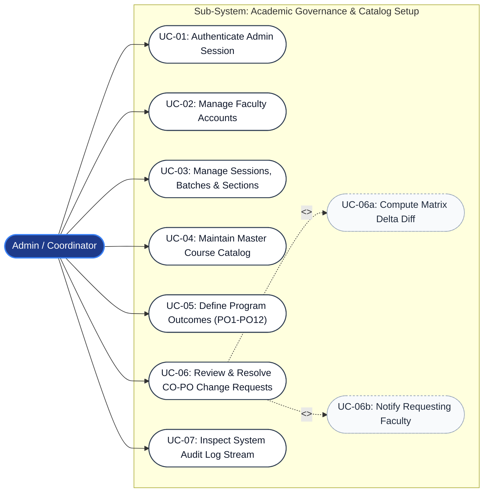
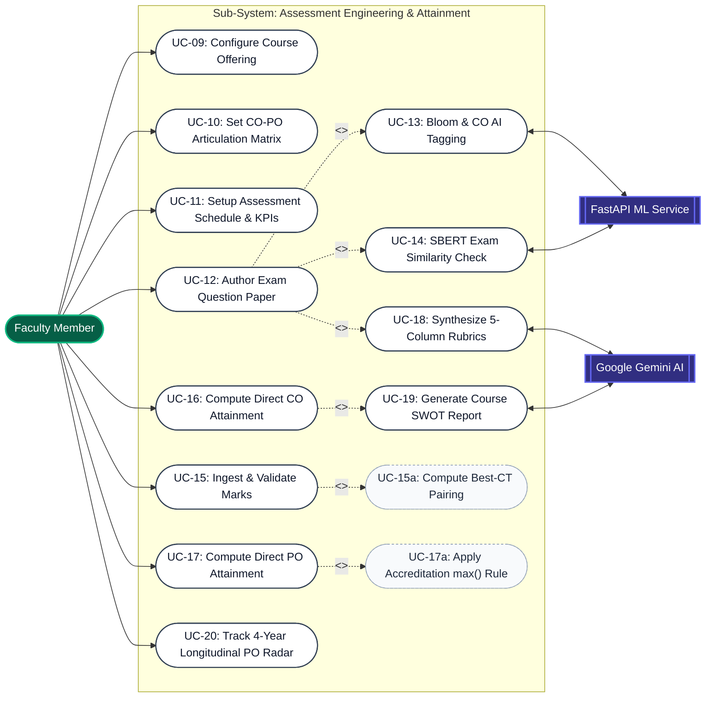
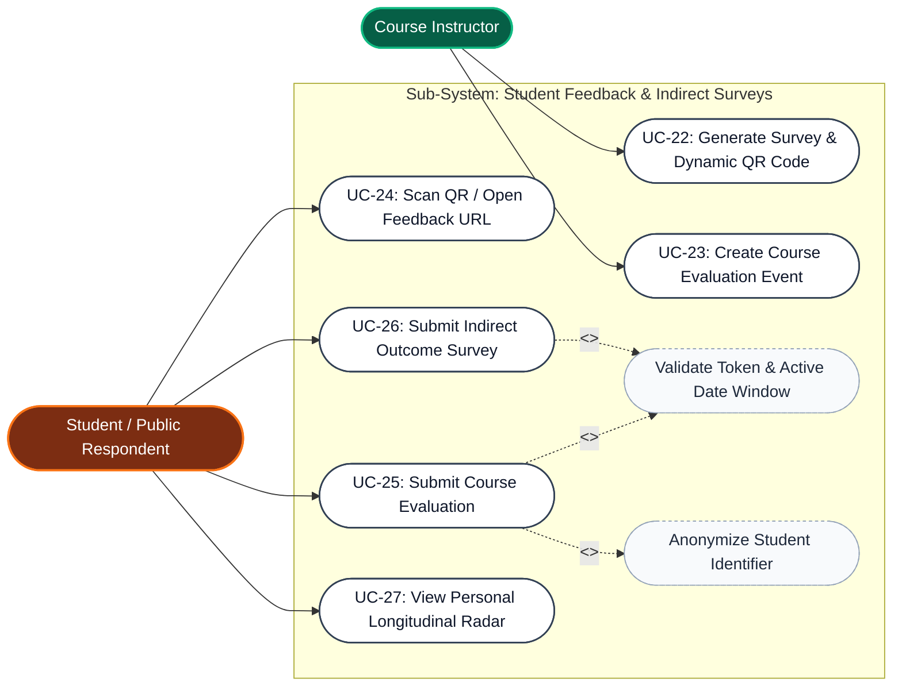

# Use Case Diagram & System Specifications

**Project Title:** Student Outcome Analyzer & OBE Management System  
**Document Purpose:** Academic Thesis Specification (Chapter 3: System Requirements, Actor Modeling & Use Case Analysis)  
**Standard Compliance:** UML 2.5 / IEEE 830 Software Requirements Specification / Washington Accord & BAETE OBE Framework  
**Document Version:** 1.0.0 (Production Verified)  
**Date:** October 2026  

---

## 1. Executive Summary & Use Case Model Overview

The **Use Case Model** formalizes the functional scope, behavioral boundaries, and access permissions of the **Student Outcome Analyzer & OBE Management System**. In accordance with software engineering standards (IEEE 830 / ISO/IEC/IEEE 29148), this specification defines the interactions between the system and its external actors.

The platform demarcates operational roles into three primary human actors and four automated external system actors:

```
+----------------------------------------------------------------------------------------------------+
|                                      SYSTEM BOUNDARY & ACTORS                                      |
+----------------------------------------------------------------------------------------------------+
|                                                                                                    |
|   HUMAN ACTORS                       SYSTEM BOUNDARY: OBE SYSTEM                 EXTERNAL ACTORS   |
|   +-------------------+            +-----------------------------+             +---------------+   |
|   |       ADMIN       | ---------> |  Academic Catalog & Admin   |             | FASTAPI ML    |   |
|   |  (Coordinator)    |            |  CO-PO Request Governance   | <---------> | MICROSERVICE  |   |
|   +-------------------+            +-----------------------------+             +---------------+   |
|                                    |  Continuous Assessment      |                                 |
|   +-------------------+            |  Question Paper Engineering |             +---------------+   |
|   |  TEACHER / FACULTY| ---------> |  Direct CO/PO Attainment    | <---------> | GOOGLE GEMINI |   |
|   |   (Instructor)    |            |  Longitudinal Radar Engine  |             | AI CLOUD HUB  |   |
|   +-------------------+            +-----------------------------+             +---------------+   |
|                                    |  Zero-Auth Public Feedback  |                                 |
|   +-------------------+            |  Indirect Surveys via QR    |             +---------------+   |
|   |      STUDENT      | ---------> |  Student Outcome Radar View |             | HUGGING FACE  |   |
|   | (Course Attendee) |            +-----------------------------+             | SERVERLESS    |   |
|   +-------------------+                                                        +---------------+   |
|                                                                                                    |
+----------------------------------------------------------------------------------------------------+
```

---

## 2. Actor Characterization & Access Permissions (RBAC)

The system enforces a **Role-Based Access Control (RBAC)** architecture. Actors and their privileges are classified as follows:

| Actor | Classification | Authentication Mechanism | Operational Scope & Institutional Responsibilities |
|:---|:---|:---|:---|
| **Admin** *(Academic Head / OBE Coordinator)* | Primary Human Actor | Bcrypt + JWT (`role: 'admin'`) | Master academic configuration, university term scheduling, batch/section creation, faculty account provisioning, syllabus curriculum management, and final approval/rejection of CO-PO change requests. |
| **Teacher / Faculty** *(Course Instructor)* | Primary Human Actor | Bcrypt + JWT (`role: 'user'`) | Course offering setup, student roster enrollment, syllabus-offering CO-PO weight adjustments, continuous assessment creation, rich question paper authoring with KaTeX math rendering, marks entry, direct CO/PO attainment computation, and student recommendation endorsement. |
| **Student** *(Course Attendee / Evaluator)* | Primary Human Actor | Zero-Auth Token URL / Scanned QR Code | Pseudonymous submission of formative/summative course evaluations, completion of indirect Course Outcome surveys, and viewing individual multi-year longitudinal PO radar graphs. |
| **FastAPI ML Microservice** | Secondary Automated Actor | Internal REST API (`/suggest-metadata`, `/similarity-check`) | Automated Bloom's Taxonomy cognitive demand classification (C1–C6), fine-tuned Sentence-BERT (`sbert-obe-csematch`) Course Outcome mapping, and exam paper overlap analysis. |
| **Google Gemini AI Engine** | Secondary Cloud Actor | Google Generative AI REST API | 9-tier ordered fallback inference for question refinement, 5-column OBE rubrics matrix synthesis, and course SWOT report generation. |
| **Hugging Face Serverless Hub** | Secondary Cloud Actor | Bearer Token HTTPS API | Cloud inference for zero-shot text classification (`distilbart-mnli-12-3`) and Sentence-BERT vector generation. |
| **MongoDB Atlas** | Supporting Storage Actor | Mongoose ODM (TLS 1.3) | Transactional data persistence, atomic document updates across 26 collections, and historical audit logging. |

---

## 3. Global System Use Case Diagram (Mermaid.js)

```mermaid
flowchart LR
    %% ==========================================
    %% ACTORS DEFINITIONS
    %% ==========================================
    ADMIN(["fa:fa-user-shield Admin / Coordinator"]):::adminActor
    TEACHER(["fa:fa-chalkboard-teacher Faculty Member"]):::teacherActor
    STUDENT(["fa:fa-user-graduate Student / Public"]):::studentActor
    
    ML_SERVICE[["fa:fa-cogs FastAPI ML Microservice"]]:::systemActor
    GEMINI_CLOUD[["fa:fa-brain Google Gemini AI Hub"]]:::systemActor

    %% ==========================================
    %% SYSTEM BOUNDARY
    %% ==========================================
    subgraph SYSTEM_BOUNDARY ["SYSTEM BOUNDARY: Student Outcome Analyzer & OBE Management System"]
        direction TB

        %% Module 1: Admin Governance Use Cases
        subgraph MOD_ADMIN ["1. Academic Governance & Setup"]
            UC_ADM_LOGIN(["UC-01: Authenticate Admin Session"]):::usecase
            UC_ADM_FACULTY(["UC-02: Manage Faculty Accounts"]):::usecase
            UC_ADM_TERMS(["UC-03: Manage Sessions, Batches & Sections"]):::usecase
            UC_ADM_CATALOG(["UC-04: Maintain Master Course Catalog"]):::usecase
            UC_ADM_PO(["UC-05: Define Program Outcomes (PO1-PO12)"]):::usecase
            UC_ADM_GOV(["UC-06: Govern CO-PO Change Requests"]):::usecase
            UC_ADM_LOGS(["UC-07: Inspect System Audit Logs"]):::usecase
        end

        %% Module 2: Teacher Pedagogical Engineering Use Cases
        subgraph MOD_TEACHER ["2. Assessment Engineering & Attainment Engine"]
            UC_TEA_LOGIN(["UC-08: Authenticate Faculty Session"]):::usecase
            UC_TEA_ROSTER(["UC-09: Configure Course Offering & Enroll Students"]):::usecase
            UC_TEA_COPO(["UC-10: Customize CO-PO Articulation Matrix"]):::usecase
            UC_TEA_ASMT(["UC-11: Configure Assessment Plan & KPI Thresholds"]):::usecase
            UC_TEA_QP(["UC-12: Author Exam Question Paper (KaTeX / RTE)"]):::usecase
            UC_TEA_BLOOM(["UC-13: Auto-Tag Bloom Cognitive Level & CO"]):::usecase
            UC_TEA_SIM(["UC-14: Check Exam Question Semantic Similarity"]):::usecase
            UC_TEA_MARKS(["UC-15: Ingest Assessment Marks (Manual / Excel)"]):::usecase
            UC_TEA_CO_ATT(["UC-16: Compute Direct CO Attainment"]):::usecase
            UC_TEA_PO_ATT(["UC-17: Compute Direct PO Attainment via max() Rule"]):::usecase
            UC_TEA_RUBRICS(["UC-18: Synthesize 5-Column OBE Rubrics Matrix"]):::usecase
            UC_TEA_SWOT(["UC-19: Generate Automated Course SWOT Report"]):::usecase
            UC_TEA_RADAR(["UC-20: Track 4-Year Longitudinal PO Radar & Endorse"]):::usecase
            UC_TEA_EXPORT(["UC-21: Export Accreditation Dossier (Word/Excel/PDF)"]):::usecase
            UC_TEA_SURVEY_MGT(["UC-22: Administer Indirect Outcome Surveys & QR"]):::usecase
            UC_TEA_EVAL_MGT(["UC-23: Schedule Course Feedback Evaluations"]):::usecase
        end

        %% Module 3: Student & Public Feedback Use Cases
        subgraph MOD_STUDENT ["3. Student Feedback & Public Evaluation"]
            UC_STU_QR(["UC-24: Access Evaluation / Survey via QR Code"]):::usecase
            UC_STU_EVAL(["UC-25: Submit Anonymous Course Evaluation"]):::usecase
            UC_STU_SURVEY(["UC-26: Submit Indirect Outcome Survey (Likert)"]):::usecase
            UC_STU_VIEW_RADAR(["UC-27: View Personal Longitudinal PO Radar"]):::usecase
        end

        %% Relationship & Helper Sub-routines
        UC_CALC_BEST_CT(["UC-28: Select Best-CT Score Pairing"]):::includeCase
        UC_VALIDATE_TOKEN(["UC-29: Validate Evaluation Token & Date Window"]):::includeCase
    end

    %% ==========================================
    %% ACTOR ASSOCIATIONS & RELATIONSHIPS
    %% ==========================================
    ADMIN --> UC_ADM_LOGIN
    ADMIN --> UC_ADM_FACULTY
    ADMIN --> UC_ADM_TERMS
    ADMIN --> UC_ADM_CATALOG
    ADMIN --> UC_ADM_PO
    ADMIN --> UC_ADM_GOV
    ADMIN --> UC_ADM_LOGS

    TEACHER --> UC_TEA_LOGIN
    TEACHER --> UC_TEA_ROSTER
    TEACHER --> UC_TEA_COPO
    TEACHER --> UC_TEA_ASMT
    TEACHER --> UC_TEA_QP
    TEACHER --> UC_TEA_MARKS
    TEACHER --> UC_TEA_CO_ATT
    TEACHER --> UC_TEA_PO_ATT
    TEACHER --> UC_TEA_RADAR
    TEACHER --> UC_TEA_EXPORT
    TEACHER --> UC_TEA_SURVEY_MGT
    TEACHER --> UC_TEA_EVAL_MGT

    STUDENT --> UC_STU_QR
    STUDENT --> UC_STU_EVAL
    STUDENT --> UC_STU_SURVEY
    STUDENT --> UC_STU_VIEW_RADAR

    %% <<include>> Relationships
    UC_TEA_MARKS -.->|"<<include>>"| UC_CALC_BEST_CT
    UC_TEA_CO_ATT -.->|"<<include>>"| UC_TEA_MARKS
    UC_TEA_PO_ATT -.->|"<<include>>"| UC_TEA_CO_ATT
    UC_STU_EVAL -.->|"<<include>>"| UC_VALIDATE_TOKEN
    UC_STU_SURVEY -.->|"<<include>>"| UC_VALIDATE_TOKEN

    %% <<extend>> Relationships
    UC_TEA_QP -.->|"<<extend>>"| UC_TEA_BLOOM
    UC_TEA_QP -.->|"<<extend>>"| UC_TEA_SIM
    UC_TEA_QP -.->|"<<extend>>"| UC_TEA_RUBRICS
    UC_TEA_CO_ATT -.->|"<<extend>>"| UC_TEA_SWOT
    UC_TEA_COPO -.->|"<<extend>>"| UC_ADM_GOV

    %% External System Integrations
    UC_TEA_BLOOM <--> ML_SERVICE
    UC_TEA_SIM <--> ML_SERVICE
    UC_TEA_RUBRICS <--> GEMINI_CLOUD
    UC_TEA_SWOT <--> GEMINI_CLOUD

    %% ==========================================
    %% CLASS STYLES
    %% ==========================================
    classDef adminActor fill:#1e3a8a,stroke:#3b82f6,stroke-width:2px,color:#ffffff;
    classDef teacherActor fill:#065f46,stroke:#10b981,stroke-width:2px,color:#ffffff;
    classDef studentActor fill:#7c2d12,stroke:#f97316,stroke-width:2px,color:#ffffff;
    classDef systemActor fill:#312e81,stroke:#6366f1,stroke-width:2px,color:#ffffff;
    classDef usecase fill:#ffffff,stroke:#334155,stroke-width:1.5px,color:#0f172a;
    classDef includeCase fill:#f1f5f9,stroke:#64748b,stroke-dasharray: 4 4,stroke-width:1.5px,color:#334155;
```

The following diagram defines the complete functional boundary, all primary/secondary actors, core use cases, and `<<include>>` / `<<extend>>` relationships.



---

## 4. Sub-System Modular Use Case Diagrams

To facilitate focused thesis presentation in Chapter 3, the global model is decomposed into three modular sub-diagrams:

### 4.1 Sub-Diagram 1: Academic Governance & Catalog Administration

Focuses on administrative workflows, curriculum configuration, and formal faculty change proposals.



### 4.2 Sub-Diagram 2: Faculty Assessment Engineering & Attainment Engine

Focuses on course delivery, AI-assisted question authoring, marks ingestion, and mathematical attainment calculations.



### 4.3 Sub-Diagram 3: Student Feedback, Indirect Surveys & Radar Portal

Focuses on mobile QR-code zero-auth access, anonymous course rating, and individual student longitudinal radar review.



---

## 5. Formal Use Case Specifications (IEEE 830 Standard)

The following tables document the primary use cases using standard software engineering specifications:

### 5.1 Use Case: UC-06 — Govern CO-PO Change Requests

| Specification Field | Operational Description |
|:---|:---|
| **Use Case ID** | `UC-06` |
| **Use Case Name** | Govern CO-PO Change Requests |
| **Primary Actor** | Admin / Academic Head |
| **Secondary Actor(s)**| Faculty Member (Initiator), MongoDB Atlas Cluster |
| **Trigger** | Faculty member submits a syllabus modification proposal from their course offering matrix workspace. |
| **Pre-conditions** | 1. Admin must be authenticated with `role: 'admin'`.<br>2. A pending request exists in `copo_requests` collection (`status: 'pending'`). |
| **Post-conditions** | 1. Proposal marked as `approved` or `rejected` with timestamp and `reviewedBy`.<br>2. If approved, changes are atomically propagated into `Course.coPoMapping` and `CourseOffering.coPoMapping`.<br>3. Action logged to `recentactivities`. |
| **Main Success Scenario** | 1. Admin navigates to **Governance & Approvals** tab in Admin Dashboard.<br>2. System displays list of pending proposals with requesting teacher name, course code, and summary.<br>3. Admin selects a request; system generates a side-by-side **Delta Diff Comparison** showing original vs proposed matrix weights and modified CO descriptions.<br>4. Admin inputs justification remarks into `adminNote` field and clicks **Approve Request**.<br>5. System commits the updated matrix to the database, sets request status to `approved`, and logs the audit event.<br>6. System displays success confirmation and updates pending badge counter. |
| **Alternative Flows** | **4a. Request Rejection:**<br>Admin enters rejection reason into `adminNote` and clicks **Reject Request**.<br>System records status as `rejected`. Original course syllabus remains unchanged. Teacher receives notification banner in their workspace. |
| **Exceptions** | **E1: Concurrency Conflict:** Another administrator approved/rejected the proposal simultaneously. System alerts admin and refreshes table. |

---

### 5.2 Use Case: UC-12 — Author Exam Question Paper & Engineering Metadata

| Specification Field | Operational Description |
|:---|:---|
| **Use Case ID** | `UC-12` |
| **Use Case Name** | Author Exam Question Paper & Engineering Metadata |
| **Primary Actor** | Faculty Member (Course Instructor) |
| **Secondary Actor(s)**| FastAPI ML Microservice, Google Gemini AI Hub, MongoDB Atlas |
| **Trigger** | Teacher opens **Question Paper Editor** for an active assessment (CT, Mid-Term, or Final). |
| **Pre-conditions** | 1. Teacher must be assigned to the course offering (`courseofferings.teacher === req.user._id`).<br>2. Assessment event defined in `assessments` collection. |
| **Post-conditions** | 1. Exam content persisted in `questionpapers`.<br>2. Question itemization, marks, CO tags, and Bloom taxonomy saved in `questionmetadatas`.<br>3. Print-ready Word (`.docx`) or PDF generated. |
| **Main Success Scenario** | 1. Teacher opens editor interface (`QuestionPaperEditor.jsx`).<br>2. System initializes Syncfusion RTE and renders existing assessment content with KaTeX math formula preview.<br>3. Teacher types question statements and item marks (e.g., Q1(a): 5 marks).<br>4. Teacher clicks **Auto-Tag Metadata** (`<<extend>> UC-13`); system dispatches question text to ML microservice and auto-selects suggested Bloom level and Course Outcome.<br>5. Teacher clicks **Similarity Check** (`<<extend>> UC-14`); system compares question text against historical department archives via SBERT embeddings.<br>6. Teacher clicks **Save & Publish**.<br>7. System validates that sum of item marks equals assessment `maxMarks` and commits records to database. |
| **Alternative Flows** | **4a. Manual Metadata Override:** Teacher disagrees with AI suggestion and selects a different CO/Bloom level via UI dropdown.<br>**5a. Overlap Detected:** System flags high semantic overlap (>60%) with a previous semester paper. Teacher clicks **AI Assist Refine** to rephrase question. |
| **Exceptions** | **E1: ML Microservice Warming:** System displays warming progress badge and seamlessly switches to local keyword heuristic classifier. |

---

### 5.3 Use Case: UC-17 — Compute Direct PO Attainment via Washington Accord max() Rule

| Specification Field | Operational Description |
|:---|:---|
| **Use Case ID** | `UC-17` |
| **Use Case Name** | Compute Direct PO Attainment via Accreditation max() Rule |
| **Primary Actor** | Faculty Member (Course Instructor) / System Math Engine |
| **Secondary Actor(s)**| MongoDB Atlas Cluster |
| **Trigger** | Assessment marks are uploaded, edited, or instructor triggers attainment re-calculation. |
| **Pre-conditions** | 1. Student marks exist in `studentmarks`.<br>2. Assessment questions mapped in `questionmetadatas`.<br>3. Course offering CO-PO correlation matrix populated. |
| **Post-conditions** | 1. Direct CO attainments updated in `coattainments`.<br>2. Direct PO attainments updated in `poattainments`.<br>3. Student longitudinal records re-indexed. |
| **Main Success Scenario** | 1. System executes `recalculateAttainments(offeringId)`.<br>2. System groups assessments, evaluating standard class tests alongside extra/makeup tests using **Best-CT pairing**.<br>3. System calculates obtained percentage for every student against `targetPassMarks` (default 40%).<br>4. System computes CO pass percentage and verifies against `kpiCO` threshold to set `attained: true/false`.<br>5. System evaluates mapped Program Outcomes (PO1–PO12). For each PO, it extracts all related COs where weight = 1.<br>6. System applies the accreditation-standard **`max()` aggregation principle**: Program Outcome pass and KPI percentages are calculated as the maximum values among all mapped Course Outcomes.<br>7. System upserts final records into `poattainments` and pushes real-time chart updates to faculty dashboard. |
| **Alternative Flows** | **5a. Unmapped PO:** If no CO maps to a specific PO in this course, attainment is recorded as 0 with status unassessed. |
| **Exceptions** | **E1: Zero Marks Ingested:** System alerts teacher that marks must be submitted prior to running attainment calculations. |

---

### 5.4 Use Case: UC-20 — Track 4-Year Longitudinal PO Radar & Recommendation

| Specification Field | Operational Description |
|:---|:---|
| **Use Case ID** | `UC-20` |
| **Use Case Name** | Track 4-Year Longitudinal PO Radar & Endorse Student Recommendation |
| **Primary Actor** | Faculty Member / Academic Advisor |
| **Secondary Actor(s)**| Student (Observer), MongoDB Atlas |
| **Trigger** | Faculty accesses **PO Recommendation Matrix** or opens a student profile. |
| **Pre-conditions** | 1. Student has completed one or more course offerings.<br>2. Course-level PO attainments calculated. |
| **Post-conditions** | 1. Multi-year radar dataset stored in `studentlongitudinalpos`.<br>2. Recommendation score and graduation eligibility saved in `porecommendations`. |
| **Main Success Scenario** | 1. Faculty selects cohort batch and student ID.<br>2. System executes `calculateAndSyncStudentPO(studentId)`.<br>3. System aggregates all completed courses, calculating cumulative CGPA ($$CGPA = \frac{\sum GP \times Credits}{\sum Credits}$$).<br>4. System computes credit-weighted cumulative attainment across PO1 through PO12.<br>5. System identifies weak POs falling beneath institutional threshold (default 60%).<br>6. System computes composite recommendation score and classifies student into one of 4 formal statuses:<br>   - *Eligible for Recommendation*<br>   - *Not Recommended (PO Gap Detected)*<br>   - *Conditional (Low CGPA)*<br>   - *Ineligible (Low CGPA & PO Gaps)*<br>7. System renders an interactive 12-axis **Longitudinal Radar Chart**.<br>8. Faculty enters qualitative remarks into `facultyNotes` and digitally endorses recommendation. |
| **Alternative Flows** | **7a. Student Self-Review:** Student scans QR or logs in to review personal radar graph, identifying personal deficit areas before final semester advising. |
| **Exceptions** | **E1: Incomplete Enrollment Record:** System flags missing grade submissions from previous semester courses and prompts advisor. |

---

### 5.5 Use Case: UC-25 — Submit Anonymous Course Evaluation

| Specification Field | Operational Description |
|:---|:---|
| **Use Case ID** | `UC-25` |
| **Use Case Name** | Submit Anonymous Course Evaluation |
| **Primary Actor** | Student (Course Attendee) |
| **Secondary Actor(s)**| Course Instructor (Evaluation Creator), MongoDB Atlas |
| **Trigger** | Student opens mobile camera, scans evaluation QR code in classroom, or clicks public link. |
| **Pre-conditions** | 1. Evaluation session created in `evaluations` with `status: 'Published'`.<br>2. Current timestamp is between `openDate` and `closeDate`. |
| **Post-conditions** | 1. Likert scores (1–5) and multidimensional text comments saved into `responses`.<br>2. Student cannot re-submit for the same evaluation token. |
| **Main Success Scenario** | 1. Student accesses URL with public token: `/feedback/:evaluationId`.<br>2. System validates evaluation token and confirms date window is open (`<<include>> UC-29`).<br>3. System displays clean, mobile-responsive questionnaire (`StudentFeedbackForm.jsx`) with instructor name, course code, and criteria partitioned across pedagogical sections.<br>4. Student selects Likert ratings (1–5: Strongly Disagree to Strongly Agree) for each question.<br>5. Student fills out qualitative feedback boxes (learned concepts, areas of difficulty, teaching recommendations).<br>6. Student enters institutional email and clicks **Submit Feedback**.<br>7. System validates all required questions are answered, hashes student identity to guarantee pseudonymity, and commits record to `responses`.<br>8. System displays confirmation banner thanking student for feedback. |
| **Alternative Flows** | **2a. Evaluation Expired / Draft:** System displays "Evaluation Session is Closed or Inactive" and denies access. |
| **Exceptions** | **E1: Duplicate Submission:** If email/token combination was previously recorded, system halts submission and displays "Response Already Recorded". |

---

## 6. Actor-to-Use-Case Traceability & Permissions Matrix

This matrix establishes 100% auditable traceability between institutional actors, use cases, and system security boundaries:

| Use Case ID | Use Case Title | Admin | Faculty | Student | ML Service | Gemini AI |
|:---|:---|:---:|:---:|:---:|:---:|:---:|
| `UC-01` | Authenticate Admin Session | **X** | — | — | — | — |
| `UC-02` | Manage Faculty Accounts | **X** | — | — | — | — |
| `UC-03` | Manage Sessions, Batches & Sections | **X** | — | — | — | — |
| `UC-04` | Maintain Master Course Catalog | **X** | — | — | — | — |
| `UC-05` | Define Program Outcomes (PO1–PO12) | **X** | — | — | — | — |
| `UC-06` | Govern CO-PO Change Requests | **X** | — | — | — | — |
| `UC-07` | Inspect System Audit Logs | **X** | — | — | — | — |
| `UC-08` | Authenticate Faculty Session | — | **X** | — | — | — |
| `UC-09` | Configure Course Offering & Roster | — | **X** | — | — | — |
| `UC-10` | Customize CO-PO Articulation Matrix | — | **X** | — | — | — |
| `UC-11` | Configure Assessment Plan & KPIs | — | **X** | — | — | — |
| `UC-12` | Author Exam Question Paper | — | **X** | — | — | — |
| `UC-13` | Bloom & CO AI Metadata Tagging | — | **X** | — | **X** | — |
| `UC-14` | SBERT Exam Similarity Check | — | **X** | — | **X** | — |
| `UC-15` | Ingest Assessment Marks (Excel/CSV) | — | **X** | — | — | — |
| `UC-16` | Compute Direct CO Attainment | — | **X** | — | — | — |
| `UC-17` | Compute Direct PO Attainment (max) | — | **X** | — | — | — |
| `UC-18` | Synthesize 5-Column OBE Rubrics | — | **X** | — | — | **X** |
| `UC-19` | Generate Course SWOT Report | — | **X** | — | — | **X** |
| `UC-20` | Track Longitudinal PO Radar & Endorse | — | **X** | — | — | — |
| `UC-21` | Export Accreditation Dossier (Word/Excel/PDF)| — | **X** | — | — | — |
| `UC-22` | Administer Indirect Surveys & QR | — | **X** | — | — | — |
| `UC-23` | Schedule Course Feedback Evaluations | — | **X** | — | — | — |
| `UC-24` | Access Evaluation / Survey via QR Code | — | — | **X** | — | — |
| `UC-25` | Submit Anonymous Course Evaluation | — | — | **X** | — | — |
| `UC-26` | Submit Indirect Outcome Survey | — | — | **X** | — | — |
| `UC-27` | View Personal Longitudinal PO Radar | — | — | **X** | — | — |

---

## 7. Ready-to-Use PlantUML Source Code

For thesis defense presentations requiring vector-rendered PlantUML graphics (via draw.io, PlantText, or PlantUML CLI), use the following script:

```plantuml
@startuml
skinparam actorStyle awesome
skinparam packageStyle rectangle
skinparam roundcorner 15
skinparam shadowing false
skinparam defaultFontName "Segoe UI", Arial, sans-serif

actor "Admin / Coordinator" as Admin #1e3a8a
actor "Faculty Member" as Teacher #065f46
actor "Student / Public" as Student #7c2d12
actor "FastAPI ML Service" as ML #312e81
actor "Google Gemini AI" as Gemini #312e81

rectangle "Student Outcome Analyzer & OBE Management System" {
  package "Academic Governance" {
    usecase "UC-01: Admin Login" as UC01
    usecase "UC-02: Manage Faculty Accounts" as UC02
    usecase "UC-03: Manage Terms & Batches" as UC03
    usecase "UC-04: Maintain Course Catalog" as UC04
    usecase "UC-05: Define Program Outcomes" as UC05
    usecase "UC-06: Govern CO-PO Requests" as UC06
    usecase "UC-07: Inspect Audit Logs" as UC07
  }

  package "Assessment & Attainment Engine" {
    usecase "UC-08: Faculty Login" as UC08
    usecase "UC-09: Configure Offerings & Roster" as UC09
    usecase "UC-10: Customize CO-PO Matrix" as UC10
    usecase "UC-11: Configure Assessments & KPIs" as UC11
    usecase "UC-12: Author Question Paper" as UC12
    usecase "UC-13: Bloom & CO AI Tagging" as UC13
    usecase "UC-14: SBERT Similarity Check" as UC14
    usecase "UC-15: Ingest Student Marks" as UC15
    usecase "UC-16: Compute Direct CO Attainment" as UC16
    usecase "UC-17: Compute Direct PO (max rule)" as UC17
    usecase "UC-18: Synthesize 5-Column Rubrics" as UC18
    usecase "UC-19: Generate SWOT Report" as UC19
    usecase "UC-20: 4-Year Longitudinal Radar" as UC20
    usecase "UC-21: Export Accreditation Dossier" as UC21
    usecase "UC-22: Manage Surveys & QR" as UC22
    usecase "UC-23: Schedule Course Evaluations" as UC23
  }

  package "Student Evaluation & Surveys" {
    usecase "UC-24: Access Form via QR Code" as UC24
    usecase "UC-25: Submit Course Evaluation" as UC25
    usecase "UC-26: Submit Indirect Survey" as UC26
    usecase "UC-27: View Personal PO Radar" as UC27
  }
}

' Admin Associations
Admin --> UC01
Admin --> UC02
Admin --> UC03
Admin --> UC04
Admin --> UC05
Admin --> UC06
Admin --> UC07

' Teacher Associations
Teacher --> UC08
Teacher --> UC09
Teacher --> UC10
Teacher --> UC11
Teacher --> UC12
Teacher --> UC15
Teacher --> UC16
Teacher --> UC17
Teacher --> UC20
Teacher --> UC21
Teacher --> UC22
Teacher --> UC23

' Student Associations
Student --> UC24
Student --> UC25
Student --> UC26
Student --> UC27

' Stereotype Dependencies
UC12 ..> UC13 : <<extend>>
UC12 ..> UC14 : <<extend>>
UC12 ..> UC18 : <<extend>>
UC16 ..> UC19 : <<extend>>
UC10 ..> UC06 : <<extend>>
UC17 ..> UC16 : <<include>>
UC16 ..> UC15 : <<include>>

' AI Services
UC13 <--> ML
UC14 <--> ML
UC18 <--> Gemini
UC19 <--> Gemini

@enduml
```



---

## 8. Thesis Chapter 3 Integration Summary

This Use Case specification provides the complete analytical baseline required for **Chapter 3 (System Requirements & Analysis)** of the academic thesis:
1. **Clear Demarcation of System Actors:** Explicitly distinguishes administrative catalog governance, faculty pedagogical authoring, and student feedback responsibilities.
2. **Accreditation Rigor:** Encapsulates the international Washington Accord / BAETE mandate by documenting direct attainment algorithms (the **`max()` rule**), **Longitudinal Radar aggregation**, and **Course-end Indirect Surveys**.
3. **Applied AI Integration:** Establishes formal `<<extend>>` boundaries connecting client rich text editing to asynchronous Python FastAPI inference and Google Gemini AI failover chains.
